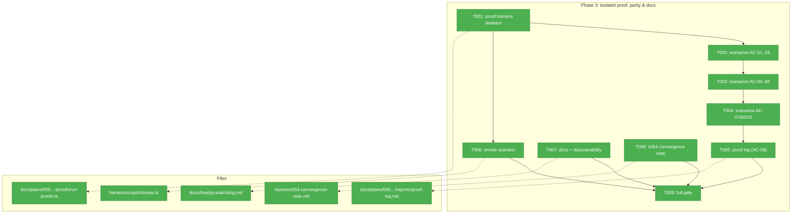
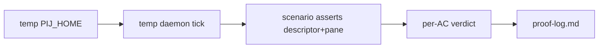
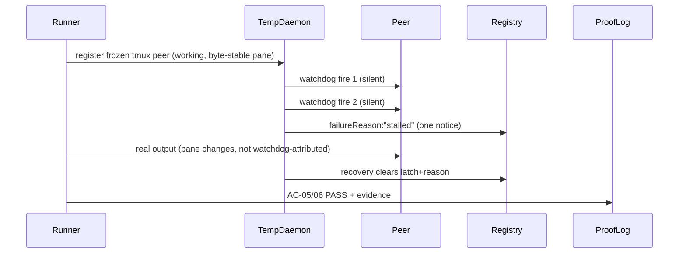

# Phase 3: Isolated proof, parity & docs — tasks

**Plan**: docs/plans/055-pij-watchdog/pij-watchdog-plan.md (v1.0.1, pin 14b03626…)
**Phase objective**: Prove every AC against a temp daemon; ship discoverability.
**Created**: 2026-07-17 · **Author**: pij-intimate-mandrill (orchestrator)

## Executive Briefing

- **Purpose**: Phases 1–2 built and reviewed the watchdog; nothing yet *proves*
  the ten acceptance criteria against a running daemon, and nothing tells a
  human the feature exists. Phase 3 closes both gaps without ever touching the
  live daemon (baton rule: restarts are baton-gated — ALL proofs run against a
  temp daemon in an isolated `PIJ_HOME`).
- **What We're Building**: a scripted temp-daemon proof harness with per-AC
  verdicts (AC-09's artifact), a `just smoke` scenario, the
  `docs/how/pij-watchdog.md` how-to + skill/domain discoverability updates, and
  the s054 convergence note (rebase target 647076a).
- **Goals**: ✅ per-AC proof log committed · ✅ smoke scenario green ·
  ✅ docs name every verb + etiquette + capture defaults · ✅ convergence note
  recorded · ✅ `just self-check` + `harness checks` green
- **Non-Goals**: ❌ restarting or reconfiguring the LIVE daemon (baton-gated;
  temp daemon only) · ❌ new watchdog features or behavior changes (fixes only
  if a proof exposes a real defect — report first) · ❌ consuming s054's
  `systemState` fields now (that's post-convergence; T008 only *plans* it)

## Prior Phase Context

### Phase 1 (commit bb863b0) — pure watchdog core
- **Deliverables**: `.pi/extensions/pij/core/watchdog.ts` + `watchdog.test.ts`
  (26 tests); additive `WatchdogSidecar`/`WatchdogPauseTier` in `core/types.ts`.
- **Exports consumed by P2/P3**: `DEFAULT_WATCHDOG_INTERVAL_MS` (1_200_000),
  `effectiveWatchdog(sidecar?)`, `isFireDue`, `evaluateResponse` (+ typed
  `WatchdogPaneObservation.workingTransitionWasWatchdog`), `buildWatchdogTurn`,
  `shouldCapture`/`captureSlice` (defaults 40 lines ∧ 4096 bytes, ceilings
  200/16384), `applyCompactPause`, `applyWatchdogResume`, `applyWorkingTransition`.
- **Gotchas**: D4 self-masking is subtle — watchdog-attributable transitions
  are TYPED, never inferred; `shouldCapture({mode:"always"}, false) === true`
  is a load-bearing Phase-1 contract (P2's HIGH-1 violated it end-to-end).
- **Patterns**: pure functions, zero I/O, `nowMs` params; TDD with mutation
  evidence.

### Phase 2 (commits de6789a + ff64d91) — daemon manager + CLI surface
- **Deliverables**: `core/daemon/watchdog-manager.ts` (+ 27-test suite),
  `adapters/watchdog-store.ts` (FsWatchdogStore, CLI-owned/daemon-read),
  additive wiring in `daemon.ts` (injection, D4 paneSig attribution guard at
  daemon.ts:253-257, tick-end `reconcile`, `disposeSession`), compact seams in
  `core/daemon/router.ts` (tmux) + `core/session.ts` (pi onInbound), CLI verbs
  in `core/cli.ts` (`pij watchdog status|pause|resume|exempt|watch|unwatch|list`,
  exempt-downgrade rejection at core/cli.ts:868-871), `spawn --no-watchdog`
  (`core/spawn.ts` + root `cli.ts` adapter injection).
- **Dependencies exported**: `WatchdogManager` ctor takes fake-able ports
  (store/channel/isAlive/now/capturePane/sendText/onFire/onResponse) —
  the proof harness and smoke can drive it the same way the daemon does; the
  `pij watchdog` + `pij state --json` watchdog block are the CLI surfaces to
  assert.
- **Gotchas & debt**: (1) stall episodes are watchdog-OWNED — only typed
  responsive recovery clears the latch; legacy detector cannot (review C1).
  (2) Descriptor `lastEventAt` is AXIS TRUTH (b36edf0) — the daemon never
  reads `events.ndjson` for watchdog decisions; proofs must assert descriptor
  state, not event-stream state. (3) Root/unowned sessions get
  `failureReason:"stalled"`; `spawnedBy` gates ONLY owner notification.
  (4) `core/daemon/loop.ts` is SW-6-fenced — zero-diff held all stream; keep
  it that way.
- **Patterns**: mutation-verified tests (`just flow-pair-mutate <file> '<expr>'
  npx vitest run <suite>` — recipe now joins multi-word suites, ff64d91);
  execution.log.md kept live per task.

## Pre-Implementation Check

| File | Exists? | Domain Check | Notes |
|------|---------|-------------|-------|
| docs/plans/055-pij-watchdog/proofs/run-proofs.ts | create | pij-control-plane (plan-folder artifact) | Self-contained runner; real PIJ_HOME-isolation precedent: docs/plans/046-pij-real-trees/ (the plan's "s051" names the STREAM, not a plan ordinal — validation-004 M1); PIJ_HOME override is real at daemon.ts:523 |
| docs/plans/055-pij-watchdog/reports/proof-log.md | create | pij-control-plane | AC-09 artifact — per-AC verdict table |
| harness/scripts/smoke.ts | modify | pij-control-plane | Existing scenario registry; tmux-gated like current scenarios |
| docs/how/pij-watchdog.md | create | pij-skill | Sibling how-tos exist (e.g. docs/how/pij-peer-watch.md — plan 033 precedent) |
| skills/pij/SKILL.md (locate via `grep -rl "CLI-verb coverage" skills/`) | modify | pij-skill | Add watchdog verb row like the `watch`/`unwatch` row |
| docs/domains/** (pij-control-plane / pij-messaging domain.md + map) | modify | both | Contract rows for watchdog manager + sidecar |
| docs/plans/055-pij-watchdog/reports/s054-convergence-note.md | create | pij-messaging | Targets s054/pij-grown-up @ 647076a |

## Architecture Map



## Tasks

| Status | ID | Task | Domain | Path(s) | Done When | Notes |
|--------|-----|------|--------|---------|-----------|-------|
| [x] | T001 | Temp-daemon proof harness skeleton: isolated `PIJ_HOME` (mktemp), temp daemon lifecycle (start/stop INSIDE the temp home — never the live daemon), scenario runner emitting a per-AC verdict table, scratch tmux session helper for pane scenarios (skip-with-verdict when tmux absent) | pij-control-plane | docs/plans/055-pij-watchdog/proofs/run-proofs.ts | Runner boots+tears down a temp daemon repeatedly; zero reads/writes of the real ~/.pij; `npx tsx …/run-proofs.ts --list` names scenarios | Plan 3.1; PIJ_HOME-isolation precedent docs/plans/046-pij-real-trees/; baton rule is ABSOLUTE |
| [x] | T002 | Scenarios AC-01/02/03: default-on 20-min fire against an idle tmux peer (interval shrunk via sidecar for test speed), self-teaching turn body (verbs+ordinal+etiquette), `pij watchdog pause`→no fire→`resume`→fires again | pij-control-plane | proofs/run-proofs.ts | Each scenario asserts DESCRIPTOR + pane text evidence and records verdict | AC-01 uses real store+manager through temp daemon tick |
| [x] | T003 | Scenarios AC-04/05/06: compact (`pij send --command compact` AND bare `/compact`) auto-pauses then auto-resumes on real working transition; frozen-pane sim (byte-stable pane, working state) → exactly ONE stalled notice + `failureReason:"stalled"` persisted; recovery clears; root/unowned session still stamped | pij-control-plane | proofs/run-proofs.ts | Frozen-pane scenario proves the P2 C1 fix at daemon level; assert descriptor fields, never events.ndjson | D5/D8; b36edf0 descriptor-axis discipline |
| [x] | T004 | Scenarios AC-07/08/10: anomaly capture lands as pointer file `~<temp PIJ_HOME>/<watcher>/watchdog-captures/` + ≤5-line inline head with caps enforced; `mode:always` captures a healthy fire; `spawn --no-watchdog` ⇒ exempt sidecar, never fires; `pij state/list --json` watchdog block shape; delivery split — tmux peer via sendText vs pi peer via inbox (paneless: event-advance-only, no pane evidence faked) | pij-control-plane | proofs/run-proofs.ts | All verdicts recorded with evidence pointers | AC-10 pi peer can be a synthetic descriptor with daemonOwnsDelivery=false |
| [x] | T005 | Commit the proof log: per-AC verdict table (AC-01..AC-10), evidence pointers, environment (temp home path, tmux availability), any skip clearly reasoned | pij-control-plane | docs/plans/055-pij-watchdog/reports/proof-log.md | Every AC row has verdict PASS/SKIP(reason)/FAIL — a FAIL stops the phase and is reported before any fix | AC-09 itself |
| [x] | T006 | Smoke scenario in the existing registry: spawn → first fire → pause → resume → compact-pause → capture, tmux-gated like current scenarios, isolated PIJ_HOME | pij-control-plane | harness/scripts/smoke.ts | `just smoke` green locally; flake = fix-or-remove (Jordan doctrine), never retry-loops | Plan 3.2 |
| [x] | T007 | Discoverability: `docs/how/pij-watchdog.md` (every verb, pause tiers incl. exempt strength, self-teaching etiquette, capture defaults 40-line/4KiB anomaly-only + always opt-in, `--no-watchdog`, stalled semantics); pij skill CLI-verb coverage row; domain.md/domain-map contract rows | pij-skill | docs/how/pij-watchdog.md; skills/pij/SKILL.md; docs/domains/** | `just local-path-check` green; doc names Jordan's three ruled defaults verbatim | Plan 3.3; mirror docs/how/pij-peer-watch.md shape |
| [x] | T008 | s054 convergence note: how watchdog consumes `systemState`/`SEMANTIC_STATES` post-merge (descriptor=axis truth restated), rebase target s054/pij-grown-up @ 647076a, what stays additive, open questions for the re-sync through the o-prime | pij-messaging | docs/plans/055-pij-watchdog/reports/s054-convergence-note.md | One page; no code changes; names Seq 442/447 contract pins | Plan 3.4 / Finding 07 |
| [x] | T009 | Full gate: `just self-check` + `harness checks` (report-only) green in the worktree; proof runner re-run clean end-to-end | pij-control-plane | (gates) | Composite gate green; execution.log.md records final evidence | Plan 3.5 |

## Context Brief

**Environment-first posture**: friction is work, not an apology — fix
small/reversible things, otherwise `harness observe` it (Discoveries row as
fallback) and pay it forward.

**Key findings from plan**:
- Finding 02 (self-masking): proofs must include the D4 case at daemon level —
  the watchdog's own injected turn must not read as recovery.
- Finding 06 (descriptor ownership): all assertions read the descriptor via
  registry/state surfaces; `writeMerged` ownership rules apply.
- Finding 07 (s054 timing): convergence is a NOTE this phase, not code.

**Domain dependencies**:
- `pij-messaging`: watchdog core fns (watchdog.ts) — scenario expectations
- `pij-control-plane`: WatchdogManager ports + FsWatchdogStore + daemon tick —
  what the temp daemon exercises for real

**Domain constraints**:
- `core/daemon/loop.ts` stays ZERO-diff (SW-6 — held all stream; do not break
  it in the last phase).
- Never read/tail `events.ndjson` for watchdog assertions (b36edf0).
- The LIVE daemon is untouchable: no restart, no config write, no
  `pij daemon` against the real home. Temp `PIJ_HOME` only (baton rule).
- `.pi/packages.yaml`, `government/**`, the-flow files: forbidden as ever.

**Reusable from prior phases**:
- watchdog-manager.test.ts fake-port fixtures (P2) — the proof harness can
  lift its port-shape; watch.test.ts shape precedent (P1 research F-07).
- Mutation recipe (fixed): `just flow-pair-mutate <file> '<expr>' npx vitest
  run <suite>`.
- PIJ_HOME-isolation precedent: docs/plans/046-pij-real-trees/ (daemon.ts:523
  honors the override; the pinned plan's "s051" names the stream, not a plan
  ordinal — validation-004 M1).

**Flow diagram**:


**Sequence diagram** (frozen-pane proof, AC-05/06):


## Discoveries & Learnings

_Populated during implementation by the implement verb._

| Date | Task | Type | Discovery | Resolution | References |
|------|------|------|-----------|------------|------------|
| 2026-07-17 | T001/T003 | Resolved — Critical product defect | A temp-home `Daemon.tick()` proof produced one owner stalled notice but two watcher `watchdog stalled` notices on consecutive stalled fires in the same uninterrupted episode. This violated AC-06's shared-latch requirement and made AC-09 impossible. | Stopped the phase, preserved the reproducer, and made no Phase 3 product fix. Coordinator-issued `fix-0003` added and mutation-proved the manager episode guard; review-approved commit `27dceeb` resumed the phase. Final AC-06 count is owner=1, watcher=1. | `proofs/run-proofs.ts`; `reports/proof-log.md`; AC-06; D8 |
| 2026-07-17 | T001 | Noteworthy | TypeScript proof artifacts under `docs/plans/**` are ignored by Biome (`No files were processed`), so the runnable proof command is the direct validation surface. | Recorded the gap; did not expand lint configuration outside the phase fence. | `npx biome check docs/plans/055-pij-watchdog/proofs/run-proofs.ts` |
| 2026-07-17 | T003/T006 | Harness correction | Scratch `cat` panes have no harness footer, so they do not derive the watchdog turn's brief busy→idle lifecycle. Initial recovery assertions therefore mislabeled the later real working edge. | Explicitly drive the watchdog-attributed working→idle pair before real recovery in proof and smoke. This models D4 without changing product code or adding retry/timing loops. | `proofs/run-proofs.ts`; D4; AC-05/06 |
| 2026-07-17 | T006 | Workflow friction | `just smoke` accepts no scenario argument; `just smoke watchdog` is parsed as a nonexistent second recipe. | Ran the canonical full `just smoke` recipe; all ten registered smoke entries passed. | `justfile:95`; `harness/scripts/smoke.ts` |
| 2026-07-17 | T002–T005 | Resolved — Proof-strength review | Review found four acceptance claims that were green without fully exercising capture content, D4 negative edges/latch reset, dedicated watchdog list, or pi compact call-time order. | Added positive/negative assertions at the real seams. Exact empty-capture and early-clear sabotages both exit 1; restored clean runner is 9/0/0. | `fix-0004`; `proofs/run-proofs.ts`; `reports/proof-log.md` |
| 2026-07-17 | T004 | Harness correction | A single large tmux paste of the multibyte capture fixture introduced terminal replacement glyphs before watchdog code saw it. | Print the fixture from a temp-home file inside the scratch pane process, then independently assert bisected three-byte boundaries and UTF-8 round-trip. | `proofs/run-proofs.ts`; AC-07 |

## Directory layout

```
docs/plans/055-pij-watchdog/
  ├── pij-watchdog-plan.md
  ├── proofs/run-proofs.ts            # T001-T004
  ├── reports/proof-log.md            # T005 (AC-09)
  ├── reports/s054-convergence-note.md# T008
  └── tasks/phase-3-isolated-proof-parity-docs/
      ├── tasks.md                    # this file
      └── execution.log.md            # created by the implement verb
```
