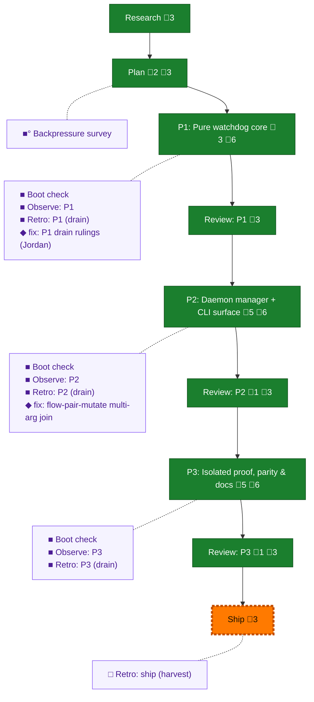

<!-- GENERATED by `harness flow render` — do not hand-edit; regenerate from the flow JSON. -->
# Flow · pij-watchdog

**Kind**: flight-plan · **Now**: ship · **Next**: ship · **Intent**: First-class daemon-owned watchdogs for pij sessions: universal 20-min default, self-teaching pause/resume turns, compact auto-pause, blind-fire through usage-limit freezes with deterministic unresponsive/stalled detection, cost-bounded on-fire tmux pane-text capture · **Nodes**: 22 · **Events**: 82

**Rail**: ◆─◆─[ ◆─◆─◆─◆─◆─◆─◇ ]  ◆ Research · ◆ Plan · [ ◆ P1: Pure watchdog core · ◆ Review: P1 · ◆ P2: Daemon manager + CLI surface · ◆ Review: P2 · ◆ P3: Isolated proof, parity & docs · ◆ Review: P3 · ◇ Ship ]

**Legend** — colour = type/status: 🟩 done · 🟢 in-progress · 🟥 blocked · 🟦 known · ⬜ assumed · 🔶 decision · 🗣 user input · 🟪 harness chore (faded = not yet done) · 🤖 companion · 🛠 worker · 🟧 current (you are here). Badges: 💬 comments · 📄 artifacts · 📝 instructions · 🧰 chore (° optional / recommended / ‼ strongly-recommended; ✓ done · ✕ skipped).

## Node log

### plan · Plan
- `2026-07-17T00:31:31.689Z` · agent · validation — validation-001: NEEDS ATTENTION (0C/0H/3M) at sha 30f2b757; all 3 mediums folded in as D7/D8 + manifest fix → plan v1.0.1; re-verify requested against new sha
- `2026-07-17T00:55:47.337Z` · user · decision — BUILD CONFIG ruled by Jordan in-pane 2026-07-17 (verbatim): 'coder is pi agent copilto gpt 5.6 sol xhigh, reviewer is same' — normalized: coder = pi agent / copilot / gpt-5.6 (sol) / effort xhigh; reviewer identical. WAITING_FOR_BUILD_CONFIG resolved; also ruled: tasks then validate.

### phase-1 · P1: Pure watchdog core
- `2026-07-17T00:57:48.829Z` · agent · note — tasks dossier written: tasks/phase-1-pure-watchdog-core/tasks.md (T001-T008, tests-first); validation-002 in flight (warm validator, plan-pin re-verified); build config recorded at .harness/temp/s055/build-config.md
- `2026-07-17T01:00:28.050Z` · agent · validation — validation-002: Phase 1 tasks VALIDATED (0C/0H/0M, 1 low prose nit fixed post-verdict) — report reports/validation-002-phase1-tasks.md; plan pin re-verified 14b03626 no drift
- `2026-07-17T01:50:00.566Z` · agent · validation — review round 1 (rev-0001, reviewer pij-tame-takin): FIX_REQUIRED — CRITICAL-1 D4 hole (watchdog-attributable workingTransition fabricates recovery; repro'd), CRITICAL-2 execution.log.md absent. Dim-0 mutation evidence real (2x RED→GREEN via underlying script; just flow-pair-mutate wrapper false-greens, captured DL-004). Gates independently green. fix-0001 + supplement dispatched to coder

### backpressure · Backpressure survey
- `2026-07-17T00:35:39.386Z` · agent · validation — verdict:Partial counts:0RUN/10EXTEND/1BUILD/2ABSENT artifact:backpressure-coverage.md basis_sha256:14b03626cf3c9ddb942350d40ebb60c1b59a05dcd0c65f206142f3a1a6618345 time:2026-07-17T00:45Z — all 10 ACs proof-selected onto just test/just smoke + task-3.1 proof harness; no Phase 0 (extensions are the plan's own TDD-first tasks); 2 ABSENT rows are honest review-tier (no arch/perf sensor repo-wide)

### boot-1 · Boot check
- `2026-07-17T01:03:12.441Z` · agent · validation — verdict:HEALTHY time:2026-07-17T01:02:58Z — first run UNHEALTHY (release-age-policy pwsh ETIMEDOUT, proven flaky: passes isolated), captured as DL-002; re-run green (typecheck=0 test=0); flake surfaced to o-prime (s048 surface, outside s055 fence)

### observe-1 · Observe: P1
- `2026-07-17T02:01:54.999Z` · agent · validation — captures:6 pointer:.harness/temp/pij-intimate-mandrill/session-buffer.md (DL-001 stale evidence path, DL-002 flaky release-age pwsh, DL-003 pi worktree spawns DOA via global-link conflicts, DL-004 flow-pair-mutate false-green, DL-005 harness-checks mutates packages.yaml, INS-001 pane footer beats model self-report) time:2026-07-17T02:05Z

### retro-1 · Retro: P1 (drain)
- `2026-07-17T02:28:16.635Z` · agent · validation — verdict:drained time:2026-07-17T02:28Z — 6 entries → .harness/records/retro/2026-07-17/001-055-pij-watchdog-p1.md; dispositions: 5 fixed-now (Jordan in-pane rulings, excursion drain-fixes-p1, all proven), 1 kept (INS-001); buffer cleared

### phase-2 · P2: Daemon manager + CLI surface
- `2026-07-17T02:01:09.474Z` · agent · warning — SW-6 (spine Seq 436, o-prime notice 2026-07-17): s054 P2 actively edits daemon.ts + core/daemon/loop.ts — phase-2's surface. Rules: build system_state/verdict shapes against s054 P2 contract (drifting; re-sync via dove at convergence); second lander rebases onto first-landed contract; MUST notify dove the moment this fleet first touches daemon.ts/loop.ts (that is phase-2 dispatch, not phase-1)
- `2026-07-17T02:37:13.823Z` · agent · validation — validation-003: Phase 2 tasks NEEDS ATTENTION (0C/0H/1M) at sha 3cc84a58 — M1 store placement mistag fixed per validator prescription (adapters/watchdog-store.ts, port in core/daemon); all other checks PASS incl SW-6 threading + real-API prior-phase context
- `2026-07-17T02:41:23.525Z` · agent · decision — Fence widening granted for dlg-0002 (coder-requested, orchestrator-ruled): .pi/extensions/pij/cli.ts (the bin/composition root) added to allowed paths, ADDITIVE ONLY, scope = FsWatchdogStore adapter injection into CliDeps + watchdog verb usage/intercept + --no-watchdog spawn sidecar write. Rationale: core/cli.ts is pure and cannot instantiate adapters; the bin is where every existing Fs*Store is injected. No SW-6 surface touched. Plan Domain Manifest gap noted for review.
- `2026-07-17T02:45:49.840Z` · agent · warning — s054 P2 write contract STABILIZED @ b36edf0 (Seq 442, relayed): descriptor = axis truth, spine events = best-effort telemetry — watchdog must never derive stalled/fire solely from event stream; eventAdvance inputs sourced from descriptor.lastEventAt. Full shape: .harness/temp/s055/s054-p2-contract-b36edf0.md. Relayed to coder mid-dlg-0002
- `2026-07-17T03:42:58.314Z` · agent · validation — decision:done reason:T001-T008 complete via fleet (dlg-0002 + fix-0002); gates green (typecheck/test 2072/lint, focused 27/27); commits de6789a (feature) + ff64d91 (drain) time:2026-07-17T03:44Z

### review-2 · Review: P2
- `2026-07-17T03:42:58.519Z` · agent · validation — decision:done reason:cross-model review 2 rounds (pij-tame-takin gpt-5.6-sol xhigh): FIX_REQUIRED 3C/2H → APPROVE; Dim-0 both mutations RED/restored GREEN; report .flow-pair/runs/2026-07-17T01-03-56Z…/reviews/review-dlg-0002.md; orchestrator sanity pass held (suite 27/27 re-run, guards at daemon.ts:253-257 + core/cli.ts:868-871 verified) time:2026-07-17T03:44Z

### boot-2 · Boot check
- `2026-07-17T02:38:44.568Z` · agent · validation — verdict:HEALTHY time:2026-07-17T02:38:09Z — router pre-flight → boot; typecheck=0 test=0 (full suite green incl. the de-flaked release-age probe under load)

### observe-2 · Observe: P2
- `2026-07-17T03:39:20.893Z` · agent · validation — decision:done reason:real capture DL-001 (flow-pair-mutate variadic quoting trap — suite arg degrades to bare npx; hit by reviewer round 1 AND coder fix cycle) at .harness/temp/agent/session-buffer.md time:2026-07-17T03:32:46Z

### retro-2 · Retro: P2 (drain)
- `2026-07-17T03:42:16.346Z` · agent · validation — decision:done reason:drained 1 entry (DL-001 mutate quoting trap) → .harness/records/retro/2026-07-17/002-055-pij-watchdog-p2.md disposition:fixed-now resolved_by:flow-pair-mutate.sh join fix (excursion fix-mutate-quoting) time:2026-07-17T03:42Z

### phase-3 · P3: Isolated proof, parity & docs
- `2026-07-17T03:52:03.846Z` · agent · validation — validation-004: Phase 3 tasks VALIDATED (0C/0H/1M) — report reports/validation-004-phase3-tasks.md; M1 (phantom docs/plans/051-* precedent; plan's 's051' names the stream) fixed per validator prescription → repointed to docs/plans/046-pij-real-trees/ + daemon.ts:523 PIJ_HOME override. Plan pin 14b03626 no drift; all P1/P2 code refs verified real. time:2026-07-17T03:55Z
- `2026-07-17T04:01:32.085Z` · agent · validation — dlg-0003 BLOCKED at first proof (by design): AC-06 FAIL — watcher stalled notices bypass the shared episode latch (watchdog-manager.ts notifyWatchers fires every due stalled fire; owner path correctly deduped). Real P2 defect caught by the temp-daemon proof harness; coder held all constraints (no product fix, live daemon untouched, loop.ts zero-diff). fix-0003 dispatched (episode-gate anomaly watchers, always-mode untouched, mutation-resistant count assertions). time:2026-07-17T04:05Z
- `2026-07-17T04:14:23.312Z` · agent · validation — fix-0003 APPROVED (takin) + committed 27dceeb: watcher stalled notices episode-gated in manager RuntimeState; exact-guard mutation RED 2/26→GREEN 28/28; isolated proof owner=1 watcher=1; daemon.ts/loop.ts/packages.yaml zero-diff. dlg-0003 UN-PAUSED — remaining scenarios AC-01..05/07/08/10 + smoke + docs + convergence note resume. time:2026-07-17T04:15Z
- `2026-07-17T04:49:40.532Z` · agent · validation — review dlg-0003 round 1 (takin): FIX_REQUIRED 0C/3H/1M — all proof-strength (AC-07 zero-byte captures pass; D4 attributed-pair negatives absent; pij watchdog list never invoked; pi compact order unasserted at call time). Product/isolation/smoke/docs all PASSED. Reviewer sabotage evidence real (2 required RED + 2 adversarial stayed-green exposing gaps; runner restored byte-identical sha ca1d90c9). fix-0004 dispatched. time:2026-07-17T04:35Z
- `2026-07-17T05:21:46.921Z` · agent · validation — decision:done reason:T001-T009 complete via fleet (dlg-0003 + fix-0004 after mid-phase fix-0003 product interlude); all 10 ACs PASS zero skips; gates green incl. just self-check + smoke(10) + harness checks 8/8; commits 27dceeb (fix-0003) + 50a657a (feature) + ff53f75 (drain) time:2026-07-17T05:28Z

### review-3 · Review: P3
- `2026-07-17T05:21:47.149Z` · agent · validation — decision:done reason:cross-model review 2 rounds (takin): FIX_REQUIRED 0C/3H/1M (proof-strength) → APPROVE; proof-integrity gate = adversarial sabotage (2 required RED + 2 adversarial exposing gaps → all 4 RED after fix); isolation/baton audit PASS; orchestrator sanity held (own proof run 9/0/0, sha fc10a1a1 match) — report reviews/review-dlg-0003.md time:2026-07-17T05:28Z

### boot-3 · Boot check
- `2026-07-17T03:45:21.845Z` · agent · validation — verdict:HEALTHY time:2026-07-17T03:45:12Z — router pre-flight → boot; typecheck=0 test=0 at HEAD ff64d91 (post-P2 baseline green before P3 dispatch)

### observe-3 · Observe: P3
- `2026-07-17T05:20:06.778Z` · agent · validation — decision:done reason:3 real captures at .harness/temp/agent/session-buffer.md — WIN-001 (proof harness caught real P2 defect two review rounds missed), DL-001 + DL-002 (flow-pair learn verb clobbers tracked candidates — recurrent, committed data loss found in bf056a7, recovered as learn-0005/0006) time:2026-07-17T05:20Z

### retro-3 · Retro: P3 (drain)
- `2026-07-17T05:21:11.047Z` · agent · validation — decision:done reason:drained 3 entries → .harness/records/retro/2026-07-17/003-055-pij-watchdog-p3.md — WIN-001 kept (proof harness caught real P2 defect reviews missed); DL-001/DL-002 disposition:task (flow-pair learn verb clobbers tracked candidates, recurrent + committed data loss, recovered as learn-0005/0006; fix outside stream fence, surfaced to Jordan at checkpoint) time:2026-07-17T05:25Z

### fix-mutate-quoting · fix: flow-pair-mutate multi-arg join
- `2026-07-17T03:41:17.836Z` · agent · validation — intent: variadic *test_cmd took only $3 → bare npx false verdicts (hit by reviewer+coder). outcome: shift 2 + join $* + suite echo in harness/scripts/flow-pair-mutate.sh; proven end-to-end unquoted multi-arg → RED 1/27, restore GREEN 27/27
