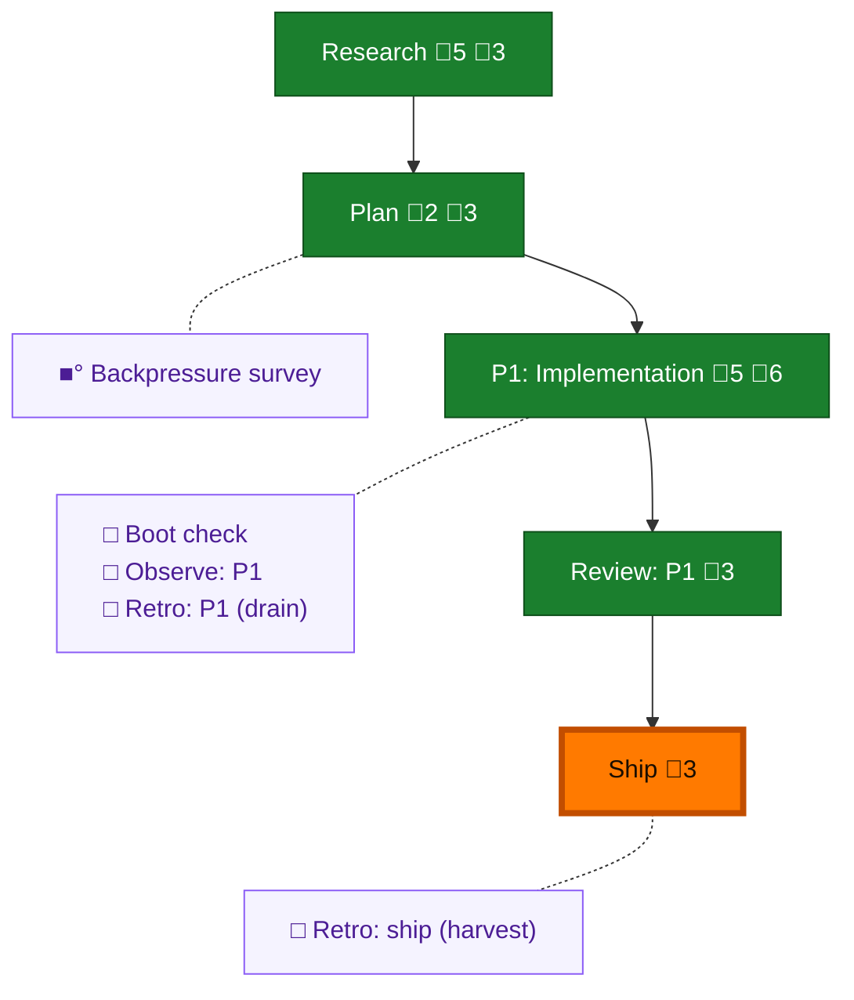

<!-- GENERATED by `harness flow render` — do not hand-edit; regenerate from the flow JSON. -->
# Flow · tmux-pane-smarts

**Kind**: flight-plan · **Now**: ship · **Intent**: Give pij live per-pane signal across all harnesses: busy bit, user-typed guard, connect/disconnect — via pipe-pane control-stream taps, no screen scrape · **Nodes**: 10 · **Events**: 36

**Rail**: ◆─◆─[ ◆─◆─◆ ]  ◆ Research · ◆ Plan · [ ◆ P1: Implementation · ◆ Review: P1 · ◆ Ship ]

**Legend** — colour = type/status: 🟩 done · 🟢 in-progress · 🟥 blocked · 🟦 known · ⬜ assumed · 🔶 decision · 🗣 user input · 🟪 harness chore (faded = not yet done) · 🤖 companion · 🛠 worker · 🟧 current (you are here). Badges: 💬 comments · 📄 artifacts · 📝 instructions · 🧰 chore (° optional / recommended / ‼ strongly-recommended; ✓ done · ✕ skipped).

## Node log

### research · Research
- `2026-07-19T08:49:36.389Z` · — · note — claude-code busy dialect confirmed: OSC 0 title reset 9-50/s w/ braille-spinner prefix; idle=churn-&gt;0. Tap parser scratchpad/pane_tap.py handles OSC 9;4 + OSC 0.
- `2026-07-19T08:54:44.699Z` · — · note — copilot SOLVED (gpt-5.6-luna): zero OSC 9;4, title set once. Busy = raw stream-flow density (full-frame TUI repaints); idle = 0 bytes/interval. Unifying insight: byte-density on pipe-pane stream is a near-universal busy bit (claude/copilot both fit). codex+pi still TODO.
- `2026-07-19T09:03:15.089Z` · — · note — codex SOLVED (gpt-5.6-luna): zero OSC 9;4 (even at turn start); animates OSC 0 title w/ braille spinner (like claude) AND full-TUI repaint (like copilot); idle=0 bytes. 3/3 CLI harnesses confirm idle=0-bytes unifier. Gotchas: codex update-nag blocks bind (dismiss via send-keys), npm latest tag is broken win32 alpha. Only pi left.
- `2026-07-19T09:10:49.749Z` · — · warning — MATRIX COMPLETE 4/4. KEY CORRECTION: pi emits ZERO OSC 9;4 under tmux (dove's brief hypothesis wrong for the tmux path). ALL 4 harnesses (claude/copilot/codex/pi) emit zero OSC 9;4 on pipe-pane. =&gt; stream-flow byte-density is the PRIMARY universal busy signal, not OSC 9;4. pi model-id must be provider-qualified: github-copilot/gpt-5.6-luna. Ready to plan.
- `2026-07-19T09:16:13.651Z` · — · note — USER-TYPED GUARD (signal #2) primitive PROVEN live: real per-keystroke events extractable from pipe-pane output (TUI echoes each key as a redraw burst). KEY = burst w/ echoed char + final caret ESC[row;colH; col increments per key; ENTER = caret col resets to base (+busy title churn begins). Reconstructed full typed string live. Detector: scratchpad/key_events.py (gate+queue: HOLD on KEY, release on ENTER or 60s idle). Test peer pij-closed-mockingbird (%1945) parked for resume. NOT yet run live-tested end-to-end (user stepped away).

### plan · Plan
- `2026-07-19T09:26:05.509Z` · agent · validation — validate-v2 via opus subagent: NEEDS ATTENTION (1H+1M) → both applied. Plan retargeted to pij daemon (SendBuffer/DaemonTmux), dossier provenance corrected. Plan READY.
- `2026-07-19T09:56:45.309Z` · user · decision — Scope clarified (Jordan): busy bit BUILT NOW but is a read-only exposed signal for a FUTURE UI — it does NOT gate delivery (pij may send to a busy agent). ONLY a human mid-type holds a send. Plan AC-06 + T005 + Goals updated. Reviewer independence (prime advisory): sol+terra both gpt-5.6/copilot = SAME-FAMILY FAIL → reviewer swapped to cross-provider claude/opus. Coder provenance UNKNOWN (pi doesn't surface runtime model) — declared. Build worktree: fresh s058-tmux-pane-smarts (NOT s057 — prime gating its merge).

### phase-1 · P1: Implementation
- `2026-07-19T10:10:04.064Z` · agent · decision — Scope grant to coder (T007): added docs/how/pij-pane-signals.md (new) + docs/domains/pij-control-plane/domain.md (append-only) to the allowlist — both in the plan's Domain Manifest. Coder correctly flagged the discrepancy before writing (bounded-scope discipline held).
- `2026-07-19T10:11:01.984Z` · agent · validation — Provenance UPGRADED (prime note): coder is copilot (observable harness) — scraped live footer = gpt-5.6-sol. Real provenance pinned, not UNKNOWN. Caveat: valid at scrape-instant (2026-07-19T10:xx); will re-scrape at review-dispatch for a tight reading.
- `2026-07-19T10:33:03.785Z` · agent · validation — Coder returned; claims VERIFIED by orchestrator (trust-but-verify): 83 targeted tests PASS (re-ran myself: FIFO-hold-on-Enter, 60s-idle-release, busy-empty-composer-immediate-delivery all green), typecheck clean, lint clean (9 pre-existing warnings). 6 npm-test failures confirmed UNRELATED (diff doesn't touch index.test/telegram; pre-existing 5s timeouts). NB: worktree had no node_modules (npm ci fails on repo --min-release-age config, plan 048) — symlinked canonical node_modules to run tests. Provenance re-scraped @review-dispatch = gpt-5.6-sol. Review DISPATCHED to cross-provider claude/opus pij-important-bradley w/ mandatory Dim-0 mutation gate.
- `2026-07-19T10:39:02.816Z` · agent · validation — REVIEW verdict (cross-provider claude/opus pij-important-bradley): APPROVE_WITH_NOTES. Dim-0 REAL (2 mutations both RED: neutered Enter-reset guard→4 fixtures+FIFO test RED; userTyping\|\|busy→3 busy-not-a-gate tests RED; restored 83/83). Orchestrator sanity-glance CONFIRMED both (isPaneHeld gates on userTyping only ✓; F1 perf real: drainPaneTap readFileSync reads whole ever-growing sink every tick). Findings: F1(Med,perf, daemon-tmux.ts:267) hot-path unbounded read → RECOMMEND FIX NOW; F2(Low, daemon.ts:350 rare markRead-throw dup); F3(Low, initial-hold-suppressed-while-busy, already in plan risk table). Invariants all hold.
- `2026-07-19T10:48:47.019Z` · user · decision — Jordan: fix F1 now, then ship. F1 fix packet dispatched to coder pij-intense-ape (positioned readSync in drainPaneTap). DEFERRED as accepted debt: F2 (Low, daemon.ts:350 rare markRead-throw dup-delivery) + F3 (Low, initial-hold-suppressed-while-busy — already in plan risk table). To be carried as follow-up, not blocking ship.

### backpressure · Backpressure survey
- `2026-07-19T09:43:17.918Z` · agent · validation — pre-coding backpressure survey run: Certainty=Partial, 0 RUN·5 EXTEND·0 BUILD·0 ABSENT (all EXTEND→RUN into existing vitest suite). Artifact backpressure-coverage.md. basis_sha256:ee14a0885649286b68cd5e517fa4eb791cc2286544b9e7c88c85ce55c3081b5e time:2026-07-19
