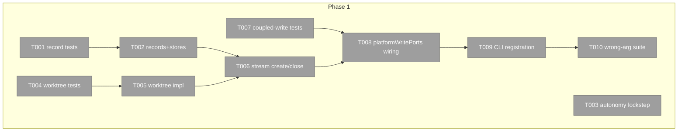
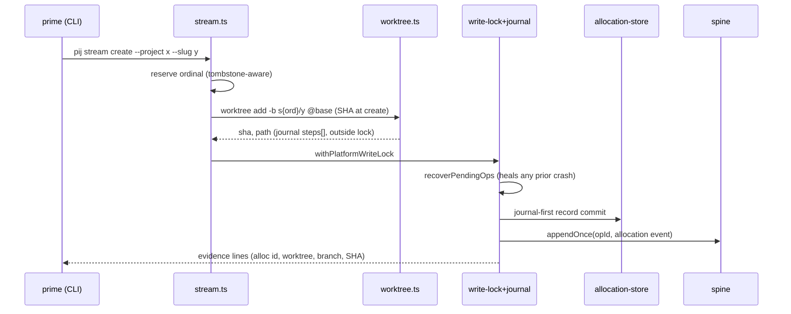

# Phase 1: Records + stream/fence verbs — Tasks

**Plan**: [../../team-scaffold-plan.md](../../team-scaffold-plan.md) (v1.1.1+manifest-fix)
**Phase**: 1 of 3 · **Created**: 2026-07-20 · **Mode**: Full, Hybrid TDD

## Executive Briefing

- **Purpose**: allocations and fences become attributed, crash-consistent store records, and stream stand-up becomes one evidenced transactional verb — replacing the 5+ hand-typed steps every prime repeats (with the observed stale-SHA bug class).
- **What We're Building**: `Allocation`/`Fence` record types + stores (`~/.pij/allocations/`, `~/.pij/fences/`), greenfield `core/worktree.ts` git mechanics, `core/stream.ts` transactional create/close, `Project.autonomy`, and four CLI verbs (`stream create/close`, `fence set/show`) — all writes riding the platform's hardened lock+op-journal coupled-write path.
- **Goals**: ✅ one evidenced verb for stream stand-up · ✅ base SHA resolved at create-time · ✅ "who owns path X" queryable · ✅ no exit-0 no-op path · ✅ crash between record write and spine append heals exactly-once
- **Non-Goals**: ❌ dispatch/ack/canary (P2/P3) · ❌ deps boot or /builder setup (PM's job, ruling 5) · ❌ spawn inside `stream create` (W-001 Q2) · ❌ fence enforcement (descriptive-sensor law) · ❌ `team scaffold` composition (v2)

## Pre-Implementation Check

| File | Exists? | Domain Check | Notes |
|------|---------|-------------|-------|
| `.pi/extensions/pij/core/platform/types.ts` | yes → modify | pij-orchestration ✓ | Allocation/Fence/autonomy; lockstep w/ guards |
| `.pi/extensions/pij/core/platform/project.ts` | yes → modify | pij-orchestration ✓ | `PROJECT_FIELD_ORDER` (F-11) |
| `.pi/extensions/pij/core/platform/journal.ts` | yes → modify | pij-orchestration ✓ | `recoverPendingOps` adjudication home (verified; plan manifest corrected — `adapters/op-journal.ts` is the store, consumed unchanged) |
| `.pi/extensions/pij/core/platform/allocation.ts` | no → create | pij-orchestration ✓ | canonical JSON + field order, project.ts as template |
| `.pi/extensions/pij/core/platform/fence.ts` | no → create | pij-orchestration ✓ | |
| `.pi/extensions/pij/adapters/allocation-store.ts` | no → create | pij-orchestration ✓ | subdir law header per store convention (F-06) |
| `.pi/extensions/pij/adapters/fence-store.ts` | no → create | pij-orchestration ✓ | |
| `.pi/extensions/pij/core/worktree.ts` | no → create | pij-orchestration ✓ | greenfield (F-05); execFile git, no shell |
| `.pi/extensions/pij/core/stream.ts` | no → create | pij-orchestration ✓ | |
| `.pi/extensions/pij/core/cli.ts` | yes → modify | pij-control-plane ✓ | three tables at :489/:510/:541; `platformWritePorts` at :1248; contract change — higher risk |
| `.pi/extensions/pij/cli.ts` | yes → modify | pij-control-plane ✓ | bin dispatch cases + generic `--help` filter at :3019 |

Duplication scan: no existing allocation/fence/worktree concepts in `docs/domains/*/domain.md` § Concepts (registry checked at plan time; `pij-orchestration` owns batons + primes only). Test convention: co-located `*.test.ts` (verified: `adapters/*-store.test.ts`, `core/platform/*.test.ts`, `platform-stores.contract.test.ts`).

## Architecture Map



## Tasks

| Status | ID | Task | Domain | Path(s) | Done When | Notes |
|--------|-----|------|--------|---------|-----------|-------|
| [x] | T001 | Tests: Allocation/Fence round-trip, canonical JSON + field order, `steps[]` journal append, guards (`isAllocation`/`isFence`), store subdir law, phantom-peer guard (`registry.list()` unaffected by `allocations/`+`fences/` dirs) | pij-orchestration | `.pi/extensions/pij/core/platform/allocation.test.ts`, `fence.test.ts`, `.pi/extensions/pij/adapters/allocation-store.test.ts`, `fence-store.test.ts` | red suite naming AC-01/03/08 behaviors; follows `project.test.ts`/`project-store.test.ts` shapes | plan 1.1; W-001 schemas; KF-02 |
| [x] | T002 | Implement `Allocation`/`Fence` types+guards (types.ts), canonicalizers + field order (allocation.ts, fence.ts), fs stores with subdir-law headers | pij-orchestration | types.ts, allocation.ts, fence.ts, allocation-store.ts, fence-store.ts | T001 green | plan 1.2; mirror project.ts/project-store.ts patterns |
| [x] | T003 | Tests+impl: `Project.autonomy?: "power-through"\|"gated"` — interface + `isProject` + `PROJECT_FIELD_ORDER` in one change | pij-orchestration | types.ts, project.ts, project.test.ts | AC-04: round-trip + existing canonicalization/spine byte-comparability tests green | plan 1.3; KF-06 three-place lockstep |
| [x] | T004 | Tests: worktree create/verify/safe-remove against real temp git repos — refusal matrix: existing dir, dirty tree, bad base ref, non-repo cwd, WIP-present remove | pij-orchestration | `.pi/extensions/pij/core/worktree.test.ts` | red suite; every refusal a named `E-*`, no exit-0 path | plan 1.4; KF-05 |
| [x] | T005 | `core/worktree.ts`: execFile git (no shell) — `worktree add -b`, base SHA resolved AT create, verify (branch/SHA/cwd), safe-remove (never with WIP); `gitCommonDir` interaction | pij-orchestration | worktree.ts | T004 green | plan 1.5; survey resolve-at-create rule |
| [x] | T006 | `core/stream.ts`: create/close orchestration — ordinal reserve (tombstone-aware), worktree steps, `steps[]` journal persist-before-mutate, resume-idempotent re-run (completed steps verified-then-skipped), close = stash+preserve/tombstone, never destructive | pij-orchestration | stream.ts, stream.test.ts | AC-01: journal/resume tests; failure at any step → named error, prior steps recorded, no spine-side effects yet | plan 1.6; W-001 transaction semantics |
| [x] | T007 | Tests: coupled-write discipline — crash-window replay (kill between record commit and spine append → next platform write's `recoverPendingOps` heals exactly-once via `appendOnce(opId)`); allocation/fence intent adjudication; **lock-scope test: lock held only across spine-emitting commits, never the git subprocess or intermediate `steps[]` appends** | pij-orchestration | journal.test.ts, stream.test.ts, `platform-stores.contract.test.ts` | red suite naming AC-11; existing recovery tests untouched | plan 1.9; KF-09; re-verify NEW-1 lock-scope pin |
| [x] | T008 | Wire stream/fence record+spine writes through `platformWritePorts` (`withPlatformWriteLock` → `recoverPendingOps` → `opJournal.record` → store write → `markCommitted` → `spineLog.appendOnce(opId)` → `clear`); extend `recoverPendingOps` adjudication to allocation/fence intents; thread new stores through ports at existing call sites | pij-orchestration | journal.ts, cli.ts (ports fn :1248), stream.ts | T007 green + ALL existing project/assignment recovery tests green | plan 1.9; KF-09; re-verify NEW-2 call-site fan-out |
| [x] | T009 | CLI registration: `stream`(create/close) + `fence`(set/show) in `FAMILY_SUBCOMMANDS`/`ALLOWED_FLAGS`/`MAX_POS` + parse cases + execute cases + bin dispatch; spine events attributed via `resolveActor`; evidence-line success output per verb; proposed event kinds `allocation`/`fence` as constants (names pending Jordan, W-001 Q1) | pij-control-plane | core/cli.ts, cli.ts | AC-03/09: verbs work end-to-end vs temp `PIJ_HOME`; `--help` served by generic filter; `fence show --path` answers ownership | plan 1.7; KF-07; F-09 |
| [x] | T010 | Wrong/missing-arg fail-loud suite for all four verbs (grant-class regression): unknown flags, missing required, bad combinations — each a named `E-*`, non-zero exit, nothing written | pij-control-plane | core/cli.test.ts (or family test file per convention) | AC-02 for phase-1 verbs; provably no exit-0 no-op path | plan 1.8; KF-01; H-01 |

## Context Brief

**Environment-first posture**: environment friction is work, not an apology — fix small/reversible things, otherwise `harness observe` it (execution-log Discoveries row as fallback); pay every hard wall forward.

**Key findings from plan**:
- KF-09 (Critical): ALL record+spine writes ride the lock+journal path — lock wraps ONLY spine-emitting commits, never subprocesses (T007/T008)
- KF-02 (Critical): store subdirs only; top-level `~/.pij` JSON mints phantom peers (T001 guard test)
- KF-01 (Critical): fail-loud is a per-verb contract — evidence line on success, named error on refusal (T009/T010)
- KF-05/06/07: worktree greenfield; three-place lockstep; platform parser only

**Domain dependencies**:
- `pij-orchestration`: baton/project store patterns (`adapters/project-store.ts`, `core/platform/project.ts`) — the templates for records
- `pij-orchestration`: `core/platform/journal.ts` (`recoverPendingOps`) + `adapters/op-journal.ts` + `adapters/platform-write-lock.ts` — the coupled-write law (consume, extend adjudication only)
- `pij-control-plane`: `core/cli.ts` three tables + `platformWritePorts` (:1248) + `resolveActor` (:1218)

**Domain constraints**: additive-only descriptor/record schemas (036 F-08); closed WS-6 state vocabularies (record states are separate); no second arg resolver (F-08); safety derived, never enforced.

**Reusable**: temp-`PIJ_HOME` fixture patterns from `project-store.test.ts` / `platform-stores.contract.test.ts`; temp-git-repo helpers if present in `adapters/git-repository.test.ts`.



## Discoveries & Learnings

_Populated during implementation by the implement verb._

| Date | Task | Type | Discovery | Resolution | References |
|------|------|------|-----------|------------|------------|
| 2026-07-20 | (tasking) | decision | `recoverPendingOps` lives in `core/platform/journal.ts`, not `adapters/op-journal.ts` (store) — plan manifest corrected at tasking | manifest row fixed | validator NEW-2 |
| 2026-07-20 | (fleet spawn) | insight | Live pij-blindness datum (Jordan-observed): coder acked its boot in-transcript, never ran the instructed `pij send` — prose reply-contract insufficient, compliance must be mechanical | evidence for P2 W-002 design (mandatory first-action ack + receipt); spawn-boot ack extension noted for P2 tasking | DL-001 + refinement capture |
| 2026-07-20 | T008 | decision | Uniform AC-11 recovery requires allocation/fence stores at the daemon runtime-axis gate; the original allowlist omitted that production caller | addendum 1 extended scope for mechanical `runtime-axis.ts` + `daemon.ts` store threading; optional recovery parameters rejected | `dlg-0001-addendum-1.md` |

```
docs/plans/061-team-scaffold/
  ├── team-scaffold-plan.md
  └── tasks/phase-1-records-stream-fence-verbs/
      ├── tasks.md
      └── execution.log.md   # created by the implement verb
```
