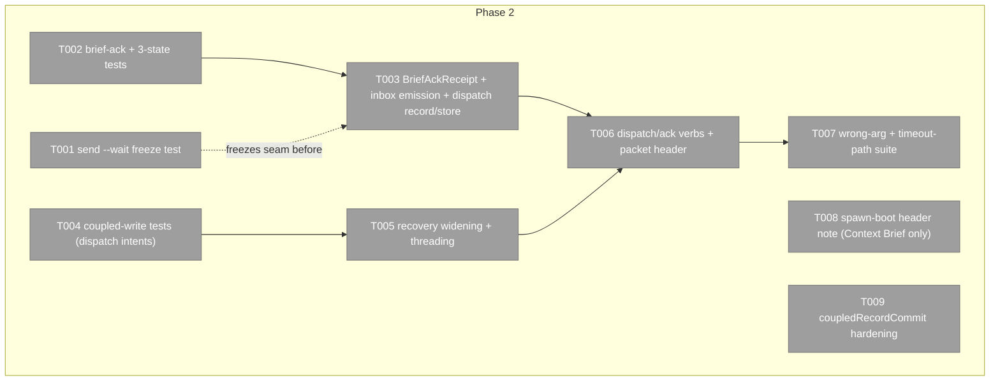
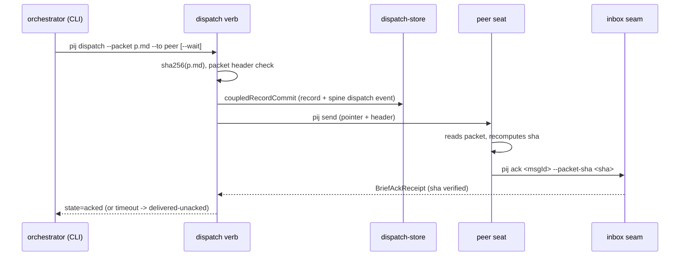

# Phase 2: Dispatch receipts — Tasks

**Plan**: [../../team-scaffold-plan.md](../../team-scaffold-plan.md) (v1.1.1+manifest-fix)
**Phase**: 2 of 3 · **Created**: 2026-07-20 · **Mode**: Full, Hybrid TDD

## Executive Briefing

- **Purpose**: brief delivery stops being memory and becomes a receipted, three-state artifact — `queued/delivered` → `delivered-unacked` → `acked` — so "did the packet land AND get engaged?" is a query, not a transcript tail. Fixes the coalface #1 ask (survey §5) and the live pij-blindness failure observed at s061's own fleet spawn (INS-001).
- **What We're Building**: additive `BriefAckReceipt` kind riding the shipped receipt seam (`inbox.ts:214`), `pij dispatch --packet [--wait]` + `pij ack` verbs, `~/.pij/dispatches/` store, spine `dispatch` events through the coupled-write path — with the shipped `send --wait` surface frozen by regression test FIRST.
- **Goals**: ✅ three distinguishable dispatch states, never conflated · ✅ ack proves parse + identity (packet sha recomputed from the file) · ✅ wrong-file ack refused loudly · ✅ `send --wait` byte-unchanged · ✅ dispatch writes crash-heal exactly-once
- **Non-Goals**: ❌ canary verb / anomaly classes (P3) · ❌ auto-ack by the harness (W-002 Q1: instructed first action in v1) · ❌ automating kickoff leg (c) comprehension ack (human-judgment layer stays) · ❌ receipt retention/GC beyond existing reap rules (W-002 Q2 rides them)

## Prior Phase Context (P1 review, 2026-07-20)

- **Deliverables**: Allocation/Fence records + stores, `WorktreeManager`, `stream.ts` transactional create/close, `stream/fence` verb families, `Project.autonomy` lockstep. All T001–T010 complete, no deferrals.
- **Dependencies exported for P2**:
  - `coupledRecordCommit(ports, event, label, writeRecord)` (`core/cli.ts:2280`) — THE shape for dispatch/ack commits.
  - `recoverPendingOps(journal, spineLog, projectStore, assignmentStore, allocationStore, fenceStore)` (`journal.ts:108`) — P2 widens again with `dispatchStore`.
  - `SPINE_KIND_ALLOCATION`/`SPINE_KIND_FENCE` (`types.ts:132-133`) — mint `SPINE_KIND_DISPATCH` alongside, same style (names still provisional pending Jordan, W-001 Q1).
  - `canonicalRecordLevel` helper (`project.ts:92`) + `*_FIELD_ORDER` pattern; `Fs*Store` port pattern for `dispatch-store.ts`.
  - `PlatformWritePorts` + `platformWritePorts(deps)` (`cli.ts:~1387/1397`) — extend with `dispatchStore` following the allocation/fence addition pattern.
- **Gotchas & debt**:
  - `coupledRecordCommit` ignores `markCommitted`'s `Result` (`cli.ts:2299`) — rev-0001 non-blocking finding, FIXED IN THIS PHASE (T009).
  - Signature widening fan-out is LAW: threading must reach `core/daemon/runtime-axis.ts` + `daemon.ts` + `acceptance-sweep.test.ts` fixtures — in the allowlist UP FRONT this time (P1 addenda 1+2 lesson, DL-004).
  - Lock scope: peer I/O / subprocess work happens OUTSIDE the lock; only record+spine commit inside.
  - T15 flaky class (daemon-activity/channel/daemon-push full-suite timeouts, green isolated) is tracked — never chase or touch.
  - CLI subprocess tests need explicit 15s timeout (default 5s too tight under load).
- **Patterns**: store subdir law + id regex + header comment; journal-first coupled write; three-table verb registration + evidence line; temp `PIJ_HOME` fixtures; 5-case wrong-arg matrix per verb.

## Pre-Implementation Check

| File | Exists? | Domain Check | Notes |
|------|---------|-------------|-------|
| `.pi/extensions/pij/core/message.ts` | yes → modify | pij-messaging ✓ | `BriefAckReceipt` additive kind; `ReceiptState` UNTOUCHED (shipped 3-value enum, F-04) |
| `.pi/extensions/pij/core/inbox.ts` | yes → modify | pij-messaging ✓ | emission at the `send-delivered-receipt` seam (:214); shipped consume path untouched |
| `.pi/extensions/pij/adapters/dispatch-store.ts` | no → create | pij-messaging ✓ | subdir law: `~/.pij/dispatches/<id>.json`; clone Fs*Store pattern |
| `.pi/extensions/pij/core/platform/types.ts` | yes → modify | pij-orchestration ✓ | `Dispatch` record + guard + `SPINE_KIND_DISPATCH`; lockstep |
| `.pi/extensions/pij/core/platform/dispatch.ts` | no → create | pij-orchestration ✓ | canonicalizer + `DISPATCH_FIELD_ORDER` |
| `.pi/extensions/pij/core/platform/journal.ts` | yes → modify | pij-orchestration ✓ | widen `recoverPendingOps` + dispatch intent adjudication |
| `.pi/extensions/pij/core/daemon/runtime-axis.ts` | yes → modify | pij-orchestration ✓ | mechanical threading ONLY (P1 addendum-1 precedent) |
| `.pi/extensions/pij/daemon.ts` | yes → modify | pij-orchestration ✓ | composition-root threading only |
| `.pi/extensions/pij/acceptance-sweep.test.ts` | yes → modify | — | fixture threading ONLY (P1 addendum-2 precedent) |
| `.pi/extensions/pij/core/cli.ts` | yes → modify | pij-control-plane ✓ | `dispatch`/`ack` in three tables + `coupledRecordCommit` hardening (T009) |
| `.pi/extensions/pij/cli.ts` | yes → modify | pij-control-plane ✓ | bin dispatch cases |

Duplication scan: no dispatch/ack/receipt-store concepts in `docs/domains/*/domain.md` § Concepts beyond the shipped delivery receipt (which stays untouched). Test convention: co-located `*.test.ts`.

## Architecture Map



## Tasks

| Status | ID | Task | Domain | Path(s) | Done When | Notes |
|--------|-----|------|--------|---------|-----------|-------|
| [x] | T001 | Regression test FREEZING current `send --wait` + `send-delivered-receipt` behavior exactly as shipped (passes on HEAD before any P2 code; named assertions on `ReceiptState` 3-value vocabulary + receipt shape) | pij-messaging | `core/inbox.test.ts` or `core/message.test.ts` per convention | test green on HEAD, committed BEFORE T003 lands; AC-06 | plan 2.1; guards the shipped seam |
| [x] | T002 | Tests: `BriefAckReceipt` emission at the inbox seam, sha-mismatch refusal (named `E-*`, receipt refused, no silent success), three dispatch states distinguishable (`queued/delivered` · `delivered-unacked` · `acked`) incl. `--wait` timeout → `delivered-unacked` | pij-messaging | `core/message.test.ts`, `core/inbox.test.ts`, `adapters/dispatch-store.test.ts` | red suite naming AC-05 behaviors | plan 2.2; W-002 contract |
| [x] | T003 | Implement: `BriefAckReceipt` kind in `message.ts` (additive; `ReceiptState` untouched), inbox emission, `Dispatch` record type + guard + `dispatch.ts` canonicalizer + `FsDispatchStore` (`~/.pij/dispatches/`, subdir law header) | pij-messaging | message.ts, inbox.ts, `core/platform/types.ts`, `core/platform/dispatch.ts`, `adapters/dispatch-store.ts` | T001 STILL green + T002 green | plan 2.3; store pattern from P1 |
| [x] | T004 | Tests: dispatch coupled-write — crash-window replay (kill between record commit and spine append → next platform write heals exactly-once), dispatch intent adjudication, lock-scope (lock never held across peer I/O) | pij-orchestration | `journal.test.ts`, `platform-stores.contract.test.ts` | red suite naming AC-11 for dispatch; existing recovery tests untouched | plan 2.4 (proof half); KF-09 |
| [x] | T005 | Widen `recoverPendingOps` with `dispatchStore` + adjudication; thread through ALL production callers (7× `core/cli.ts` via ports, `runtime-axis.ts`, `daemon.ts`) + acceptance-sweep/runtime-axis test fixtures (fixture threading only, never weaken assertions) | pij-orchestration | journal.ts, runtime-axis.ts, daemon.ts, cli.ts ports fn, acceptance-sweep.test.ts | T004 green + ALL existing recovery/acceptance tests green | P1 DL-004 lesson: fan-out in-allowlist up front |
| [x] | T006 | `pij dispatch <id> --packet <path> [--wait]` + `pij ack <dispatchId> --packet-sha <sha>` verbs: strict tables + parse/execute/bin cases, packet header contract (dispatch/packet id + sha + reply-with-ack block), CLI recomputes sha from file at ack, receipt resolves the actual transport messageId from the record, spine `SPINE_KIND_DISPATCH` events via `resolveActor` through `coupledRecordCommit`, evidence lines | pij-control-plane | core/cli.ts, cli.ts | AC-05/09: end-to-end vs temp `PIJ_HOME` — cooperating seat → acked w/ matching sha; non-cooperating → `delivered-unacked`; `--wait` resolves on ACK not delivery | plan 2.4; W-002 rulings 1+2 |
| [x] | T007 | Wrong/missing-arg fail-loud suite for `dispatch`/`ack` (5-case matrix per verb) + timeout-path tests proving `delivered-unacked` is never conflated with `acked` | pij-messaging | core/cli.test.ts (family convention) | AC-02/05 for P2 verbs; no exit-0 no-op path; nothing written on refusal | plan 2.5 |
| [x] | T008 | Document (Context Brief → execution log note): packet-header block is REUSABLE by spawn boot tasks (INS-001 evidence — mechanical ack extends to spawn in a later plan; NO code here) | — | execution.log.md note only | one Discoveries row citing INS-001 | scope guard: P3 skill layer cites it |
| [x] | T009 | Hardening (rev-0001 carried finding): surface `markCommitted`'s `Result` in `coupledRecordCommit` before `appendOnce` (named error per fail-loud contract) + test for the marker-persistence-failure path | pij-control-plane | core/cli.ts (:2299), matching test file | new test red→green; all existing coupled-write + recovery tests green | rev-0001-approval.md carry-forward |

## Context Brief

**Environment-first posture**: unchanged from P1 (fix small/reversible, `harness observe` the rest).

**Key findings**:
- KF-09 (Critical): dispatch/ack writes ride the SAME lock+journal path; peer I/O stays outside the lock (T004/T005/T006)
- F-04: `ReceiptState` has shipped consumers — additive receipt KIND, never a 4th enum value (T001 freeze proves it)
- KF-01: per-verb fail-loud — ack sha mismatch is a named refusal, `--wait` timeout leaves a distinguishable state (the shutdownType lesson)
- INS-001 (live, this stream): prose reply-contracts fail mechanically — the ack verb IS the fix; packet header instructs `pij ack` as first action (W-002 Q1)

**Domain dependencies**: `pij-messaging` owns message/inbox/dispatch-store; `pij-orchestration` owns record+journal; `pij-control-plane` owns verb tables + ports. Same templates as P1 (project/allocation stores, coupledRecordCommit).

**Domain constraints**: additive-only schemas (036 F-08); shipped delivery-receipt surface byte-unchanged (AC-06); closed state vocabularies — dispatch states are a NEW closed set on the Dispatch record, not an extension of `ReceiptState`.

**Reusable**: temp-`PIJ_HOME` fixtures; P1's store/canonicalizer/wrong-arg suites as line-for-line templates; 15s subprocess-test timeout budget.



## Discoveries & Learnings

_Populated during implementation by the implement verb._

| Date | Task | Type | Discovery | Resolution | References |
|------|------|------|-----------|------------|------------|
| 2026-07-20 | (tasking) | decision | Fan-out files (runtime-axis.ts, daemon.ts, acceptance-sweep fixtures) put in the P2 allowlist up front — P1 needed two mid-phase addenda for the same class | T005 scope pre-granted | P1 DL-004; addenda 1+2 |
| 2026-07-20 | (tasking) | decision | rev-0001 non-blocking finding (markCommitted Result ignored) scheduled as T009 rather than left to drift | hardening in-phase | rev-0001-approval.md |
| 2026-07-20 | fix-0002 | test-proof | The real-bin timeout test only matched a pre-wait `delivered-unacked` echo, so a false terminal-on-delivery mutation stayed green. | Assert the final timeout line and absence of `state=acked`; mutation red, restored code green. | rev-0002 required fix; AC-05 |
```

docs/plans/061-team-scaffold/
  └── tasks/phase-2-dispatch-receipts/
      ├── tasks.md
      └── execution.log.md   # created by the implement verb
```
