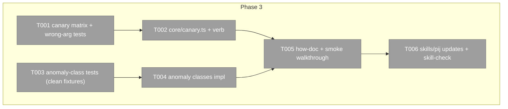

# Phase 3: Canary + derived safety + integration — Tasks

**Plan**: [../../team-scaffold-plan.md](../../team-scaffold-plan.md) (v1.1.1+manifest-fix)
**Phase**: 3 of 3 · **Created**: 2026-07-20 · **Mode**: Full, Hybrid TDD

## Executive Briefing

- **Purpose**: the kickoff ritual's mechanical legs become one verb (`pij canary` — nonce round-trip + identity/model compare), half-done team states become visible anomalies instead of silent decay, and the operator layer (how-doc + /pij skill) points at the shipped verbs so the next prime types commands instead of re-deriving ritual.
- **What We're Building**: `core/canary.ts` + `pij canary <id> [--expect-model <m>]`; derived anomaly classes `delivered-unacked-stale` + `allocation-half-open` surfaced by `pij anomalies`; `docs/how/pij-team-scaffold.md` with a doc-walkthrough smoke case; `skills/pij` kickoff/node-route updates.
- **Goals**: ✅ canary pass/refuse matrix mechanical (timeout/mismatch/UNPINNED all named refusals) · ✅ canary record written at pass time (pane+pid+native-id triple) · ✅ anomalies derived read-only, evidence-ref'd, 0 false positives on clean fixtures · ✅ doc commands run verbatim (smoke-proven) · ✅ `pij-skill-check` green
- **Non-Goals**: ❌ automating kickoff leg (c) comprehension (human judgment, survey law) · ❌ fence/anomaly ENFORCEMENT (derived-never-enforced, F-10/WS-6) · ❌ `team scaffold` composition verb (v2) · ❌ spawn-boot ack code (T008 header primitive recorded; a later plan consumes it)

## Prior Phase Context (P1+P2 reviews, 2026-07-20)

- **P2 deliverables P3 rides**: `Dispatch`/`DispatchState` (`undelivered|delivered-unacked|acked`) + `DispatchDeliveryState`; `FsDispatchStore.list()` (id-sorted, invalid files skipped — THE anomaly-scan entry point); `acknowledgeDispatch` (validates messageId+packetId+sha+seat, idempotent); `BriefAckReceipt.declaredRuntime` (`{model|"default", effort|"default", source:"self-report"}` from the acking seat's descriptor) — the model-compare key for canary leg (b); packet header block (`[pij dispatch <id>]` / `packet:` / `sha256:` / `ACKNOWLEDGE FIRST…`); `renderDispatchRecord`/`renderDispatchWaitTimeout` evidence-line helpers; `WAIT_TIMEOUT_MS=15_000`, `FOLLOW_MS=200` (reuse, don't mint).
- **P1 deliverables**: Allocation record with `steps[]` journal + `state` (anomaly `allocation-half-open` derives over it); `coupledRecordCommit` (canary record commit rides it); wrong-arg 5-case matrix template.
- **Gotchas**:
  - Zero-write refusal discipline: every refusal path writes NOTHING; anomaly detection is READ-ONLY over `list()` — never mutate on suspicion.
  - `waitDispatch`: only `state==="acked"` is terminal-success; T15 flaky class expected in full gates (never chase); crash-window: a record on disk always reflects a committed transition (T009 hardening).
  - Freeze-then-extend: pin current behavior red-proof-first before any code that reinterprets dispatch/allocation states.
- **Patterns (binding)**:
  - **Terminal-output test rule (rev-0002)**: real-bin tests assert the LAST stdout line via `stdout.trim().split(/\r?\n/).at(-1)` + `toBe(...)`, plus negative `not.toContain` for the forbidden state — never substring-only. Canary timeout/refusal tests inherit this.
  - Real-bin waits use explicit short overrides (`--wait=20`-style), 15s test timeout budget; three-table verb registration + evidence line; temp `PIJ_HOME` + temp-git fixtures.

## Pre-Implementation Check

| File | Exists? | Domain Check | Notes |
|------|---------|-------------|-------|
| `.pi/extensions/pij/core/canary.ts` | no → create | pij-control-plane ✓ | nonce ride on dispatch/send machinery; leg (a)+(b) only |
| `.pi/extensions/pij/core/canary.test.ts` | no → create | pij-control-plane ✓ | pass/refuse matrix + wrong-arg suite |
| `.pi/extensions/pij/core/platform/types.ts` | yes → modify | pij-orchestration ✓ | canary record type (additive) — spine kind: record as `dispatch` ref per W-001 D4 (NO new kind without Jordan) |
| `.pi/extensions/pij/core/anomalies.ts` | yes → modify | pij-orchestration ✓ | derived classes `delivered-unacked-stale`, `allocation-half-open` (F-10 pattern; read-only) |
| `.pi/extensions/pij/core/anomalies.test.ts` | yes → modify | pij-orchestration ✓ | clean-fixture zero-false-positive proof |
| `.pi/extensions/pij/core/cli.ts` + `cli.ts` | yes → modify | pij-control-plane ✓ | `canary` in three tables + parse/execute/bin |
| `docs/how/pij-team-scaffold.md` | no → create | pij-skill ✓ | verb family, worked stand-up, manifest template example |
| `harness/scripts/smoke.ts` | yes → modify | — | doc-walkthrough case: run the how-doc's commands vs scratch `PIJ_HOME` (backpressure AC-10 BUILD row) |
| `skills/pij/SKILL.md` + `skills/pij/references/**` | yes → modify | pij-skill ✓ | kickoff steps cite verbs; node route rows; `just pij-skill-check` green |

Duplication scan: existing `anomalies.ts` owns the derived-anomaly pattern (extend, don't fork); no existing canary concept in domains.

## Architecture Map



## Tasks

| Status | ID | Task | Domain | Path(s) | Done When | Notes |
|--------|-----|------|--------|---------|-----------|-------|
| [x] | T001 | Tests: canary pass/refuse matrix — nonce round-trip pass; nonce timeout (named refusal, never hangs — explicit short `--wait`-style override); identity mismatch (registry descriptor vs reply seat); model compare `--expect-model` vs `declaredRuntime` incl. UNPINNED honest-default (declared "default" + no pin = pass-with-caveat, named); busy-peer timeout = refusal not hang. PLUS 5-case wrong-arg suite. Real-bin tests follow the terminal-output rule | pij-control-plane | canary.test.ts, core/cli.test.ts | red suite naming AC-07 + AC-02 behaviors | plan 3.1; W-001 verb row; rev-0002 lesson |
| [x] | T002 | `core/canary.ts` + `pij canary <id> [--expect-model <m>]`: leg (a) nonce round-trip riding send/receipt machinery (reuse FOLLOW_MS cadence), leg (b) registry/descriptor identity + declared-vs-pinned compare; canary record written AT PASS TIME with pane+pid+native-id defensive triple (s051), committed via `coupledRecordCommit` with `dispatch`-kind ref (NO new spine kind); refusals zero-write; three-table registration + evidence line | pij-control-plane | canary.ts, core/cli.ts, cli.ts, types.ts | T001 green; AC-07 | plan 3.2; leg (c) OUT of scope |
| [x] | T003 | Tests: anomaly derivation — `delivered-unacked-stale` (dispatch record `delivered-unacked` older than threshold, evidence-ref to record+age) + `allocation-half-open` (allocation with incomplete `steps[]` journal past threshold); CLEAN fixtures produce ZERO anomalies (false-positive proof); read-only guarantee (store untouched after scan) | pij-orchestration | anomalies.test.ts | red suite; AC coverage per plan 3.3 | freeze-then-extend: pin current anomaly output on existing fixtures first |
| [x] | T004 | Implement both anomaly classes in the existing derived-anomaly pattern (evidence-ref'd, never enforced); `pij anomalies` surfaces them | pij-orchestration | anomalies.ts | T003 green; existing anomaly tests untouched | plan 3.3; F-10 |
| [x] | T005 | `docs/how/pij-team-scaffold.md`: verb family table, worked stream stand-up (create→fence→dispatch→ack→canary→close), manifest template example (workshop-001 JSON schema); + smoke case in `harness/scripts/smoke.ts` running the doc's commands verbatim against a scratch `PIJ_HOME`+temp git repo | pij-skill | docs/how/pij-team-scaffold.md, harness/scripts/smoke.ts | AC-10: `just smoke` green incl. new case; doc commands copy-paste-run | plan 3.4; backpressure BUILD row |
| [x] | T006 | `skills/pij` updates: kickoff steps 2/6/10/11 cite the shipped verbs (stream create/fence set/dispatch/canary); node route rows for new stores; keep prose thin — cite the how-doc | pij-skill | skills/pij/SKILL.md, skills/pij/references/** | AC-10: `just pij-skill-check` green; no broken links | plan 3.5; provisional names note (Jordan may rename kinds) |

## Context Brief

**Key findings**: KF-01 fail-loud (canary refusal matrix IS the product); F-10 derived-never-enforced; W-001 D4 — canary acts recorded as `dispatch`/`allocation` refs, NOT new spine kinds (names pending Jordan); s051 defensive triple (pane+pid+native-id) at pass time; survey law — leg (c) never automated.

**Carried lessons (binding)**: terminal-output test rule; zero-write refusals; freeze-then-extend; 15s subprocess budget + explicit short waits; T15 never chased.

**Domain constraints**: additive types only; `skills/pij` edits must keep router thin (progressive disclosure — cite, don't restate); smoke case must not depend on tmux (scratch `PIJ_HOME` + direct CLI only).

**Reusable**: P2's real-bin test harness (~cli.test.ts:4859+) as the canary real-bin template; anomalies.ts existing derivation scaffolding; workshop-001 manifest JSON schema for the doc example.

## Discoveries & Learnings

_Populated during implementation by the implement verb._

| Date | Task | Type | Discovery | Resolution | References |
|------|------|------|-----------|------------|------------|
| 2026-07-20 | (tasking) | decision | Canary records ride `dispatch`-kind spine refs — no new spine kind minted while W-001 Q1 names await Jordan | scope pinned in T002 | W-001 D4 |
| 2026-07-20 | T001 | question | The canary reply wire shape is not specified: a text nonce reply does not directly carry P2 `declaredRuntime`, while a durable pre-pass dispatch conflicts with zero-record-write refusal on timeout. | Persisted and asked the orchestrator to rule the responder command/wire shape and pass-time dispatch attachment before production canary code. | T001/T002; Context Brief; workshop 001 D4 |
| 2026-07-20 | T001 | decision | Canary uses the standard dispatch/ack wire: the nonce is packet content, sha verification proves leg (a), and the ack receipt's declared runtime proves leg (b). Timeout preserves a real `delivered-unacked` record; CanaryRecord is absent on every non-pass and attaches to the real acked dispatch only after all checks pass. | Implement one packet/ack protocol, a named timeout refusal, and pass-time coupled dispatch update with the defensive identity triple. | dlg-0003 addendum 1 |
| 2026-07-20 | fix-0003 | review fix | The packet writer SHA was not bound to the dispatch path's reread, so a replacement packet could be recorded and acknowledged under a canary nonce retained from earlier bytes. | Thread the writer SHA as internal dispatch metadata and reject `E-CANARY-PACKET` at the reread/commitment boundary before any dispatch record, spine event, or delivery. | rev-0003 required fix; fix-0003 |
```

docs/plans/061-team-scaffold/
  └── tasks/phase-3-canary-integration/
      ├── tasks.md
      └── execution.log.md   # created by the implement verb
```
