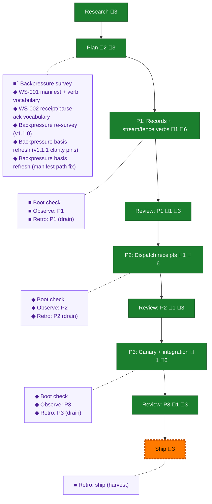

<!-- GENERATED by `harness flow render` — do not hand-edit; regenerate from the flow JSON. -->
# Flow · team-scaffold

**Kind**: flight-plan · **Now**: ship · **Next**: review-3 · **Intent**: Deterministic team scaffolding: human backlog item -&gt; prime intake -&gt; transactional team scaffold -&gt; /builder plan -&gt; pair-fleet build -&gt; PR; humans touched only at real gates · **Nodes**: 25 · **Events**: 80

**Rail**: ◆─◆─[ ◆─◆─◆─◆─◆─◆─◇ ]  ◆ Research · ◆ Plan · [ ◆ P1: Records + stream/fence verbs · ◆ Review: P1 · ◆ P2: Dispatch receipts · ◆ Review: P2 · ◆ P3: Canary + integration · ◆ Review: P3 · ◇ Ship ]

**Legend** — colour = type/status: 🟩 done · 🟢 in-progress · 🟥 blocked · 🟦 known · ⬜ assumed · 🔶 decision · 🗣 user input · 🟪 harness chore (faded = not yet done) · 🤖 companion · 🛠 worker · 🟧 current (you are here). Badges: 💬 comments · 📄 artifacts · 📝 instructions · 🧰 chore (° optional / recommended / ‼ strongly-recommended; ✓ done · ✕ skipped).

## Node log

### plan · Plan
- `2026-07-20T10:23:47.341Z` · agent · validation — cold Opus validate-v2 @17616953: NEEDS ATTENTION (1 HIGH coupled-write law, 1 MEDIUM canary wrong-arg); both folded -&gt; v1.1.0 @1aae1cad (KF-09, task 1.9, 2.4/3.1 amendments, AC-11); re-verify dispatched
- `2026-07-20T10:26:37.736Z` · agent · validation — re-verify @1aae1cad: V-01 CLOSED, V-02 CLOSED; NEW-1 MEDIUM lock-scope + NEW-2 LOW sizing folded as clarity pins -&gt; final sha 6f5496f13f43ac93997bbc06d96851b3e2bf5c65e52fb2f4f43a21b3530a9cfd. Plan validated; awaiting Jordan workshops+plan review (ratification gates: 4 Round-1 answers, W-01 selected decisions + event-kind names, W-02 selected, v1-scope non-goal)

### phase-1 · P1: Records + stream/fence verbs
- `2026-07-20T11:36:14.792Z` · agent · validation — P1 complete: dlg-0001 all T001-T010, 3156/3169 full suite (2 ruled T15 daemon-push flakes + 11 skips), typecheck/lint/acceptance green; coder pij-shy-justine (gpt-5.6-sol xhigh); evidence execution.log.md + flow-pair run 2026-07-20T10-37-07Z

### review-1 · Review: P1
- `2026-07-20T11:36:15.124Z` · agent · validation — rev-0001 APPROVE_WITH_NOTES by pij-atomic-troblum (gpt-5.6-terra xhigh, canary 4482-heron); Dim-0 real (2 mutations RED-GREEN-restore, revert verified byte-identical); orchestrator sanity pass held; non-blocking finding (markCommitted Result ignored, cli.ts:2299) carried to P2; records .flow-pair/runs/2026-07-20T10-37-07Z-github.com-AI-Substr/reviews/rev-0001-findings.md + rev-0001-approval.md

### backpressure · Backpressure survey
- `2026-07-20T10:15:23.975Z` · agent · validation — decision:route verdict:surveyed certainty:Partial counts:2RUN/10EXTEND/1BUILD/1ABSENT artifact:backpressure-coverage.md basis_sha256:17616953a71575ac558fd0dfd1a49ae10a315800d0813e66425e8a3ae9728412 time:2026-07-20T10:35:00Z

### boot-1 · Boot check
- `2026-07-20T10:48:18.120Z` · agent · validation — verdict:HEALTHY-at-base (session-entry boot: ready:true typecheck:0 test:0 @6cefddce-plan/8627aa0-base, pre-dispatch). Phase-edge re-run raced coder's in-flight TDD edits (exit 1, inconclusive by construction — red tests are correct mid-TDD); real router invocation + real boot attempt both made; coder's packet mandates its own gate before report. Ordering lesson captured as observation. time:2026-07-20T10:55:00Z

### observe-1 · Observe: P1
- `2026-07-20T11:34:03.352Z` · agent · validation — decision:done reason:real captures exist in .harness/temp/agent/session-buffer.md — DL-001 (boot reply-contract non-compliance), DL-002 (boot-before-dispatch ordering), DL-004 (allowlist missed production caller of widened signature), INS-001 (mechanical ack needed), CONF-001 (T15 family documented by signature not manifest) time:2026-07-20T11:59:00Z

### retro-1 · Retro: P1 (drain)
- `2026-07-20T11:35:58.782Z` · agent · validation — decision:done reason:real post-coding drain — 8 entries (6 agent + 2 pij-shy-justine buckets) materialized to .harness/records/retro/2026-07-20/001-061-team-scaffold-p1.md and 002-061-team-scaffold-p1-coder.md, buffer cleared; DL-001/INS-001/DL-002 disposition:plan routed to P2 tasking time:2026-07-20T11:36:00Z

### retro-ship · Retro: ship (harvest)
- `2026-07-20T13:29:26.357Z` · agent · validation — decision:done reason:real post-flight harvest — harness retro insights: 39 records/170 entries repo-wide, 142 open, s061 records 001-004 in top clusters; buffer 0; highest-leverage candidate = known-flake manifest (independently captured by orchestrator CONF-001 + coder DL-002, T15 discriminator manually re-run at 6 gates this stream); encode offer surfaced to Jordan at ship gate time:2026-07-20T13:30:00Z

### phase-2 · P2: Dispatch receipts
- `2026-07-20T12:28:53.506Z` · agent · validation — P2 complete: dlg-0002 T001-T009 + fix-0002; targeted 467/467; full suite T15-only reds across two attempts; typecheck/lint green

### review-2 · Review: P2
- `2026-07-20T12:28:53.810Z` · agent · validation — rev-0002 FIX_REQUIRED (vacuous --wait assertion) -&gt; fix-0002 (terminal-line pin, mutation-proof red/green) -&gt; rev-0002b APPROVE; Dim-0 real both rounds; sanity pass held; records reviews/rev-0002-findings.md + rev-0002-approval.md

### phase-3 · P3: Canary + integration
- `2026-07-20T13:25:02.811Z` · agent · validation — P3 complete: dlg-0003 T001-T006 + fix-0003 (E-CANARY-PACKET TOCTOU binding); focused 308/308; smoke 11-case + scratch walkthrough green; pij-skill-check green

### review-3 · Review: P3
- `2026-07-20T13:25:03.152Z` · agent · validation — rev-0003 FIX_REQUIRED (TOCTOU writer-sha unbound) -&gt; fix-0003 (commitment-point binding + zero-write fixture) -&gt; rev-0003b APPROVE; Dim-0 real; sanity pass held; records reviews/rev-0003-findings.md + rev-0003-approval.md

### boot-2 · Boot check
- `2026-07-20T11:42:37.231Z` · agent · validation — decision:done verdict:HEALTHY reason:real pre-flight router run — harness boot ready:true, typecheck ok + just test ok (full suite green at P1 commit 4597473, no T15 fire) time:2026-07-20T11:42:29Z

### observe-2 · Observe: P2
- `2026-07-20T12:28:53.086Z` · agent · validation — decision:done reason:2 real captures this phase (agent DL-001 observe path-scoping friction, INS-001 W-002 allocation-timing lesson) drained to .harness/records/retro/2026-07-20/003-061-team-scaffold-p2.md time:2026-07-20T12:28:30Z

### retro-2 · Retro: P2 (drain)
- `2026-07-20T12:28:53.305Z` · agent · validation — decision:done reason:real post-coding drain — 2 entries materialized to record 003, buffer cleared time:2026-07-20T12:28:30Z

### boot-3 · Boot check
- `2026-07-20T12:36:13.622Z` · agent · validation — decision:done verdict:HEALTHY-with-known-flake reason:real pre-flight run — typecheck ok; just test red ONLY in telegram/index + channel timeout class (T15); discriminator applied: both files isolated 34/34 green in 13.5s (contention-only, matches documented family signature; P2 commit fef9e2b base) time:2026-07-20T12:36:00Z

### observe-3 · Observe: P3
- `2026-07-20T13:25:02.369Z` · agent · validation — decision:done reason:real capture WIN-001 (Dim-0 cross-model value datum) drained to .harness/records/retro/2026-07-20/004-061-team-scaffold-p3.md time:2026-07-20T13:26:00Z

### retro-3 · Retro: P3 (drain)
- `2026-07-20T13:25:02.591Z` · agent · validation — decision:done reason:real post-coding drain — 1 entry to record 004, buffer cleared time:2026-07-20T13:26:00Z

### backpressure-1aae1cad9996 · Backpressure re-survey (v1.1.0)
- `2026-07-20T10:23:47.134Z` · agent · validation — decision:route verdict:re-surveyed certainty:Partial counts:2RUN/11EXTEND/1BUILD/1ABSENT delta:AC-11-coupled-write-row artifact:backpressure-coverage.md basis_sha256:1aae1cad9996a13a4a3b0662d527b5c7ed89e83c5c9812ee96f6087e7401be8d time:2026-07-20T10:50:00Z

### backpressure-6f5496f13f43 · Backpressure basis refresh (v1.1.1 clarity pins)
- `2026-07-20T10:26:37.515Z` · agent · validation — decision:route verdict:basis-refresh delta:clarity-only(lock-scope pin + cli.ts sizing note) proof-surface:unchanged counts:2RUN/11EXTEND/1BUILD/1ABSENT artifact:backpressure-coverage.md basis_sha256:6f5496f13f43ac93997bbc06d96851b3e2bf5c65e52fb2f4f43a21b3530a9cfd time:2026-07-20T11:05:00Z

### backpressure-6cefddcea384 · Backpressure basis refresh (manifest path fix)
- `2026-07-20T10:32:27.841Z` · agent · validation — decision:route verdict:basis-refresh delta:manifest-row-path-fix(journal.ts not op-journal.ts) proof-surface:unchanged counts:2RUN/11EXTEND/1BUILD/1ABSENT basis_sha256:6cefddcea38412aaa77a3647d74edd9b1120790932c22fa4b5269715c5c29c75 time:2026-07-20T11:30:00Z
