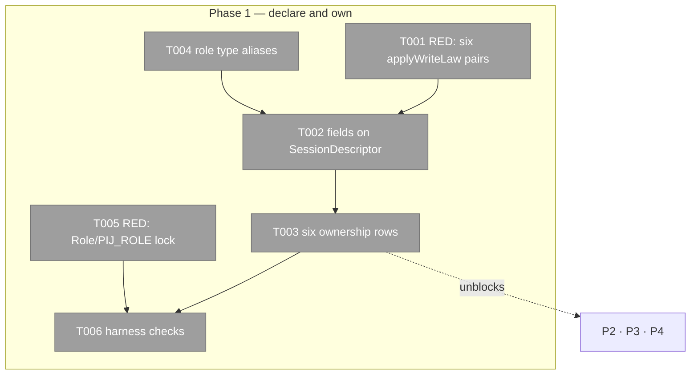

# Phase 1: Descriptor prerequisite (A-1) — Tasks

**Plan**: [../../pij-rail-v2-plan.md](../../pij-rail-v2-plan.md) (v1.0.0, gates G-A/G-B/G-C all PASS)
**Phase**: 1 of 9 · **Created**: 2026-07-29 · **Mode**: Full, TDD (RED-first, store layer)
**Worktree**: `pij-worktrees/s074-pij-rail-v2` · **Branch**: `s074/pij-rail-v2` · **Base**: `8a63c58`

## Executive Briefing

- **Purpose**: give every descriptor field this plan will later write a **declared owner before
  anything writes it**. This is amendment A-1 from `contract-review-001.md`, ruled by the o-prime
  to land as one prerequisite change ahead of items 1, 2 and 3.
- **What We're Building**: six optional fields on `SessionDescriptor`, six `"cli"` rows in
  `DESCRIPTOR_FIELD_OWNER`, the two orchestration-role type aliases, and the `applyWriteLaw` proof
  pairs that make the ownership claim testable rather than asserted.
- **This phase ships ZERO behaviour.** Nothing reads or writes these fields when it is done. That
  is the point: it is safe to land first, it cannot regress anything, and it removes the single
  failure mode that three later phases would otherwise each carry alone.
- **Goals**: ✅ six fields declared, all optional (migration-safe) · ✅ six ownership rows ·
  ✅ six `applyWriteLaw` pairs proving CLI-wins / daemon-restores · ✅ `Role` and `PIJ_ROLE`
  regression-locked against widening · ✅ `harness checks` green with zero failures
- **Non-Goals**: ❌ any writer of any new field (P2/P3/P4) · ❌ any projection onto `list`/`tree`/
  `node show` (P2/P3/P4) · ❌ the `interstitial` field, which is **daemon**-owned and lands in P9 ·
  ❌ touching `Role`/`PIJ_ROLE` semantics · ❌ any migration or backfill

## Why this phase exists (read before touching the table)

`core/registry-write.ts:9-11` records incident **#1** verbatim: *"the node-truth denorms
(`currentAssignment`/`currentTask`/`semanticState`) are CLI-stamped between the daemon's tick-start
snapshot and its persist, so a daemon write replayed them away."* The six fields this plan adds
are the **same class**, stamped by the **same function** (`denormDescriptor`), at the **same
moment**, on the **same object**.

The failure is silent by construction — `core/registry-write.ts:59-65`: omitting the declaration
*"is SILENTLY LOSSY FOR YOUR OWN [fields]: any contested field you are trying to SET is discarded
whenever disk already holds a value for it, with no error and no log line."*

WS-002 caught this for `orchestrationRole` and called it "incident-#1 class if omitted". WS-001 and
WS-003 did not (measured: 10 citations vs 0 vs 0). A-1 closes both.

## Pre-Implementation Check

| File | Exists? | Domain | Notes |
|---|---|---|---|
| `.pi/extensions/pij/core/types.ts` | yes → modify | pij-control-plane ✓ | `SessionDescriptor` fields around `:166-170`; convention "all optional ⇒ migration-safe" at `:229`; `Role` at `:11-12` — **do not widen** |
| `.pi/extensions/pij/core/registry-write.ts` | yes → modify | pij-control-plane ✓ | `DESCRIPTOR_FIELD_OWNER` at `:73-94`; `satisfies` clause at `:94` — **see F-02 below** |
| `.pi/extensions/pij/core/registry-write.test.ts` | yes → modify | pij-control-plane ✓ | the proof-pair template is at `:40-42`; co-located test convention |
| `.pi/extensions/pij/core/types.test.ts` | yes → modify | pij-control-plane ✓ | already pins `SEMANTIC_STATES`; add the executed `PIJ_ROLE` source lock here |
| `.pi/extensions/pij/core/orchestration/role.ts` | no → **create** (types only) | pij-orchestration ✓ | the two aliases only; `RoleService` is **P2**, not here |
| `.pi/extensions/pij/index.ts` | yes → **read only** | pij-control-plane ✓ | `:282-283` is the `PIJ_ROLE` narrowing the lock asserts; **do not edit** |

**Duplication scan**: no existing `stateNote`, `statusPrev/Next/At/Seq` or `orchestrationRole`
concept anywhere in the extension (repo-wide grep at plan time). `orchestrationRole` is distinct
from the existing `role?: Role` boot-wiring field and must never be conflated with it.

## The one structural fact that shapes every task (F-02)

```ts
// core/registry-write.ts:94
} as const satisfies Partial<Record<keyof SessionDescriptor, DescriptorWriter>>;
```

**An ownership row cannot compile before its descriptor field exists.** A-1 is therefore *not* a
one-line table edit — field and row are atomic, and the o-prime's ruling records this as forcing,
not merely preferable (spine 23224). Task order T004 → T002 → T003 is a **type-system constraint**,
not a style preference.

## Architecture Map



## Tasks

| Status | ID | Task | Domain | Path(s) | Done When | Notes |
|---|---|---|---|---|---|---|
| [x] | T001 | **RED**: one `applyWriteLaw` pair per new field — `stateNote`, `statusPrev`, `statusNext`, `statusAt`, `statusSeq`, `orchestrationRole`. Each pair asserts (a) with writer `"cli"` the proposed value **survives**, (b) with writer `"daemon"` the disk value is **restored** | pij-control-plane | `core/registry-write.test.ts` | 6 failing pairs naming AC-01 | Template verbatim at `:40-42` (`currentAssignment`). This is the "cheap experiment" WS-002 proposed; A-1 makes it mandatory |
| [x] | T002 | Declare the fields on `SessionDescriptor`, **all optional**: `stateNote?: { readonly text: string; readonly state: SemanticState; readonly at: string }`, `statusPrev?: string`, `statusNext?: string`, `statusAt?: string`, `statusSeq?: number`, `orchestrationRole?: StoredOrchestrationRole` | pij-control-plane | `core/types.ts` | typecheck green | **Must precede T003** (F-02). Convention at `:229` — all optional ⇒ migration-safe. Depends on T004 for the alias |
| [x] | T003 | Add the six rows to `DESCRIPTOR_FIELD_OWNER`, all `"cli"`, under one comment naming incident #1 and pointing at `:9-11` | pij-control-plane | `core/registry-write.ts:73-94` | T001 green | Group them; do not scatter. **This table has exactly one owner phase — no later phase edits it** |
| [x] | T004 | Define `StoredOrchestrationRole = "pm" \| "worker"` and `OrchestrationRole = "prime" \| StoredOrchestrationRole`, with the JC-2 D1-c docstring: stored ≠ projected, and **`"prime"` is NEVER stored** — prime-ness is `prime?: boolean`, owned by `PrimeService`, and the projections join the two | pij-orchestration | `core/orchestration/role.ts` (new, types only) | typecheck green | The docstring is load-bearing: it is what stops a later editor storing `"prime"` and creating a second source of truth against five live consumers |
| [x] | T005 | **RED + lock**: assert `Role` is still exactly `["parent","worker"]` and that the `PIJ_ROLE` narrowing at `index.ts:282-283` still discards any third word | pij-control-plane | `core/types.ts`, `core/types.test.ts` | compiled exact-union invariant plus executed source-contract test green | JC-2's decisive evidence: widening `Role` would **not** fail loudly — a `PIJ_ROLE=pm` seat boots with `role: undefined` and the defect surfaces as a PM that is never nudged |
| [x] | T006 | Run `just typecheck`, `just lint`, `just test`, and `harness checks` on the branch | — | all exit 0; full suite has 0 failed | AC-14. Phase 6 closed the former C1 baseline red, so no failure exception remains |

## Context Brief

**Environment-first posture**: environment friction is work, not an apology. Fix small and
reversible things; otherwise record it (`harness observe`, or the Discoveries table below).

**Key findings from plan**: F-01 (undeclared = silently lossy), **F-02 (satisfies ⇒ field+row
atomic)**, F-13 (the test template already exists).

**Domain constraints**:
- Additive, optional descriptor fields only — the migration-safe convention is the file's own.
- `orchestrationRole` stores the **partial** union; the total union is a *projection* concern and
  belongs to P2. Nothing in this phase projects anything.
- No writer, no reader, no CLI surface, no spine kind. If a task in this phase touches
  `core/cli.ts`, it has gone out of scope.

**Reusable**: `core/registry-write.test.ts` fixtures (`descriptor()` helper, `applyWriteLaw` call
shape); `core/types.test.ts` vocabulary-pinning style.

**Do not**: edit `index.ts`; widen `Role`; add `interstitial` (P9, and it is **daemon**-owned — the
one field in this plan the CLI must not own); touch `denormDescriptor`.

## Definition of Done

1. Six fields, six rows, six passing proof pairs.
2. `Role`/`PIJ_ROLE` locked.
3. `harness checks` green with zero failures.
4. **Zero behaviour change** — provable by the absence of any diff in `core/cli.ts`.
5. Checkpoint reported upward as a pointer with path + SHA + gate output + observations.

## Discoveries & Learnings

- The six RED tests all failed on the daemon-restores-disk assertion while the CLI-wins
  assertion passed, isolating the missing ownership rows rather than the new field shapes.
- Removing only `orchestrationRole: "cli"` turned its targeted AC-01 pair red
  (`Expected: "pm"`, `Received: "worker"`); restoring the row turned it green.
- Type-level assertions in `*.test.ts` are decorative in this repository because
  `tsconfig.json` excludes test files. The exact `Role` proof therefore lives in compiled
  `core/types.ts`; the executed `PIJ_ROLE` source-contract test remains in `core/types.test.ts`.
- The task file's original T006 exception was stale after Phase 6 repaired the C1 baseline.
  This phase follows the newer zero-failure ruling: 3,644 passed, 0 failed, 19 skipped after
  removing the decorative type-only Vitest case.
