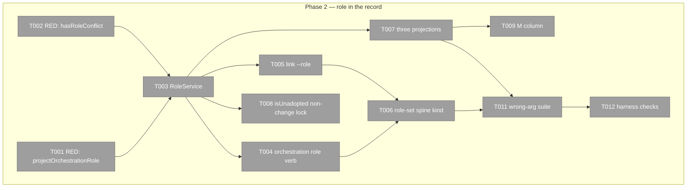

# Phase 2: Item 2 — orchestrationRole (JC-2) — Tasks

**Plan**: [../../pij-rail-v2-plan.md](../../pij-rail-v2-plan.md) (v1.0.0, gates G-A/G-B/G-C all PASS)
**Phase**: 2 of 9 · **Created**: 2026-07-29 · **Mode**: Full, TDD (RED-first, store layer)
**Worktree**: `pij-worktrees/s074-pij-rail-v2` · **Branch**: `s074/pij-rail-v2` · **Base**: `8a63c58`
**Depends on**: **phase 1** (the field and its ownership row). **Merge order**: 2 → 3 → 4.
**Contract**: WS-002 (`chainglass/docs/plans/090-pij-rail-v2/workshops/002-jc2-orchestration-role.md`) — **ratified as written, no amendment**. The workshop is authoritative; this file implements it and never restates it.

## Executive Briefing

- **Purpose**: make "is this seat a PM?" a **fact in the record** rather than a guess. The rail's
  whole promise rests on that one bit, and so does pij's own PM-keyed nudge (phase 5). One optional
  field pays twice, across two repos.
- **What We're Building**: `RoleService` (shaped verbatim on `PrimeService`), the
  `pij orchestration role set|unset` verb family, `pij link --role`, the `role-set` spine audit
  event, the total-union projection on three reads, the `role-conflict` anomaly, and the `M`
  column.
- **Goals**: ✅ store partial, project total · ✅ prime-ness keeps its single writer · ✅ a
  disagreement is **surfaced**, not silently resolved · ✅ zero per-row cost on every read CG polls
- **Non-Goals**: ❌ widening `Role`/`PIJ_ROLE` (provably unusable — `index.ts:282-283` silently
  narrows any third word) · ❌ any migration or backfill · ❌ `adopt --role` (reviewed and declined:
  `adopt` is self-declaration, `link --role` is designation by the governor) · ❌ a `pij role list`
  verb · ❌ an initial-role argument on spawn (Q-12, deferred) · ❌ inferring role from tree position,
  ever, on either side

## The hinge: store partial, project total (D1-c)

The descriptor stores `"pm" | "worker"`. Every JSON projection emits the **total** union
`"prime" | "pm" | "worker" | null`, computed once:

```ts
prime === true ? "prime" : (stored ?? null)
```

**Why not store the total union**: `prime?: boolean` has **five live consumers** — adoption
(`core/tree.ts:25-26`), revive resolution (`core/revive.ts:368-385`), the invariant guard
(`core/invariant-guard.ts:16-17`), prime discovery (`core/discovery.ts:106-107`), and render
(`core/cli.ts:2118`). A second writable source of prime-ness is a correctness bug, not a
redundancy: two fields can disagree and nothing arbitrates.

**Why not make consumers join it themselves**: that pushes derivation into every consumer
including chainglass, which AC-03 forbids on principle and which drifts the moment a fourth word
appears.

**Precedent is one line away from where the new line goes**: `renderSessionForestJson` already
spreads the node and then **re-stamps** `prime`/`oldPrime` on top (`core/cli.ts:4340-4344`).

## Pre-Implementation Check

| File | Exists? | Domain | Notes |
|---|---|---|---|
| `.pi/extensions/pij/core/orchestration/role.ts` | yes (types from P1) → **extend** | pij-orchestration ✓ | P1 left the two aliases; add `RoleService`, `projectOrchestrationRole`, `hasRoleConflict` |
| `.pi/extensions/pij/core/orchestration/prime.ts` | yes → **read as template**; modify only for T010 | pij-orchestration ✓ | `PrimeService` at `:13-38`; `update` at `:28-37` — copy its shape verbatim, including the `"cli"` declaration and its comment |
| `.pi/extensions/pij/core/orchestration/cli.ts` | yes → modify | pij-orchestration ✓ | `ORCHESTRATION_USAGE` at `:8-24`; `ParsedOrchestrationCommand` union; honour-system posture already stated at `:22` |
| `.pi/extensions/pij/core/cli.ts` | yes → modify | pij-control-plane ✓ | `list` row literal `:2061-2103` (stamp beside `:2083-2084`); human column `:2118`; `node show` card `:4139-4151`; tree spread + re-stamp `:4340-4344`; `link` write `:2238` and its audit append |
| `.pi/extensions/pij/core/anomalies.ts` | yes → modify | pij-control-plane ✓ | `role-conflict` class |
| `.pi/extensions/pij/core/platform/types.ts` | yes → modify | session-work-state ✓ | `role-set` kind on the `SPINE_KIND_NODE_LINKED` template at `:237-243` |
| `.pi/extensions/pij/core/tree.ts` | yes → **read only** | pij-orchestration ✓ | `isUnadopted` at `:25-26` — **explicit non-change**, see T008 |

## Architecture Map



## Tasks

| Status | ID | Task | Domain | Path(s) | Done When | Notes |
|---|---|---|---|---|---|---|
| [x] | T001 | **RED**: `projectOrchestrationRole(d)` — `prime === true` → `"prime"` (even with a stored role); stored role passes through; neither → `null`. **This is THE join; it is never duplicated in a consumer** | pij-orchestration | `core/orchestration/role.test.ts` | red naming AC-02 | Table-drive all four descriptor shapes |
| [x] | T002 | **RED**: `hasRoleConflict(d)` is true iff `prime === true` **and** `orchestrationRole !== undefined` | pij-orchestration | `core/orchestration/role.test.ts` | red | Deterministic precedence must not mean a silent disagreement — silent precedence is how two-source bugs stay invisible |
| [x] | T003 | `RoleService` over `RegistryPort`, shaped **verbatim** on `PrimeService` (`prime.ts:13-38`): `set(id, role)`, `unset(id)`, private `update` that re-reads, compares, and writes **declaring `"cli"`**. Carry across `prime.ts:30-32`'s comment about why the declaration is what makes the write land | pij-orchestration | `core/orchestration/role.ts` | T001/T002 green | Never write the descriptor directly from a verb; the service is the only writer |
| [x] | T004 | Verb family `pij orchestration role set [<id>] <pm\|worker> [--json]` and `role unset [<id>] [--json]`; `[<id>]` defaults to self exactly as `prime set` does; extend `ORCHESTRATION_USAGE` and `ParsedOrchestrationCommand` | pij-orchestration | `core/orchestration/cli.ts` | `--help` shows it; parse + execute cases wired | Same family, same honour-system posture already documented at `:22` |
| [x] | T005 | `pij link --role <pm\|worker>` — adopt and designate in **one call**, written **through `RoleService`**, inside the same guarded path `link` already uses for `parentId` (`core/cli.ts:2238`) | pij-control-plane | `core/cli.ts` | one call does both | Adoption is the instant the fact becomes known. This is also JC-2's migration vector (D5-d) — the population converges by use, never by script |
| [x] | T006 | `role-set` spine kind on the `SPINE_KIND_NODE_LINKED` template (`core/platform/types.ts:237-243`): uncoupled (descriptor is truth, event is history), appended under the platform write lock, attribution resolved **before** any write; `prev`/`next` carry the role words; **`unset` OMITS `next`** (string-typed, never null, exactly as a `--root` link does); a first designation omits `prev` | session-work-state | `core/platform/types.ts`, `core/cli.ts` | event appended on **change only** | "Who made this a PM, when" is a question that will be asked |
| [x] | T007 | The three projections, all emitting the **total** union with the key **always present** (`null` = unknown, mirroring `currentTask: d.currentTask ?? null`): (a) `list --json` row beside `prime`/`oldPrime` at `:2083-2084`; (b) `tree --json` — **re-stamp over the spread at `:4340-4344`, mandatory**; (c) `node show --json` card at `:4139` | pij-control-plane | `core/cli.ts` | all three carry it; **no join, no spine read, no per-row fan-out** | (b) is the trap: `const { children, ...raw } = node` spreads the **stored partial** form straight through unless re-stamped. (c) is hand-built and inherits nothing — and note it carries neither `prime` nor `oldPrime` today, a pre-existing gap this partly closes |
| [x] | T008 | **RED + lock (explicit non-change)**: `isUnadopted` still keys on `prime !== true` (`core/tree.ts:25-26`). Designating a seat `"pm"` must **not** move it out of the adoption sweep | pij-orchestration | `core/tree.test.ts` | regression test | If it keyed on the new field, designating a PM would silently orphan its subtree. Silent and structural — exactly the class that never gets found by hand |
| [x] | T009 | Human designation column grows one branch: `P` · `O` · **`M`** · blank. **Do NOT render `w`** | pij-control-plane | `core/cli.ts:2118` | 1-char column, unchanged width | `worker` is the common designation, so rendering it fills the column with noise **and** makes blank ambiguous between *worker* and *undesignated*, which is the exact distinction D4 exists to preserve. Blank keeps meaning **undesignated** |
| [x] | T010 | *(optional, OQ-D / Q-11)* `prime set/retire/unset` appends a `prime-set` spine event, closing the asymmetry: after this phase, role history is on the spine and prime history is not — and since `prime` **outranks** the stored role, the spine would carry a full history of the *losing* input and none of the winning one | pij-orchestration | `core/orchestration/prime.ts`, `core/platform/types.ts` | history exists for the winning designation too | CG consumes neither event; purely a pij-side consistency call. Cheap here because `RoleService` solves the same problem |
| [x] | T010b | **Compiled exactness invariant for the role aliases** (P1 re-review, LOW — read this BEFORE writing the `RoleService` tests). `StoredOrchestrationRole` does constrain `SessionDescriptor.orchestrationRole`, so a typed write cannot store `"prime"` — the P1 declaration is more than a docstring. But **nothing stops a later editor widening the alias itself** to include `"prime"`, and at that moment the whole store-partial/project-total design silently collapses into the two-source-of-truth bug D1 exists to prevent. Add `Assert<Exact<…>>` invariants beside both aliases, using P1's exported-invariant pattern | pij-orchestration | widening `StoredOrchestrationRole` to add `"prime"` **fails `just typecheck`**; narrowing either alias also fails | Use the **exported** form: Biome's `lint/correctness/noUnusedVariables` is enabled and flags a private unused type alias; `tsconfig` does not set `noUnusedLocals`, so Biome is the controlling policy. **A type proof in a `*.test.ts` is decorative here** — `tsconfig` excludes them |
| [x] | T011 | Wrong/missing-arg fail-loud suite for every new path: unknown role word (must name the two-word vocabulary), missing role, unknown flag, bad `--role` value on `link` — each a named `E-*`, non-zero, **nothing written** | pij-orchestration | family test file | AC-02; provably no exit-0 no-op path | grant-class regression precedent |
| [x] | T012 | `harness checks` on the branch | — | **exit 0 with ZERO failures** | AC-14. **No baseline exception exists.** Phase 6 closed the C1 red (commit `244c78f`), so any red is this phase's. Do not grant yourself an exception that a shipped phase already removed |

## Context Brief

**Key findings from plan**: F-11 (the column is a 1-char ternary — Q-13 is free), F-12 (`list` rows
are a hand-built literal and the denorm is a pure field read; N × `node show` was measured at 179
rows ≈ 80s, which is why no projection here may add a join).

**Domain constraints**:
- `orchestrationRole` is **CLI-owned** — its `DESCRIPTOR_FIELD_OWNER` row landed in **phase 1**.
  **Do not edit that table in this phase.** One phase owns it.
- `Role`/`PIJ_ROLE` are untouched and P1 locked them. If a task here reaches `index.ts`, it is out
  of scope.
- Absence is the state. **No backfill of any kind.** Backfilling `"worker"` manufactures a fact;
  backfilling `"pm"` for tree-lead seats is the forbidden tree-position inference done once and
  *persisted*, which is worse than inferring live because it launders a guess into the record.

**Day-one expectation, so it is not read as a bug**: shipped with no designations made, **6 seats
project `prime`, ~232 project `null`, zero PMs, zero nudges.** That is the contract behaving
correctly. Population converges through sweep-adopt (phase 7) + `link --role`.

**Reusable**: `PrimeService` + its tests as the verbatim service template; the `node-linked` append
site as the audit-event template; `currentTask: d.currentTask ?? null` as the row-absence idiom.

## Definition of Done

1. Role readable on all three JSON reads, total union, key always present.
2. Prime-ness still has exactly one writer, and a conflict raises an anomaly rather than being
   absorbed.
3. `isUnadopted` provably unchanged.
4. `harness checks` green with **zero failures** — the baseline red was closed by phase 6; there is no exception to claim.
5. Reported upward as a pointer with path + SHA + gate output + observations.

## Discoveries & Learnings

- A new pij capability must enroll across distributed governance surfaces:
  descriptor ownership, raw-write governance, and the production CLI composition root.
  The flow-pair packet named implementation paths but omitted composition/enrollment
  paths, requiring bounded scope corrections after deterministic inspection.
- Type-only alias proofs remain compiled-source obligations. The stored-role widening
  and projected-role narrowing mutations both failed `just typecheck` as intended.
