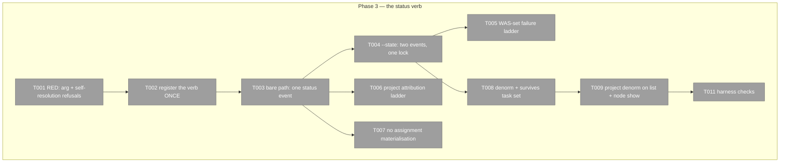

# Phase 3: Item 1 — the `report` family + `report now` (JC-1) — Tasks

**Plan**: [../../pij-rail-v2-plan.md](../../pij-rail-v2-plan.md) (v1.0.0, gates G-A/G-B/G-C all PASS)
**Phase**: 3 of 9 · **Created**: 2026-07-29 · **Mode**: Full, TDD (RED-first)
**Worktree**: `pij-worktrees/s074-pij-rail-v2` · **Branch**: `s074/pij-rail-v2` · **Base**: `8a63c58`
**Depends on**: **phase 1** (the `statusPrev/Next/At/Seq` fields and their ownership rows). **Merge order**: 2 → 3 → 4.
**Contract**: WS-001, **as amended** — it now carries A-1 and A-2 verbatim and the corrected E-26. The workshop is authoritative; this file implements it and never restates it.

## Executive Briefing

- **Purpose**: a PM records *what I just did* and *what's next* in **one call**, and the record is
  honest about exactly what landed when something fails halfway.
- **What We're Building**: the `report` family; the move of state writes from
  `state set|clear|verify` to `report state|clear|verify`; `report now`; the spine
  `kind:"status"` event; the two-events-under-one-lock composition for `--state`;
  the WAS-set failure ladder; and the `statusPrev/Next/At/Seq` denorm that pij's
  **own** watchdog consumes (not chainglass).
- **Goals**: ✅ one call, one line of output, zero syntax recall · ✅ never partially state-set ·
  ✅ every partial failure names exactly what landed · ✅ a status is never attributed to a guessed
  seat
- **Non-Goals**: ❌ CG-facing read paths (they drain the spine; we add no endpoint) · ❌ a role gate
  on the write (OQ-7 answered: **allow it**) · ❌ materialising an assignment from the status leg ·
  ❌ consuming the denorm from chainglass · ❌ any spine rotation

## The two things most likely to be got wrong

**1 — Do NOT merge the two events.** With `--state`, this writes **two** spine events, in the ruled
order `state-set` → `status`, under **one** `withPlatformWriteLock`, correlated by a
`state-set:<seq>` ref on the status event. Merging is not a simplification, it is a **break of a
shipped consumer**: s055's watchdog consumes `state-set` by **exact kind name**, so a state change
hidden inside a `status` event becomes invisible to code already in production.

**2 — Self-resolution is a refusal, not a fallback.** `report now`, `report state`, and
`report clear` take **no `<node>` positional**; the peer is the calling seat.
`report verify <node>` keeps its supervisory target. If the calling seat can only be
*asserted* rather than *resolved*, **refuse with `E-NOID`**. A claim attributed to a
guessed seat renders under the wrong name, and **there is no way to detect it after the fact**.

## Pre-Implementation Check

| File | Exists? | Domain | Notes |
|---|---|---|---|
| `.pi/extensions/pij/core/cli.ts` | yes → modify | pij-control-plane ✓ | flag allowlist `:695-705`; `MAX_POS` `:707`; the `state-set` coupled write `:3817-3910` is the **template to copy**, lock at `:3823`; WAS-set framing `:3874`, `:3885`, `:3893`; success line `:3911`; `denormDescriptor` `:2775-2803`; `list` row `:2061-2103`; `node show` card `:4139-4151` |
| `.pi/extensions/pij/core/platform/types.ts` | yes → modify | session-work-state ✓ | add the `status` kind constant beside the existing `SPINE_KIND_*` list |
| `.pi/extensions/pij/core/platform/spine.ts` | yes → **read only** | session-work-state ✓ | `buildSpineEvent` already accepts and emits `prev`/`next`, omitting them when undefined |
| `.pi/extensions/pij/core/registry-write.ts` | yes → **DO NOT TOUCH** | pij-control-plane ✓ | the four ownership rows landed in **phase 1**. One phase owns this table |

**Duplication scan**: `"kind":"status"` is genuinely unclaimed — **0 occurrences in 22,664 live
spine lines** (measured 2026-07-29). The verb name is free at the top level in **both** parsers.

## Verb ruling — `report` family

Jordan ruled the surface in-pane on 2026-07-29. `state set|clear|verify` are
unshipped and move to `report state|clear|verify`; `state <id>` remains the
read-only state card. The family is registered through the core parser's family,
flag, arity, parse/execute tables and the control-plane `USAGE` block.

## Architecture Map

## Tasks

| Status | ID | Task | Domain | Path(s) | Done When | Notes |
|---|---|---|---|---|---|---|
| [x] | T001 | **RED**: exactly 2 required positionals, both non-empty after trim; whitespace collapsed **before** the length check; >280 chars → `E-ARG` naming the limit; unknown `--state` word → `E-ARG` naming the **whole** 8-word vocabulary; **unresolvable self → `E-NOID`** | pij-control-plane | `core/cli.test.ts` | red naming AC-03/AC-04 | Guard template at `:1336-1337`. Collapse-then-measure matters: the 280 limit is measured on what is actually stored |
| [x] | T002 | Register the **`report` family**, including its control-plane `USAGE` block | pij-control-plane | `core/cli.ts`, `cli.ts` | `pij report --help` prints only the family | The usage enrollment prevents silent fallback to the entire help document |
| [x] | T002b | Move `state set|clear|verify` to `report state|clear|verify`; keep `state <id>` as a read | pij-control-plane | `core/cli.ts`, tests | old write spellings gone; state card remains | Jordan authorised unshipping the old spellings |
| [x] | T002c | Make `report now|state|clear` first-person and keep `report verify <node>` supervisory | pij-control-plane | `core/cli.ts`, tests | asserted-only caller refuses `E-NOID` | Every writer resolves to a registry-backed descriptor |
| [x] | T003 | Bare path: append one spine `kind:"status"` event on the existing envelope. `refs` = `node:<seat>` + `assignment:<id>` when current + `project:<slug>` when attributed. **Never `state:<word>`** | session-work-state | `core/cli.ts`, `core/platform/types.ts` | JC-1's worked example reproduced field-for-field | One fact, one carrier: `state-set` already refs `state:<word>`, and duplicating it double-counts for anyone tallying transitions |
| [x] | T004 | `--state` path: **two events, one `withPlatformWriteLock`, order `state-set` → `status`**, correlated by a `state-set:<seq>` ref on the status event | pij-control-plane | `core/cli.ts` | both events present, order asserted, single lock asserted | Copy the coupled-write template at `:3817-3910` (lock `:3823`). The journalled leg must be the one that can fail **before** an irreversible unjournalled append. Correlate by **ref, not adjacency** — adjacency holds today but nothing promises it |
| [x] | T005 | Failure ladder, reusing the existing WAS-set framing verbatim in style: state-set leg fails → **no status attempted**; status append fails after state-set → name what landed; denorm fails → the record is truth, the denorm is a cache | pij-control-plane | `core/cli.ts` | AC-05; one test per rung | House style at `:3874`, `:3885`, `:3893`. **Exit 0 must mean both events landed**; any non-zero must name exactly what did |
| [x] | T006 | Project attribution ladder: `--project` → current assignment's `projectSlug` → **omitted**. Never `""`, never `null` | pij-control-plane | `core/cli.ts` | "no project" is a designed case | The implicit *general* assignment is materialised with no `projectSlug` at all, so this is the common path, not a failure |
| [x] | T007 | **RED + impl**: the status leg **never** materialises a general assignment. Only the `--state` leg does, exactly as today | pij-control-plane | `core/cli.test.ts` | recording what you did creates no record you did not ask for | D-13 |
| [x] | T008 | Denorm `statusPrev/Next/At/Seq` through `denormDescriptor`, **and assert they SURVIVE a `task set`** | pij-control-plane | `core/cli.ts`, test | regression test green | **A-6**: opposite lifetime to `stateNote`. If a status cleared on an assignment swap, phase 5's clock would reset on every task change and the never-reported-PM problem would recur silently. If phase 4 has already landed, extend its policy comment rather than writing a second one |
| [x] | T009 | Project the denorm into `list --json` and the `node show` card | pij-control-plane | `core/cli.ts:2093-2094`, `:4139-4151` | pure field read — **no join, no spine read, no fan-out** | Consumer is pij's **own** watchdog (phase 5). CG registers it known-but-unconsumed |
| [x] | T010 | One-line confirmation shaped after `report state`; `--json` emits the stamped status event verbatim | pij-control-plane | `core/cli.ts` | one line, both modes | Token economics: no `--json` needed on the normal path |
| [x] | T011 | `harness checks` on the branch | — | **exit 0 with ZERO failures** | AC-14. Phase 6 **has landed** (`244c78f`) and closed the C1 baseline red. The conditional in this row is now resolved: there is no exception, and any red is this phase's |

## Context Brief

**Key findings from plan**: F-07 (`denormDescriptor` has exactly three call sites, so the blast
radius is knowable), F-08 (the spine is permanent — no rotation, so no backfill work exists),
F-12 (`list` rows are a hand-built literal; the denorm must stay a pure field read).

**Domain constraints**:
- **Do not touch `DESCRIPTOR_FIELD_OWNER`** — phase 1 owns it.
- No new read surface for chainglass. It drains the spine; we add nothing for it.
- The spine is append-only and irreversible: **never silently truncate**. A half-question or a
  half-status that survives reads like a complete, different one.
- OQ-7 is answered: **a non-PM may write a status.** A role gate would refuse every seat on the
  machine on day one, because JC-2 ships with no designations by design.

**Reusable**: the `state-set` coupled write as the structural template; the WAS-set message family;
`buildSpineEvent`'s `prev`/`next` handling.

## Definition of Done

1. One call writes one event, or two in the ruled order under one lock.
2. Exit 0 ⇒ everything landed. Non-zero ⇒ the message names exactly what landed.
3. The denorm survives a `task set`, proved by test.
4. The verb name appears only at its registration sites.
5. `harness checks` green at **zero failures**; there is no baseline exception to claim.

## Discoveries & Learnings

- Jordan's in-pane ruling superseded the original bare-verb task shape: this phase
  ships the `report` family and unships the state-write spellings.
- `PIJ_SESSION_ID` is compatible assertion elsewhere, not proof of a registered
  reporting seat; report writers require a descriptor-backed self.
- Report descriptors must be re-read after the platform lock is acquired. A
  pre-lock current-assignment snapshot can be superseded while waiting and must
  never steer or restore an obsolete assignment.
- Removed-capability migration uses a caller grep, then the prescriptive/descriptive
  test: text that tells someone what to run migrates; text recording what was run
  remains historical.
- Vitest treats a `-t` pattern beginning with `--` as a CLI option. Mutation probes
  should filter on a non-option substring.
