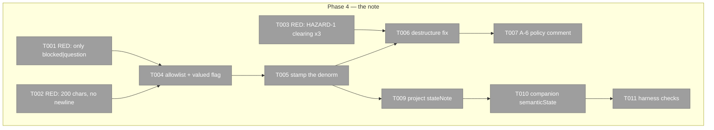

# Phase 4: Item 3 — `--note` on `state set` (JC-3) — Tasks

**Plan**: [../../pij-rail-v2-plan.md](../../pij-rail-v2-plan.md) (v1.0.0, gates G-A/G-B/G-C all PASS)
**Phase**: 4 of 9 · **Created**: 2026-07-29 · **Mode**: Full, TDD (RED-first)
**Worktree**: `pij-worktrees/s074-pij-rail-v2` · **Branch**: `s074/pij-rail-v2` · **Base**: `8a63c58`
**Depends on**: **phase 1** (the `stateNote` field + ownership row). **Merge order**: 2 → 3 → 4 — this phase merges **last**.
**Contract**: WS-003, **as amended** (it now carries A-1). Authoritative; this file implements it and never restates it.

## Executive Briefing

- **Purpose**: a seat's question to the human travels as **text**, not just a kind — and it stops
  being true on exactly the transitions that end it.
- **What We're Building**: `--note` on `state set`, the `stateNote{text,state,at}` denorm, the
  **HAZARD-1** destructure fix, the A-6 policy comment, and the `semanticState` companion
  projection.
- **Goals**: ✅ one call carries state and reason · ✅ a note never outlives the state word it was
  written for · ✅ over-limit is refused, never truncated · ✅ zero new reads for chainglass
- **Non-Goals**: ❌ `--note` on `hold` or any of the other five words · ❌ the daemon-detected
  interstitial path (P9) · ❌ CG-side render concerns · ❌ authoring `note` onto the `Assignment`
  record (optional in the contract; **not** taken in this plan)

## Surface — THREE shapes, ruled by Jordan 2026-07-29 (supersedes `--note on state set` below)

This file predates the `report`-family ruling. Wherever it says "`--note` on `state set`", read:

| # | Shape | Note allowed? |
|---|---|---|
| 1 | `pij report question "<text>"` · `pij report blocked "<text>"` | text is the **positional** — the standalone ask |
| 2 | `pij report now "<did>" "<next>" --state question\|blocked --note "<text>"` | **yes**, and **only** for those two words — `E-ARG` naming both otherwise |
| 3 | `pij report state <word>` | **never**, for any word |

**Why both 1 and 2 exist**: different speech acts — *"I need an answer"* versus *"here is my
progress, and I am stuck on you"*. Same records written either way, so it is two doors into one
room, not two rooms.

**Shape 3 is where OPEN-4 is enforced STRUCTURALLY**: there is no `report hold "<text>"` to type and
no `--note` on `report state` to reach for. A rule you cannot express beats a rule you must
remember.

**Validation is shared** — ≤200 chars, no newlines, refuse over-limit rather than truncate —
whichever door the text arrives through.

## HAZARD-1 is the reason this phase is dangerous

`denormDescriptor` clears stale state with a destructure of a **single named field**:

```ts
// core/cli.ts:2789
const { semanticState: _stale, ...rest } = latest;
```

A `stateNote` not added there **survives `state clear` and survives an assignment swap**. The
symptom is the worst one this feature has: **an answered question pinned at the top of the human's
rail indefinitely.** It is silent on this side and loud on chainglass's.

Write the clearing tests (T003) **before** the stamp (T005). If you stamp first, the phase looks
finished and the hazard ships.

## A-6 — this function will hold two opposite lifetimes

After phases 3 and 4, one function carries two field families with **opposite** clearing policies:

| Family | On `state clear` / `task set` | Mechanism |
|---|---|---|
| `semanticState`, `stateNote` | **clear** | named in the destructure |
| `statusPrev/Next/At/Seq` (P3) | **survive** | fall through in `...rest` |

Today that works by accident of omission. T007 makes it a stated policy so the next editor must
**choose** rather than inherit — and P3 may have written that comment already; extend it, do not
write a second one.

## Pre-Implementation Check

| File | Exists? | Domain | Notes |
|---|---|---|---|
| `.pi/extensions/pij/core/cli.ts` | yes → modify | pij-control-plane ✓ | `state set` allowlist `:699`; vocabulary guard `:1336-1337`; **HAZARD-1 destructure `:2789`**; `writeExact` rationale comment `:2790-2793`; state-set denorm call `:3897-3901`; `task set` denorm `:3803`; `state clear` denorm `:4000`; `list` row `:2091-2103`; `node show` card `:4146` |
| `.pi/extensions/pij/core/platform/assignment.ts` | yes → **comment only** | session-work-state ✓ | `closeAssignment` at `:84` — see T008 |
| `.pi/extensions/pij/core/registry-write.ts` | yes → **DO NOT TOUCH** | pij-control-plane ✓ | `stateNote: "cli"` landed in **phase 1** |

## Architecture Map



## Tasks

| Status | ID | Task | Domain | Path(s) | Done When | Notes |
|---|---|---|---|---|---|---|
| [ ] | T001 | **RED**: `--note` accepted **only** with `blocked` or `question`. Table-drive **all eight** words: two accept, six refuse with `E-ARG` naming both permitted words | pij-control-plane | `core/cli.test.ts` | 8 cases | **OPEN-4 answered NO for `hold`.** Permitting it opens the argument for `waiting`/`ready` next, and at that point the note is a per-seat status field — reintroducing per-worker periodic status through a side door, without the 280-char discipline or the spine event the real one gets |
| [ ] | T002 | **RED**: >200 chars → `E-ARG` naming the limit; any newline → `E-ARG`; `--note` with no value → `E-ARG` | pij-control-plane | `core/cli.test.ts` | red naming AC-04 | **Never truncate.** A half-question that survives ("Should I raise MAX_CHANNELS from 20 to") reads like a complete, different question |
| [ ] | T003 | **RED — HAZARD-1, write these BEFORE T005.** After `state set question --note "…"`, assert `stateNote` is **absent** following each of: `state clear`, `state set <other-word>` with no note, and `task set` | pij-control-plane | `core/cli.test.ts` | 3 red tests | The failure these prevent is invisible here and loud on the rail. **Mutation bar**: removing `stateNote` from the destructure must turn these red |
| [ ] | T004 | Add `"note"` to the `state set` allowlist; **valued flag, NOT in `BOOLEAN_FLAGS`** (as `--refs` is not); `flags.note === true` → `E-ARG` | pij-control-plane | `core/cli.ts:699` | T001/T002 green | The comment at `:696-697` already explains the valued-flag convention in place |
| [ ] | T005 | Stamp `stateNote: { text, state: cmd.state, at: isoNow }` in the state-set denorm | pij-control-plane | `core/cli.ts:3897-3901` | stamped on the descriptor | Nested object, `state` typed `SemanticState` — the shape P1 declared |
| [ ] | T006 | **Add `stateNote` to the stale-clearing destructure** | pij-control-plane | `core/cli.ts:2789` | T003 green | HAZARD-1. One line, and the whole phase's risk sits on it |
| [ ] | T007 | **(A-6)** State the per-field clearing policy in the comment beside the destructure: `semanticState`/`stateNote` **clear** on swap; `statusPrev/Next/At/Seq` **survive**. **If phase 3 already wrote this comment, EXTEND it — do not write a second one** | pij-control-plane | `core/cli.ts:2790-2793` | the next editor must choose, not inherit | Encode, don't document: the rule lives where the edit happens |
| [ ] | T008 | **(OPEN-1 forward obligation)** Comment at `core/platform/assignment.ts:84` recording that `closeAssignment` has **no caller** today, and that whoever adds one inherits the clearing decision for all three field families | session-work-state | `core/platform/assignment.ts` | comment present | F-09. OPEN-1 needed no producer change *because the transition does not exist* — that fact has to live where the caller will be added, not in a plan nobody rereads |
| [ ] | T009 | Project `stateNote` on `list --json` rows and the `node show` card | pij-control-plane | `core/cli.ts:2091-2103`, `:4146` | pure field read — no join, no fan-out | |
| [ ] | T010 | **Companion ask**: project `semanticState` on `list --json` rows | pij-control-plane | `core/cli.ts:2091-2103` | closes a pre-existing consumer gap | `node show` already projects it at `:4146`; `list` does not. CG's supersede guard needs it, and it costs exactly what the three denorms beside it cost |
| [ ] | T011 | `harness checks` on the branch | — | **exit 0 with ZERO failures** | AC-14. Phase 6 closed the C1 baseline red; **no exception exists** and any red is this phase's |

## Context Brief

**Key findings from plan**: F-06 (the destructure names exactly one field), F-07 (`denormDescriptor`
has exactly three call sites, so the blast radius is knowable), F-09 (`closeAssignment` has no
caller).

**Domain constraints**:
- **Do not touch `DESCRIPTOR_FIELD_OWNER`** — phase 1 owns it.
- This phase **merges last** of 2/3/4. Expect to rebase on both; the shared surfaces are the
  `list` row literal and `denormDescriptor`.
- **In this repo, a type-level assertion inside a `*.test.ts` is DECORATIVE** — `tsconfig.json`
  excludes `**/*.test.ts`, so `tsc` never compiles it and vitest erases it. Learned the hard way in
  phase 1 (a `Role` exact-union lock that let `Role | "pm"` through a green typecheck). If you need
  a type proof, it must live in compiled code.

**Reusable**: the vocabulary-guard template at `:1336-1337`; `currentTask: d.currentTask ?? null`
as the row-absence idiom.

## Definition of Done

1. `--note` accepted for exactly two words, refused for six, over-limit refused not truncated.
2. The note does not survive `state clear`, a differing `state set`, or a `task set` — proved by
   test, and provable by mutation of the destructure.
3. The clearing policy is stated where the edit happens.
4. `harness checks` green at **zero failures**.

## Discoveries & Learnings

_(append during execution)_
