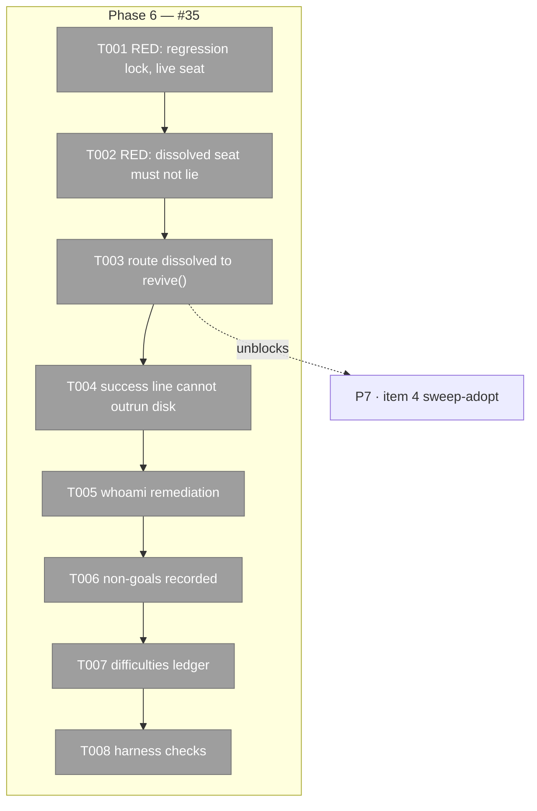

# Phase 6: #35 — adopt writes what it reports — Tasks

**Plan**: [../../pij-rail-v2-plan.md](../../pij-rail-v2-plan.md) (v1.0.0, gates G-A/G-B/G-C all PASS)
**Phase**: 6 of 9 · **Created**: 2026-07-29 · **Mode**: Full, TDD (RED-first, regression-locked)
**Worktree**: `pij-worktrees/s074-pij-rail-v2` · **Branch**: `s074/pij-rail-v2` · **Base**: `8a63c58`
**Depends on**: nothing. **Blocks**: phase 7 (item 4, sweep-adopt). **The first thing the fleet can start.**

## Executive Briefing

- **Purpose**: `pij adopt` on a dissolved seat prints `adopted <id> … (pane %N, bound)` and
  **persists zero bytes**. It is the verb `whoami`'s own remediation text prescribes, and every
  restart-killed seat is dissolved — so **the documented recovery path is closed for exactly the
  class it serves, silently.** This phase closes it.
- **Why it is in this plan at all**: item 4 (sweep-adopt) notifies a prime about unadopted seats
  and has it adopt them. The unadopted population *is* the dissolved population. A sweep built on
  today's `adopt` would report success and change nothing, at scale, for every seat it touched.
  **#35 is not a nice-to-have ahead of item 4; item 4 is unshippable without it.**
- **Goals**: ✅ no path prints "bound" without a persisted binding · ✅ the dissolved case either
  writes or refuses with a named error · ✅ `whoami`'s remediation names a path that works ·
  ✅ the working path is regression-locked before anything moves
- **Non-Goals**: ❌ #37 (`CLAUDE_CONFIG_DIR` unhonoured) · ❌ #36(b) (hardlink the transcript into
  the seat data dir) · ❌ releasing leech's symlink or roadrunner's two hardlinks · ❌ any change to
  `adopt`'s identity model or to `revive`'s resolution logic

## The mechanism, pinned in this worktree (not inherited prose)

The defect is a **signature asymmetry**, and that is sharper than "the write is guarded":

```ts
// core/ports.ts:67,72,74
write(descriptor: SessionDescriptor, writer?: DescriptorWriter): void;   // ← returns NOTHING
writeExact(descriptor: SessionDescriptor): void;                          // ← returns NOTHING
revive(descriptor: SessionDescriptor): Result<void>;                      // ← returns a Result
```

```ts
// adapters/fs-registry.ts:205-211 — inside write()
if (
    existing?.lifecycle === "dissolved" &&
    descriptor.lifecycle !== undefined &&
    descriptor.lifecycle !== "dissolved"
) {
    return;            // ← silent. No error, no Result, no log line.
}
```

So: the tombstone guard is **correct** — a dissolved record must not be resurrected by a merging
write. What is wrong is that `write()` returns `void`, so **the caller is structurally incapable of
noticing the refusal.** `revive()` exists precisely for this case and returns a `Result<void>`, and
`adopt` calls **neither** it nor `writeExact`.

Then the success line reports the caller's *intent* as the system's *state*:

```ts
// cli.ts:2925
`adopted ${pijId} ↔ ${harness} session ${finalHarnessSessionId} (pane ${pane}, bound) — …`
```

`pane` is interpolated **from the request**, and the word "bound" is gated on
`finalHarnessSessionId` — a value read off the descriptor the verb has just failed to write. Every
token in that line is true about what was asked for and false about what happened.

**Design consequence for this phase**: the fix is *not* "make `adopt` handle dissolved". It is
"route the dissolved case through the verb that reports" and "make the success line unable to claim
what disk does not say". Do not add a third write path.

## Pre-Implementation Check

| File | Exists? | Domain | Notes |
|---|---|---|---|
| `.pi/extensions/pij/cli.ts` | yes → modify | pij-control-plane ✓ | `runAdopt` at `:2527`; success lines at `:2925` (bound) and `:2929` (pending — **note this branch already exists and is honest**) |
| `.pi/extensions/pij/adapters/fs-registry.ts` | yes → **read only** | pij-control-plane ✓ | guard `:205-211`, `revive` `:228`. **The guard is correct; do not weaken it** |
| `.pi/extensions/pij/core/ports.ts` | yes → **read only** | pij-control-plane ✓ | `:67/:72/:74` — the signature asymmetry above |
| `.pi/extensions/pij/cli.integration.test.ts` | yes → modify | pij-control-plane ✓ | integration home for adopt; its stale C1 prerequisite expectation was repaired in fix round `fix-0001` |
| `docs/difficulties.md` | yes → modify | — | #35 resolution, mechanism not symptom |

**Duplication scan**: `revive` already exists as both a port method (`ports.ts:74`) and a CLI verb
(`pij revive`, control-plane `runRevive`). This phase adds **no** new verb and **no** new write
path — it routes an existing case to an existing guarded method.

## Architecture Map



## Tasks

| Status | ID | Task | Domain | Path(s) | Done When | Notes |
|---|---|---|---|---|---|---|
| [x] | T001 | **Regression lock, FIRST — this is the first code the stream ships.** Pin `adopt`'s current behaviour on a **live, non-dissolved** descriptor: the binding persists, `whoami` names the seat, `phonehome` reports `(bound)`, the pane is recorded. Also pin the existing honest `(pane %N, pending)` branch at `cli.ts:2929` | pij-control-plane | `cli.integration.test.ts` | green **before** any production edit | **The o-prime's ruling: this RED is the proof the fix is real.** A green T002 against an unmoved T001 is the entire claim. Without T001 the fix is indistinguishable from breaking the working path |
| [x] | T002 | **RED**: `adopt` against a **dissolved** descriptor must not print `(pane %N, bound)`. Assert the outcome is one of exactly two honest states: (a) the binding is persisted and a fresh `registry.read` proves it, or (b) a **named non-zero error** that names the remediation which actually works. Assert stdout never contains "bound" when disk holds no binding | pij-control-plane | `cli.integration.test.ts` | red, naming AC-10 | Today: prints success, writes zero bytes, exit 0. The test must fail on the *current* code for the *right* reason — check the failure message before proceeding |
| [x] | T003 | Route the dissolved case through **`RegistryPort.revive`** (`core/ports.ts:74`), the guarded verb that exists for exactly this and returns a `Result<void>`. **Do not weaken the tombstone guard at `fs-registry.ts:205-211`** and **do not add a third write path** | pij-control-plane | `cli.ts` (`runAdopt`, from `:2527`) | T002 green, T001 still green | The guard is correct — a merging write must never resurrect a tombstone. The bug is that `write()` returns `void` so the caller cannot see the refusal |
| [x] | T004 | Make the success line unable to outrun disk: the word "bound" and the pane must both come from **the descriptor as persisted**, re-read after the write — never from the request object | pij-control-plane | `cli.ts:2925` | no code path can print a binding it did not persist | Today `pane` is interpolated from the request and "bound" is gated on a value read off a descriptor the verb just failed to write |
| [x] | T005 | Correct `whoami`'s remediation text, which currently prescribes `adopt` — the verb broken for this exact class. Point at the path that works | pij-control-plane | `cli.ts` (whoami remediation) | remediation is executable and succeeds | *The documented recovery path being closed for the class it serves* is the whole defect; leaving the text is leaving half the bug |
| [x] | T006 | **Record the non-goals in code comments, not just here**: this fix does **not** clear #37 or #36(b), and does **not** release leech's symlink or roadrunner's two hardlinks. Those wait on a different fix, and the obligation to tell the holders sits with the o-prime | pij-control-plane | `cli.ts` (comment at the revive routing) | comment present and specific | Three live workarounds across two repos, one root cause. If a fix ships and nobody tells the holders, three workarounds silently become permanent infrastructure |
| [x] | T007 | `docs/difficulties.md` — mark #35 resolved with the **mechanism** (`write()` returns `void`, so the silent tombstone-guard refusal at `fs-registry.ts:205-211` is undetectable by the caller; `revive()` returns `Result<void>` and was never called), not the symptom | — | ledger entry names the signature asymmetry | Repo doctrine: encode the lesson, don't restate the incident |
| [x] | T008 | `harness checks` on the branch; fix round repairs the independently stale routing-doc expectations | — | exact full-suite acceptance: 3,637 passed, 0 failed, 19 skipped | AC-14. The old `top-level help and skill guidance distinguish pull from push delivery` red was traced to independent doc change `13818b9`; fixing its first failed assertion exposed the same suffix drift in the next routing assertion |

## Context Brief

**Environment-first posture**: environment friction is work, not an apology. Fix small and
reversible things; otherwise record it.

**Key findings from plan**: F-14 (`adopt` calls neither `revive` nor `writeExact`), and the
signature asymmetry above, verified in this worktree.

**Domain constraints**:
- The dissolved-tombstone guard is **load-bearing and correct**. Incident #5 (`releaseIdentity`)
  was a `writeAtomic` that bypassed exactly this guard and resurrected a tombstone as an
  unreconcilable `pending` zombie. Do not repeat it.
- No new verb, no new write path, no change to `revive`'s resolution logic.
- `adopt` is **self**-declaration (a seat registering its own pane). It is not governance
  reparenting. Nothing in this phase gives it a `--role`.

**Reusable**: existing `cli.integration.test.ts` temp-`PIJ_HOME` fixtures; the `pending` branch at
`cli.ts:2929` is the house style for an honest partial outcome — mirror its framing.

**Live severity, so this is not treated as cosmetic**: the inherited handover records
`pij-exclusive-whitefish` — transcript present on disk at 1,902,167 bytes, descriptor dissolved,
and the shipped verb refusing it. That is a human waiting on a seat's context, not a backlog item.
(#35 alone does not recover whitefish — that is #37 — but it is the same family of *the verb lied
about what it did*.)

## Definition of Done

1. T001 green and **unmoved** by every later task — the working path did not shift.
2. No code path prints a binding it did not persist.
3. `whoami` prescribes a remediation that works.
4. Non-goals recorded in code, so the three live workarounds are not assumed released.
5. `harness checks` green with the exact full-suite acceptance count: 3,637 passed, 0 failed,
   19 skipped.
6. Reported upward as a pointer with path + SHA + gate output + observations.

## Discoveries & Learnings

- T002 failed on the unmodified production path with exit 0, stdout claiming
  `(pane %74, bound)`, and the fresh registry read still holding a dissolved
  descriptor on `%73`. That exact mismatch is now the regression assertion.
- A revived adopt must also strip the prior incarnation's terminal/runtime
  metadata before `revive()`. Otherwise the binding persists but remains
  mechanically dead because `terminal` and `systemState: "dead"` survive.
- The first `harness checks` smoke sensor timed out while cloning the already
  configured `pi-askuserquestion` package. A direct `just smoke` retry passed all
  scenarios, and the second full inventory passed every sensor except the named
  pre-existing help-text assertion.
- Fix round `fix-0001` extracted the post-write check into
  `verifyPersistedAdoptDescriptor` and directly proved all three rejection reasons:
  missing descriptor, still-dissolved descriptor, and persisted pane mismatch. T002
  uses soft assertions so all three reasons are checked without changing the suite's
  exact test count.
- The strip-list is intentionally future-durable: unknown fields survive revival.
  Phase 1's `statusPrev`, `statusNext`, `statusAt`, `statusSeq`, and
  `orchestrationRole` survive; `stateNote` also survives and clears only on assignment
  or explicit state clear.
- Fix round `fix-0001` repaired the independently stale C1 prerequisite expectations
  introduced by routing-doc commit `13818b9`. The first full run then exposed the
  same parent-carry suffix drift in the next routing assertion, demonstrating how
  one standing failure had masked another in the same test.
