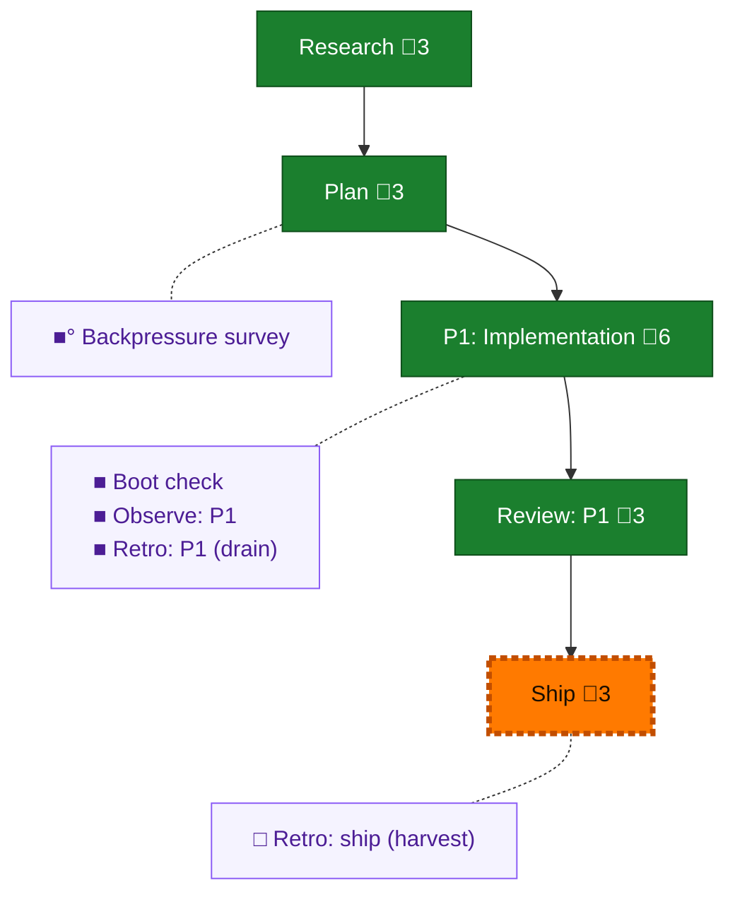

<!-- GENERATED by `harness flow render` — do not hand-edit; regenerate from the flow JSON. -->
# Flow · pij-chore-primitive

**Kind**: flight-plan · **Now**: ship · **Intent**: pij chore: first-class change-detector + durable duty roster for PA seats — extensible, with fleet/repo/seat scoped chores · **Nodes**: 10 · **Events**: 21

**Rail**: ◆─◆─[ ◆─◆─◇ ]  ◆ Research · ◆ Plan · [ ◆ P1: Implementation · ◆ Review: P1 · ◇ Ship ]

**Legend** — colour = type/status: 🟩 done · 🟢 in-progress · 🟥 blocked · 🟦 known · ⬜ assumed · 🔶 decision · 🗣 user input · 🟪 harness chore (faded = not yet done) · 🤖 companion · 🛠 worker · 🟧 current (you are here). Badges: 💬 comments · 📄 artifacts · 📝 instructions · 🧰 chore (° optional / recommended / ‼ strongly-recommended; ✓ done · ✕ skipped).

## Node log

### backpressure · Backpressure survey
- `2026-08-02T01:04:06.172Z` · agent · validation — decision:completed verdict:Partial counts:14 RUN · 2 EXTEND · 0 BUILD · 0 ABSENT next-move:propose the extensions first artifact:docs/plans/076-pij-chore-primitive/backpressure-coverage.md time:2026-08-02T01:05:00Z basis_sha256:d0e02d2ea9c63de3dba7f4e974dd215a3401bdf3321ef601eb08bf93ee9411e8
- `2026-08-02T01:05:06.488Z` · agent · validation — re-selection: plan bytes changed after the survey (its own two recommendations folded in as T015/T016 + AC-15/AC-16, nothing else). Re-selected against basis_sha256:ba3d0da97ddf7185e59de9e8eec1cba8c59f0f40674342f3c04b1f65c3c4de89 — Proof Plan and Partial rating unchanged; the 2 EXTEND rows stay EXTEND until T015/T016 land. time:2026-08-02T01:07:00Z

### boot-1 · Boot check
- `2026-08-02T01:15:54.896Z` · agent · validation — decision:completed hook:pre-flight verdict:SLOW (ready:true, all stages green; boot 79.9s &gt; 45s threshold) stages:typecheck ok code 0 · test ok code 0 command:harness boot time:2026-08-02T01:15:49Z

### observe-1 · Observe: P1
- `2026-08-02T02:02:35.215Z` · agent · validation — decision:completed 4 real captures via 'harness observe' in .harness/temp/agent/session-buffer.md: DL-001 (boot misreported missing node_modules as a typecheck failure), DL-002 (npm ci blocked by min-release-age+git dep; paved fix undiscoverable from the error), DL-004 (F-07 research miss — PA_VERB_CLASSIFICATION totality is unenforced), plus an insight on probe output as untrusted input. time:2026-08-02T02:05:00Z

### retro-1 · Retro: P1 (drain)
- `2026-08-02T02:04:23.107Z` · agent · validation — decision:completed hook:post-coding drain: 5 entries all disposition:kept, 0 declined. Record: .harness/records/retro/2026-08-02/001-076-pij-chore-primitive.md. Highest-leverage: DL-004 (PA_VERB_CLASSIFICATION totality is unenforced — a wrong belief survived into a committed plan). Buffer cleared. time:2026-08-02T02:04:00Z
