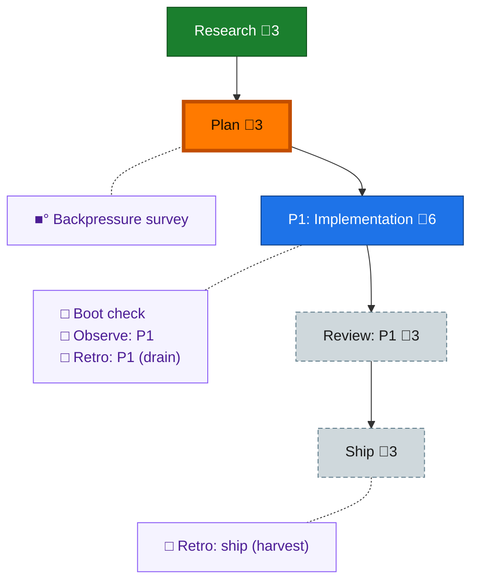

<!-- GENERATED by `harness flow render` — do not hand-edit; regenerate from the flow JSON. -->
# Flow · pij-chore-primitive

**Kind**: flight-plan · **Now**: plan · **Next**: phase-1 · **Intent**: pij chore: first-class change-detector + durable duty roster for PA seats — extensible, with fleet/repo/seat scoped chores · **Nodes**: 10 · **Events**: 9

**Rail**: ◆─◆─[ ◇─◇─◇ ]  ◆ Research · ◆ Plan · [ ◇ P1: Implementation · ◇ Review: P1 · ◇ Ship ]

**Legend** — colour = type/status: 🟩 done · 🟢 in-progress · 🟥 blocked · 🟦 known · ⬜ assumed · 🔶 decision · 🗣 user input · 🟪 harness chore (faded = not yet done) · 🤖 companion · 🛠 worker · 🟧 current (you are here). Badges: 💬 comments · 📄 artifacts · 📝 instructions · 🧰 chore (° optional / recommended / ‼ strongly-recommended; ✓ done · ✕ skipped).

## Node log

### backpressure · Backpressure survey
- `2026-08-02T01:04:06.172Z` · agent · validation — decision:completed verdict:Partial counts:14 RUN · 2 EXTEND · 0 BUILD · 0 ABSENT next-move:propose the extensions first artifact:docs/plans/076-pij-chore-primitive/backpressure-coverage.md time:2026-08-02T01:05:00Z basis_sha256:d0e02d2ea9c63de3dba7f4e974dd215a3401bdf3321ef601eb08bf93ee9411e8
- `2026-08-02T01:05:06.488Z` · agent · validation — re-selection: plan bytes changed after the survey (its own two recommendations folded in as T015/T016 + AC-15/AC-16, nothing else). Re-selected against basis_sha256:ba3d0da97ddf7185e59de9e8eec1cba8c59f0f40674342f3c04b1f65c3c4de89 — Proof Plan and Partial rating unchanged; the 2 EXTEND rows stay EXTEND until T015/T016 land. time:2026-08-02T01:07:00Z
