# PR A tasks — chore literals and paths

**Source of truth**: `../../research-dossier.md` plus the PR A dispatch packet.
**Mode**: Simple implementation pass through `/builder 6 implement`.

| Status | ID | Task | Domain | Path(s) | Done When | Notes |
|--------|-----|------|--------|---------|-----------|-------|
| [x] | T001 | Add shipped-CLI regression coverage for repo-root execution, cross-worktree path portability, repo-external absolute-path refusal, and lint-safe repo roster JSON | `pij-control-plane` | `.pi/extensions/pij/core/chores/drive.test.ts` | Tests fail on the current writer/runner and set `PIJ_HOME` to a temp directory | RED first |
| [x] | T002 | Implement repo-relative normalization/refusal, repo-root probe execution, and repo-only formatted atomic JSON; update operator and domain contracts | `pij-control-plane`, `agent-tooling-interface` | `.pi/extensions/pij/core/chores/cli-verbs.ts`, `.pi/extensions/pij/adapters/{atomic-file,chore-store}.ts`, tests, docs | T001 turns green without changing compact machine-state writers | External absolute paths remain valid only for seat/fleet scope |
| [x] | T003 | Run targeted tests, actual cross-worktree/subdirectory and Biome verification, full `harness checks`, then record evidence and commit | `extension-authoring-harness` | verification artifacts + execution log | Every sensor is green and the branch commit contains only PR A scope | No push or PR |
| [x] | T004 | Replace the spelling-based repo-path refusal with resolved worktree containment after review rejection | `pij-control-plane` | `.pi/extensions/pij/core/chores/{cli-verbs,drive.test}.ts`, docs | Add/update and probe/full reject `../` and `//` escapes while accepting inside-relative paths through the shipped CLI | Reviewer-proven HIGH |
| [x] | T005 | Make repo command analysis fail-closed after dynamic-shell review rejection | `pij-control-plane` | `.pi/extensions/pij/core/chores/{cli-verbs,drive.test}.ts`, docs | Add/update × probe/full refuse every reviewed dynamic/malformed form with a named construct; static multi-word commands remain accepted | Repo scope trades expressiveness for portability |
| [x] | T006 | Invert repo command validation to an explicit allow-list grammar after third review rejection | `pij-control-plane`, `agent-tooling-interface` | `.pi/extensions/pij/core/chores/{cli-verbs,drive.test}.ts`, docs | Unknown well-formed commands refuse by default; current committed chores and multi-argument repo scripts remain accepted | Design change; no further construct enumeration |
| [x] | T007 | Invert script-runner flag validation to exact safe lists after fourth review rejection | `pij-control-plane`, `agent-tooling-interface` | `.pi/extensions/pij/core/chores/{cli-verbs,drive.test}.ts`, docs | Unknown/equals/bundled runner flags refuse by default with unchanged roster bytes; explicitly safe flags remain usable | Runner flag lists change only by reviewed source change |
| [x] | T008 | Split the dynamic refusal matrix after CI exposed an ambient-speed timeout | `extension-authoring-harness` | `.pi/extensions/pij/core/chores/drive.test.ts` | Each construct is an independently named test under 3 seconds locally; every original assertion remains | No timeout increase |

## Architecture Map

```mermaid
flowchart LR
	T001["T001 CLI regressions"] --> T002["T002 path + writer fix"]
	T002 --> T003["T003 actual runs + full gate"]
	T003 --> T004["T004 review fix: resolved containment"]
	T004 --> T005["T005 review fix: fail-closed static analysis"]
	T005 --> T006["T006 design fix: allow-list grammar"]
	T006 --> T007["T007 design fix: runner flag allow-lists"]
	T007 --> T008["T008 CI fix: split refusal matrix"]
	classDef pending fill:#f3f4f6,stroke:#6b7280,color:#111827
	classDef inprogress fill:#ffedd5,stroke:#f97316,color:#7c2d12
	classDef completed fill:#dcfce7,stroke:#16a34a,color:#14532d
	class T001 completed
	class T002 completed
	class T003 completed
	class T004 completed
	class T005 completed
	class T006 completed
	class T007 completed
	class T008 completed
```

## Discoveries & Learnings

| Tag | Discovery | Decision / effect |
|-----|-----------|-------------------|
| Noteworthy | `writeJsonAtomic` serves every durable state file, while only the repo roster is committed for human review. | Keep compact output as the default and add one formatted atomic wrapper used only by repo rosters. |
| Noteworthy | `runVerb` receives both caller cwd and worktree root, so it can choose cwd per chore scope without changing seat/fleet behavior. | Repo chores run at the worktree root; seat/fleet chores retain caller-cwd semantics. |
| Noteworthy | A shell may spell the same checkout through a symlink alias (`/tmp` vs `/private/tmp`). | Canonicalize existing absolute path literals before deciding whether they are inside the active worktree. |
| Noteworthy | Reviewing only absolute-looking spellings left `../` and `//` as persisted repo-roster bypasses. | Extract static shell words, resolve path-like literals against the worktree, and guard the containment property instead. |
| Noteworthy | Resolved containment is still meaningless when the command dynamically constructs its runtime path. | Repo scope must reject every dynamic or malformed construct the analyser cannot resolve; seat/fleet retain full shell expressiveness. |
| Noteworthy | A longer deny-list remained fail-open and was bypassed by `eval` with an inert quoted payload. | Invert validation: only documented executables and static token forms are accepted; every unknown form refuses by default. |
| Noteworthy | The outer allow-list still contained an inner deny-list for runner inline flags, so an equals-joined Node flag bypassed it. | Runner productions must allow only exact reviewed flags before the script path; unknown flags refuse by default. |
| Noteworthy | One 32-surface CLI matrix depended on ambient runner speed and timed out only in CI. | Generate one named test per construct family so each proof is bounded and failures identify the regressed form. |
