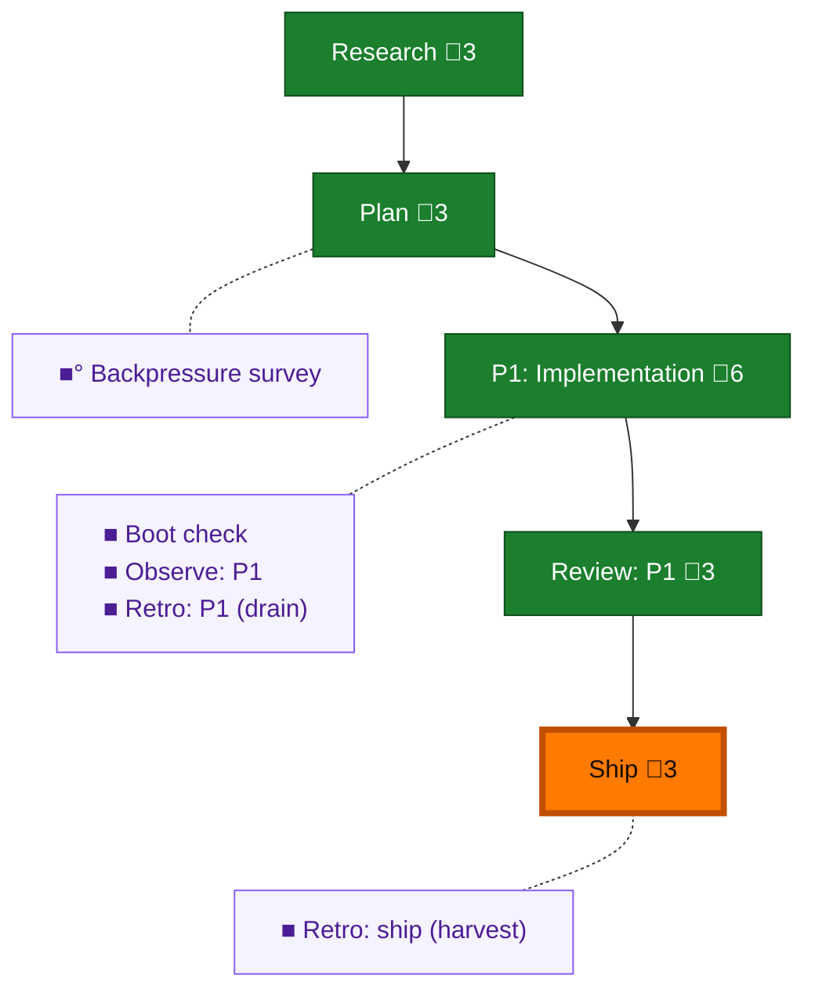

<!-- GENERATED by `harness flow render` — do not hand-edit; regenerate from the flow JSON. -->
# Flow · a2a-wire-discipline

**Kind**: flight-plan · **Now**: ship · **Next**: ship · **Intent**: pij A2A messages are too verbose; cut token spend via prompting-only wire discipline in the pij skill (./skills/) — no deterministic tooling · **Nodes**: 10 · **Events**: 34

**Rail**: ◆─◆─[ ◆─◆─◆ ]  ◆ Research · ◆ Plan · [ ◆ P1: Implementation · ◆ Review: P1 · ◆ Ship ]

**Legend** — colour = type/status: 🟩 done · 🟢 in-progress · 🟥 blocked · 🟦 known · ⬜ assumed · 🔶 decision · 🗣 user input · 🟪 harness chore (faded = not yet done) · 🤖 companion · 🛠 worker · 🟧 current (you are here). Badges: 💬 comments · 📄 artifacts · 📝 instructions · 🧰 chore (° optional / recommended / ‼ strongly-recommended; ✓ done · ✕ skipped).

## Node log

### backpressure · Backpressure survey
- `2026-08-03T07:54:43.726Z` · agent · validation — verdict:Partial counts:1RUN/0EXTEND/3BUILD(declined-by-ruling)/1ABSENT artifact:backpressure-coverage.md basis_sha256:de804d9d948d4fcbeb1297e3a5341a0193ba68a5f555181f0c1d9bfb483685ac time:2026-08-03T08:12+10:00

### boot-1 · Boot check
- `2026-08-03T08:42:39.885Z` · agent · validation — verdict:HEALTHY ready:true typecheck=0 test=0 time:2026-08-03T08:42Z (first attempt returned transient error envelope, immediate re-run clean)

### observe-1 · Observe: P1
- `2026-08-03T08:50:02.588Z` · agent · validation — 2 real captures: DL-001 (transient boot error envelope), DL-002 (silent assumed→done status no-op) in .harness/temp/pij-rural-shrimp/session-buffer.md time:2026-08-03T08:46Z

### retro-1 · Retro: P1 (drain)
- `2026-08-03T08:50:51.946Z` · agent · validation — drained 2 entries (DL-001 transient boot error envelope, DL-002 silent assumed→done no-op) → .harness/records/retro/2026-08-03/001-083-a2a-wire-discipline.md disposition:kept; buffer cleared time:2026-08-03T08:50Z

### retro-ship · Retro: ship (harvest)
- `2026-08-04T05:05:15.832Z` · agent · validation — harvest run: 53 records/226 entries scanned; top open clusters difficulty/tooling n=18 + harness-itself n=5 (both proof-gap); this plan's DL-001/DL-002 committed in 2026-08-03 record; encode offer surfaced to human time:2026-08-04
