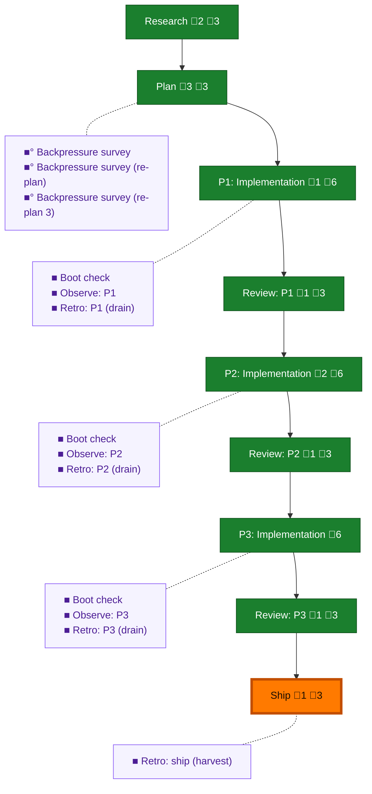

<!-- GENERATED by `harness flow render` — do not hand-edit; regenerate from the flow JSON. -->
# Flow · pa-gate-repair

**Kind**: flight-plan · **Now**: ship · **Next**: ship · **Intent**: Run the /builder flow over AI-Substrate/pij#95 (three ruled fixes: PA may watchdog-watch its own parent; --for &lt;seat&gt; for prime repair preserving addedAt; project orchestrationRole+parentId in pij state) plus #99 and #102 pulled in by ruling R-03. · **Nodes**: 22 · **Events**: 86

**Rail**: ◆─◆─[ ◆─◆─◆─◆─◆─◆─◆ ]  ◆ Research · ◆ Plan · [ ◆ P1: Implementation · ◆ Review: P1 · ◆ P2: Implementation · ◆ Review: P2 · ◆ P3: Implementation · ◆ Review: P3 · ◆ Ship ]

**Legend** — colour = type/status: 🟩 done · 🟢 in-progress · 🟥 blocked · 🟦 known · ⬜ assumed · 🔶 decision · 🗣 user input · 🟪 harness chore (faded = not yet done) · 🤖 companion · 🛠 worker · 🟧 current (you are here). Badges: 💬 comments · 📄 artifacts · 📝 instructions · 🧰 chore (° optional / recommended / ‼ strongly-recommended; ✓ done · ✕ skipped).

## Node log

### research · Research
- `2026-08-05T03:54:05.457Z` · agent · validation — pre-flight seam fired via /eng-harness-flow --hook pre-flight (entry). Real invocation, boot verb. Verdict: HEALTHY — ready:true, stages typecheck(just typecheck)=0, test(just test)=0. Maturity read L0. Housekeeping: 7 telemetry segments unpushed. time:2026-08-05T03:53:25Z
- `2026-08-05T05:49:48.969Z` · agent · note — No research-dossier.md produced. Research was performed inline instead: direct source verification of all three seams by the orchestrator, plus two parallel Opus-class research passes (domain/pattern scout + risk/constraint finder). Their findings are folded into the plan's Key Findings 01-08, each carrying file:line citations. Marked done because the stage's purpose was served and its evidence is durable in the plan, not because a dossier file exists.

### plan · Plan
- `2026-08-05T04:09:34.012Z` · agent · note — LIVE EVIDENCE for this plan, encountered 2026-08-05 during an unrelated prime succession: the new o-prime pij-continuing-ermine had to ask ME (a pm) to watch it, because its PA is role 'pa' and the gate refuses the watchdog family, and 'watch' registers only the CALLING seat so the prime could not do it for the PA. That is issue #95's exact composition, reproduced live and independently. Second datapoint: verifying the subscription I created required reading ~/.pij/&lt;id&gt;/watchdog.json directly, because 'pij state --json' projects watchdog.watchers as bare id strings with no capture bounds and no addedAt — #95's diagnostic half. Captured as harness observation DL-001.
- `2026-08-05T05:02:04.214Z` · agent · warning — CRITICAL KEY FINDING for the plan — the gate has TWO seams and the one that fires FIRST cannot see the target. cli.ts:4098 (seam 2, paBinRefusal) runs for EVERY top token before core parse; core/cli.ts:2233 (seam 1, paGate) runs inside dispatch. 'pij watchdog watch &lt;id&gt;' is refused at SEAM 2, before seam 1 is ever reached — the bin's 'top === watchdog' branch at cli.ts:4130 is only the --help shortcut, so the verb otherwise falls through to core. Consequence: a target-scoped allowance implemented ONLY in paGate/paRefusal will pass its unit tests and STILL refuse at the CLI. Seam 2 has process.argv (argv[2]=watchdog, argv[3]=watch, argv[4]=target) so it CAN resolve the target, but paRefusal(role, verb) currently takes no target and neither seam passes one. The predicate signature is the central design decision of this plan. pa-capability.ts's own header warns 'a verb list you can tick is the most believable kind of incomplete gate' — this is that trap in its target-scoped form.
- `2026-08-05T05:56:22.387Z` · agent · validation — /validate-v2 run COLD by an independent agent (not self-marked). verdict:VALIDATED artifact:docs/plans/084-pa-gate-repair/validations/pa-gate-repair-plan-validation.md. All 14 file:line citations independently re-verified and resolving (0-2 line drift on two, acceptable on a live branch). 3 MEDIUM findings, all surfaced not applied: two citation-drift nits, plus OQ-1 (#102) correctly gated at task 2.9 and not blocking phases 1-2. Assessment: fit to hand to a coder.

### phase-1 · P1: Implementation
- `2026-08-05T06:08:05.483Z` · agent · decision — RULING to coder on D-041: project ONE key 'parent' = effectiveParent(d), NOT a raw parentId and NOT both. Deciding reason: effectiveParent falls back to spawnedBy, so a PA spawned by its prime but never explicitly linked has no raw parentId — a Phase-2 predicate keyed on raw parentId would refuse that PA permission over its actual parent, rebuilding #95's trap inside its own fix. Plan amended: AC-01 re-keyed, AC-01b added, Key Finding 09 recorded with coder credit, tasks 1.1 and 2.1 each gain the spawned-but-never-linked fixture.

### review-1 · Review: P1
- `2026-08-05T08:19:00.555Z` · agent · validation — verdict:APPROVE artifact:docs/plans/084-pa-gate-repair/reviews/review.phase-1.md. Cold reviewer (gpt-5.6-sol, no authorship). FIRST return was a bare 'APPROVE / no significant issues' with zero evidence and was REFUSED and sent back — the review recorded is the second pass, answering all 6 questions with file:line. Orchestrator's own independent proof alongside it: RED-&gt;restore-&gt;GREEN mutation check (swapped effectiveParent for raw parentId =&gt; exactly 1 test red, the D-041 divergence guard; restored =&gt; 384 green, diffstat identical, no residue) plus a live 'just pij' CLI check. Reviewer caught that both the coder AND I undercounted the tests: 11 added, not 8 (8 state + 3 refusal) — both of us had scoped to one file.

### ship · Ship
- `2026-08-05T14:15:50.902Z` · agent · validation — SHIPPED. PR #134 open against main, head 7987d6a, state OPEN, mergeable MERGEABLE. CI GREEN — verified by me independently, not taken on the o-prime's relay: check(22) pass 10m55s, check(24) pass 9m29s, windows-compat pass 5m21s. NOT MERGED and will not be: merge is Jordan's per-PR call per the s091 brief. Local ship gate before commit was mine too: harness checks ok=true 8/8 skipped=[] including smoke, 3419 tests, green first run. Post-flight harvest fired and receipted. All 13 harness chores across the stream are closed with receipts. Outstanding with Jordan, none blocking: the merge, the #102 ruling (one line either way, gates nothing now), and the retro save prompt (18 observations deliberately unmaterialised — offered twice, silence is neither acceptance nor decline).

### backpressure · Backpressure survey
- `2026-08-05T05:52:47.955Z` · agent · validation — pre-coding seam fired via /eng-harness-flow --hook pre-coding — REAL invocation, routed to the backpressure verb, module references/stages/backpressure.md loaded. verdict:Partial counts:4-RUN/11-EXTEND/0-BUILD/1-ABSENT next-move:propose-the-extensions-first artifact:docs/plans/084-pa-gate-repair/backpressure-coverage.md basis_sha256:dd966be82477ece8a51bd6e9dd5f27e73a4f46b4220213f6ef42916555a87818 time:2026-08-05T05:55:00Z

### boot-1 · Boot check
- `2026-08-05T05:59:00.392Z` · agent · validation — pre-flight seam fired via /eng-harness-flow --hook pre-flight at the phase-1 edge — REAL invocation, routed to the boot verb. verdict:HEALTHY ready:true stages:typecheck(just typecheck)=0,test(just test)=0 time:2026-08-05T05:58:40Z. Housekeeping surfaced: 19 telemetry segments unpushed (non-blocking; ship flushes).

### observe-1 · Observe: P1
- `2026-08-05T06:19:44.479Z` · agent · validation — captures:5 pointer:.harness/temp/agent/session-buffer.md ids:DL-001,DL-002,DL-003,WIN-001(superseded),WIN-002 time:2026-08-05T06:19:21Z. Real captures, not narrated — verified via 'harness observe --list'. Three by the orchestrator (state omits watcher bounds; peer effort self-report absent while process args carried it), two by the Phase-1 coder incl. a self-correction: WIN-001's headline was wrong and the coder MEASURED it rather than leaving the guess standing, superseding it with WIN-002. WIN-002's finding is the plan's own thesis proven from a different angle: ordinary value assertions DO detect an absent key, so the exposure is consumer-side — any reader doing 'j.k == null' or '?? null' cannot distinguish absent-because-legacy from present-and-null, and for a capability gate the fabricated answer is the PERMISSIVE one.

### retro-1 · Retro: P1 (drain)
- `2026-08-05T08:11:18.018Z` · agent · validation — post-coding seam fired via /eng-harness-flow --hook post-coding — REAL invocation, routed to the retro (drain) verb, module references/stages/retro.md loaded. Real outcome: buffer read via 'harness observe --list' (5 pending: DL-001, DL-002, DL-003, WIN-001 superseded, WIN-002); the save prompt was presented to the human per the verb's soft-prompt contract. Human decision on 'harness record retro' is PENDING — silence is neither acceptance nor decline, so the buffer was deliberately NOT cleared and nothing is lost; the offer stays live. Drain finding worth carrying: DL-001, DL-002 and DL-003 are the SAME defect shape as the plan being built — an absent value read as an empty one — hit three times in three unrelated places while fixing it once. time:2026-08-05T08:10:00Z

### retro-ship · Retro: ship (harvest)
- `2026-08-05T14:04:08.673Z` · agent · validation — post-flight seam fired via /eng-harness-flow --hook post-flight — REAL invocation, routed to retro (harvest) + improve. 'harness retro insights --json' returned ok: 54 records / 230 entries across 25 plans. This stream's own buffer stands at 18 pending (DL-001..DL-010, WIN-001..WIN-008), DELIBERATELY UNCLEARED — the save prompt has been standing with the human since the phase-1 drain and is unanswered; silence is neither acceptance nor decline, so nothing was materialised and nothing was lost. HIGHEST-LEVERAGE IMPROVEMENT NAMED (the closeout beat, not left silent): every one of the 10 difficulties captured on this stream was an ABSENT thing reading as an EMPTY thing and reporting nothing wrong, and the only mechanisms that behaved correctly all session were the 3 encoded pins that fired — all 3 caught something real. The encode candidate the evidence actually argues for is Pattern 0's remedy, discovered by the coder: PIN THE PATH, NOT THE INSTANCE, AND GUARD THE PIN. A flag-level pin protects one flag; a path-level pin protects every future flag on that surface; and a pin without a vacuity guard is a better-scoped illusion. Recorded in the plan ahead of the other two patterns. time:2026-08-05T14:03:40Z

### phase-2 · P2: Implementation
- `2026-08-05T10:56:43.557Z` · agent · decision — FENCE WIDENED (notify-only, invariant 11): +.pi/extensions/pij/cli.inbox.integration.test.ts, one-line change only. Cause: it pins whoami --json with toEqual DELIBERATELY (:205-206 'so a future addition to this surface has to be noticed here'); AC-13's conditionalVerbs addition trips it with exactly one diff line. Coder STOPPED at the fence and reported rather than editing through — correct. Ruled: add conditionalVerbs: [] to the expected object; explicitly FORBADE downgrading toEqual to toMatchObject, which would silently disable the pin for every future addition. Contrast worth keeping: every defect this stream hit today (#95, #129, DL-006) was an ABSENT thing reading as EMPTY and reporting nothing wrong. This is the inverse — a deliberate loud failure on addition, encoded weeks ago, firing correctly on us.
- `2026-08-05T11:10:40.185Z` · agent · validation — AC-06b LIVE CLI PROOF LANDED — the stage-closing requirement. Run by the PA seat itself in its own pane via 'just pij' (the orchestrator's impersonation attempt was correctly refused with E-AMBIG, which forced the better proof). (1) PA vs non-parent -&gt; E-OWN refusal, exit 2, naming role+field+target+both permitted ids+remedy. (2) PA vs its own parent -&gt; success, exit 0, roster 1-&gt;2. (3) PA unwatch its own parent -&gt; success, exit 0, roster 2-&gt;1 (R-02). Cleanup verified at source by me, not on report: role restored to worker; co-watcher's addedAt byte-identical at 2026-08-05T09:55:08.194Z. Artifact: docs/plans/084-pa-gate-repair/evidence/live-cli-proof.phase-2.md

### review-2 · Review: P2
- `2026-08-05T12:06:48.229Z` · agent · validation — verdict:REQUEST_CHANGES -&gt; BOTH FINDINGS CLOSED, both mutation-proved. artifact:docs/plans/084-pa-gate-repair/reviews/review.phase-2.md. Independently verified by me: core/orchestration + core/cli.test.ts -&gt; 569 passed; cli-verbs.ts byte-identical after being used as a mutation site (git status clean on that path); bin fixture now write('pij-parent',{orchestrationRole:'pm'}) not prime:true; handler PARENT_ID fixture renamed off 'prime'; new test at core/cli.test.ts:7926 asserts watch AND unwatch succeed against a parent of EVERY role and a stranger stays refused in each. THE MEASUREMENT THAT MATTERS: with the mutation narrowed to the PARENT branch only, the OLD prime fixtures gave 11 passed / 1 failed and the ONLY failure was the NEW test — every pre-existing test green. The suite was COMPLETELY blind to KF-11, confirmed by measurement rather than assumed. The coder's FIRST mutation was too broad (it also caught watch-ITSELF), which would have supported a flattering 'the old suite partly caught this'; it re-measured and reported the unflattering truth unprompted. Finding 1 fixed rather than narrowed: chore subverbs now scraped from source with a self-guard (length&gt;=6) so a regex matching nothing cannot make the test vacuous. AC-12 tightened to state the build-time-only property explicitly, at the coder's prompting.

### boot-2 · Boot check
- `2026-08-05T10:37:48.262Z` · agent · validation — pre-flight seam fired via /eng-harness-flow --hook pre-flight at the phase-2 edge — REAL invocation, routed to the boot verb. verdict:HEALTHY ready:true stages:typecheck=0,test=0 time:2026-08-05T10:37:20Z. NOTE: this chore was INVISIBLE until this turn — my plan-complete expander cloned phase-2/3's chore nodes without their 'chore' {kind,importance} field, so 'harness flow chores' listed 5 not 11 and due_chores at phase-2 returned EMPTY. Backfilled via apply; verified 11 chores and 3 due at phase-2. Captured as DL-006. Had it not been caught, the harness seams for two of three phases would have been skipped in silence — an absent field reading as 'nothing due', the same defect class as the plan being built.

### observe-2 · Observe: P2
- `2026-08-05T11:24:07.663Z` · agent · validation — captures:9 pointer:.harness/temp/agent/session-buffer.md ids:DL-001..DL-008,WIN-002..WIN-006 (phase-2 additions: DL-004 worktree-CLI/daemon binding assumption, DL-005 report-now not clearing semanticState -&gt; filed as issue #129, DL-006 my expander dropping the chore field, DL-007 the two seams resolve the CALLER differently so a bin-shaped test setting only PIJ_SESSION_ID silently tests ONE seam, DL-008 zero dispatch-level watchdog tests existed before this phase, WIN-004 pin-it-loudly, WIN-006 the day's synthesis). Real captures verified via 'harness observe --list'. Coder's retro line carried verbatim: the refusal-text factual error was INVISIBLE TO 3411 PASSING TESTS AND OBVIOUS IN ONE REAL REFUSAL — the ABSENT human-judgement row in backpressure-coverage earning its keep.

### retro-2 · Retro: P2 (drain)
- `2026-08-05T11:45:23.070Z` · agent · validation — post-coding seam fired via /eng-harness-flow --hook post-coding — REAL invocation, routed to the retro (drain) verb. Buffer read via 'harness observe --list': 11 pending (DL-001..DL-008, WIN-002..WIN-006). Save prompt PRESENTED to the human at the phase-1 drain and RE-PRESENTED here; no answer yet, so per the verb's contract silence is neither acceptance nor decline — the buffer is deliberately NOT cleared, nothing is lost, and the offer stands. Phase-2 drain findings: (a) DL-007 the two gate seams resolve the CALLER differently, so a bin-shaped test setting only PIJ_SESSION_ID silently tests ONE seam — cost the coder two red runs and is the sharpest harness gap this phase; (b) the phase's decisive defect (a refusal message calling a pm 'its own prime') was INVISIBLE TO 3411 PASSING TESTS AND OBVIOUS IN ONE REAL REFUSAL — the ABSENT human-judgement row we recorded as unprovable is the row that caught it; (c) WIN-006, the day's synthesis: four times a cheap check stood between this fleet and a confident FALSE result, and in all four the wrong version would have PASSED as evidence. time:2026-08-05T11:45:00Z

### review-3 · Review: P3
- `2026-08-05T14:01:03.718Z` · agent · validation — verdict:REQUEST_CHANGES -&gt; 3 in-scope findings CLOSED + mutation-proved, 1 ruled out of scope and filed as #133. artifact:docs/plans/084-pa-gate-repair/reviews/review.phase-3.md

### boot-3 · Boot check
- `2026-08-05T12:10:08.768Z` · agent · validation — pre-flight seam fired via /eng-harness-flow --hook pre-flight at the phase-3 edge — REAL invocation, routed to the boot verb. verdict:HEALTHY ready:true stages:typecheck=0,test=0 time:2026-08-05T12:09:39Z.

### observe-3 · Observe: P3
- `2026-08-05T12:36:48.645Z` · agent · validation — captures:13 pointer:.harness/temp/agent/session-buffer.md (phase-3 additions: WIN-007 the vacuous AC-10 test the coder found via its OWN mutation proof, plus the general rule 'an authorisation test must be built so every other guard would PERMIT the call, or it proves the wrong guard'; WIN-008 the three properties of a legitimate escape hatch — scoped, loud, self-pinning — from usage-flags.test.ts). Real captures verified via 'harness observe --list'. Phase-3 headline: the coder's first AC-10 test gave the PA no parent, so Phase 2's target rule refused it and the --for rule was NEVER EXERCISED — right verdict, wrong reason, green either way. Mutation 3 reddening only 1 of 2 AC-10 tests is what exposed it. Third instance this stream of a test that could not return the contrary answer, and the first one caught by its own author using the proof the orchestrator had asked for.

### retro-3 · Retro: P3 (drain)
- `2026-08-05T13:38:31.445Z` · agent · validation — post-coding seam fired via /eng-harness-flow --hook post-coding at the phase-3 edge — REAL invocation, routed to the retro (drain) verb. Buffer read: 17 pending (DL-001..DL-009, WIN-001..WIN-008). Save prompt has been standing with the human since the phase-1 drain and is RE-PRESENTED here; still unanswered, so per the verb's contract silence is neither acceptance nor decline — buffer deliberately NOT cleared, nothing lost, offer stands into the ship harvest. PHASE-3 DRAIN HEADLINE: WIN-007 — the coder's OWN mutation proof exposed one of its OWN AC-10 tests as vacuous (the PA had no parent, so Phase 2's target rule refused the call and the --for rule was never exercised: right verdict, wrong reason, green either way; mutation 3 reddening only 1 of 2 is what surfaced it). Generalised rule worth keeping: AN AUTHORISATION TEST MUST BE BUILT SO EVERY OTHER GUARD WOULD PERMIT THE CALL, OR IT PROVES THE WRONG GUARD. WIN-008: the three properties of a legitimate escape hatch — scoped, loud, self-pinning — read out of usage-flags.test.ts. Tally across the stream: 9 defects filed, EVERY ONE a silent absence; 3 encoded pins fired, ALL THREE caught something real. time:2026-08-05T13:40:00Z

### backpressure-b3a3b7d8979a · Backpressure survey (re-plan)
- `2026-08-05T06:07:52.447Z` · agent · validation — pre-coding seam RE-FIRED via /eng-harness-flow --hook pre-coding after a mid-build plan amendment (Key Finding 09 — effectiveParent vs raw parentId, raised by coder pij-yucky-mosquito and verified at source before ruling). REAL invocation, routed to the backpressure verb. verdict:Partial counts:4-RUN/12-EXTEND/0-BUILD/1-ABSENT next-move:propose-the-extensions-first delta:AC-01 re-keyed to 'parent'; AC-01b added as the spawned-but-never-linked regression guard artifact:docs/plans/084-pa-gate-repair/backpressure-coverage.md basis_sha256:b3a3b7d8979a16e2e399c28520de855d764d32ea4208ac34fa508b95aa04a6e8 supersedes_basis:dd966be82477ece8a51bd6e9dd5f27e73a4f46b4220213f6ef42916555a87818 time:2026-08-05T06:08:00Z

### backpressure-6096d5b53389 · Backpressure survey (re-plan 3)
- `2026-08-05T10:40:44.242Z` · agent · validation — pre-coding seam RE-FIRED (3rd basis) via /eng-harness-flow --hook pre-coding — REAL invocation, routed to the backpressure verb. Trigger: plan amended with AC-06b (live CLI proof) after the o-prime observed a bin-shaped TEST is still a test on a two-seam gate; then its baton dependency was removed once the CLI was shown to evaluate the refusal per invocation. verdict:Partial counts:5-RUN/12-EXTEND/0-BUILD/1-ABSENT (AC-06b classifies as EXISTS/RUN — 'just pij' is a paved command) next-move:propose-the-extensions-first artifact:docs/plans/084-pa-gate-repair/backpressure-coverage.md basis_sha256:6096d5b53389 supersedes:b3a3b7d8979a,dd966be82477 time:2026-08-05T10:40:00Z. NOTE: this node and its predecessor were BOTH invisible to 'harness flow chores' until backfilled this turn — same missing-chore-field defect as DL-006.
