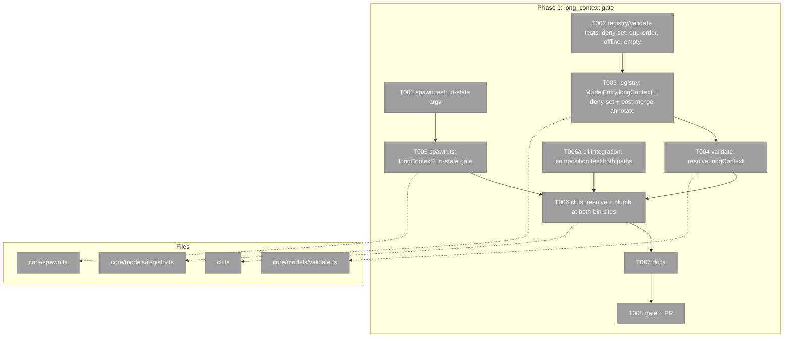
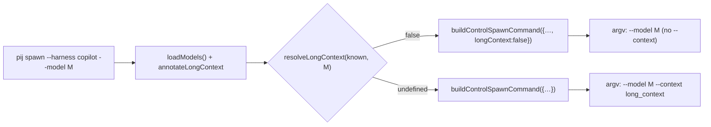
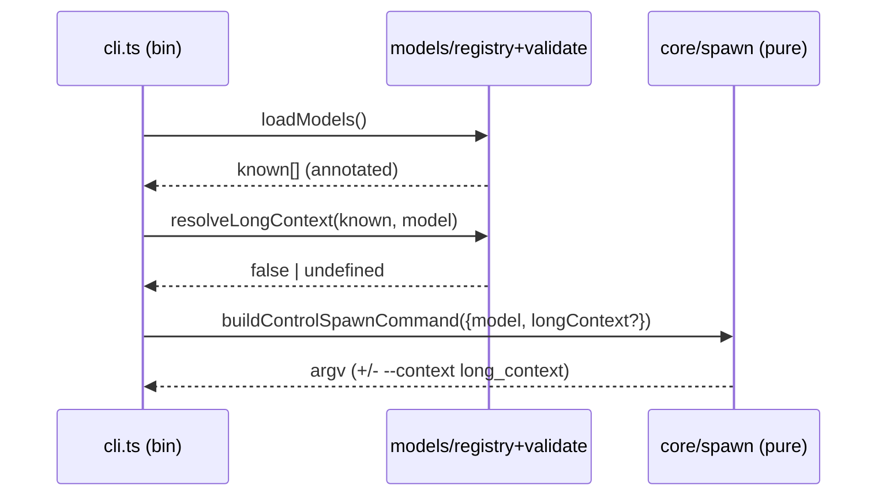

# Phase 1: Item 6 — gate `--context long_context` per model — tasks dossier

**Plan**: `/Users/vaughanknight/GitHub/pij-worktrees/s391-day3-core/docs/plans/391-day3-core/391-day3-core-plan.md` (v1.5.0) · **Phase**: 1 of 5 · **Branch/PR**: `s391/item6-long-context` off `main@d2dbab0` (code-identical to `2953d75`), one PR · **Domain**: pij-control-plane · **CS**: 2 (small)

### Executive Briefing
- **Purpose**: `pij spawn --harness copilot --model <m>` appends `--context long_context` for EVERY pinned copilot model (`core/spawn.ts:463-465`); `gemini-3.6-flash` rejects that flag with HTTP 400, so the model is unspawnable. This phase gates the flag per model from a curated registry deny-set, resolved at the two bin spawn sites, with the pure builder's default behaviour unchanged.
- **What We're Building**: `ModelEntry.longContext?: boolean` + exported `COPILOT_NO_LONG_CONTEXT` deny-set + post-merge annotation in `loadModels()`; `resolveLongContext(known, model)` in `core/models/validate.ts`; tri-state `ControlSpawnInput.longContext?` (`undefined` = today's emit, `false` = suppress); wiring at `cli.ts` peer-spawn (`:2606`) and agent-spawn (`:3995`); docs.
- **Goals**: ✅ AC-01 argv exactness (deny → no `--context`; undefined/true → `--context long_context`; non-copilot never) · ✅ AC-02 resolver is correct in merged-duplicate order, offline-snapshot, and empty-registry cases · ✅ both bin sites resolve · ✅ docs amended (`docs/how/pij-models-discovery.md:99`, `/Users/vaughanknight/GitHub/pij-worktrees/s391-day3-core/docs/domains/pij-control-plane/domain.md:110`)
- **Non-Goals**: ❌ `core/focus.ts:330` (pure core; stays `undefined` ⇒ today's behaviour) · ❌ `core/revive.ts:525-538` (never emitted `--context`; follow-up F-1) · ❌ any `SessionDescriptor` field · ❌ live copilot 400 reproduction · ❌ `pij canary` context-join changes (risk noted in plan)

### Prior Phase Context
_None — Phase 1._

### Pre-Implementation Check

| File | Exists? | Domain Check | Notes |
|------|---------|-------------|-------|
| `.pi/extensions/pij/core/spawn.ts` | yes (1157 l) | pij-control-plane ✔ | **contract** change (`ControlSpawnInput` gains optional field) — additive, optional |
| `.pi/extensions/pij/core/spawn.test.ts` | yes (1597 l) | ✔ | `:453-469` exact argv array and `:471-480` "always selects long-context" must be rewritten to the tri-state contract |
| `.pi/extensions/pij/core/models/registry.ts` | yes (324 l) | ✔ | **contract** (`ModelEntry` gains optional field); curated-table precedent `COPILOT_GPT56_IDS` `:75`; merge order `:284-323` (raw `github-copilot` entries FIRST, then remapped `copilot` seed + snapshot) |
| `.pi/extensions/pij/core/models/registry.test.ts` | yes (392 l) | ✔ | |
| `.pi/extensions/pij/core/models/validate.ts` | yes (65 l) | ✔ | `findKnownModel(model, known)` is **module-private** (`:13`, arg order model-first) — the resolver goes in this module; do NOT hand-roll matching; `normalizeModelQuery` from `core/models/match.ts:13` |
| `.pi/extensions/pij/core/models/validate.test.ts` | yes (140 l) | ✔ | |
| `.pi/extensions/pij/cli.ts` | yes (4847 l) | ✔ | peer spawn `:2602-2612` (`rpcPort` conditional-spread idiom; `known = loadModels()` already at `:2354`); agent spawn `:3995-4000` (`models = loadModels()` at `:3892`/`:4080`, model is `plan.model`) |
| `/Users/vaughanknight/GitHub/pij-worktrees/s391-day3-core/docs/how/pij-models-discovery.md` | yes | docs | `:99` states the law being amended |
| `/Users/vaughanknight/GitHub/pij-worktrees/s391-day3-core/docs/domains/pij-control-plane/domain.md` | yes | docs/contract | `:110` shape row already stale (omits `contextWindow?`) |

Duplication check: no existing capability/flag field on `ModelEntry` (`registry.ts:16-36`); `contextWindow` cannot discriminate (finding 04). No prior "gate a flag per model" pattern in spawn.ts other than harness branches. Nothing to reuse beyond `COPILOT_GPT56_IDS` (pattern) and `findKnownModel` (matcher).

### Architecture Map


### Tasks

| Status | ID | Task | Domain | Path(s) | Done When | Notes |
|--------|-----|------|--------|---------|-----------|-------|
| [x] | T001 | TEST (RED first): rewrite `:471-480` to the tri-state contract; keep `:453-469` exact argv (undefined ⇒ `--context long_context` still present); add: `longContext:false` ⇒ argv has `--model gemini-3.6-flash` and NO `--context`; `longContext:true` ⇒ present; claude/codex with model ⇒ never `--context` | pij-control-plane | `/Users/vaughanknight/GitHub/pij-worktrees/s391-day3-core/.pi/extensions/pij/core/spawn.test.ts` | new cases fail on base; `toEqual` exact argv arrays (mirror `:1572-1591` positive/negative shape) | AC-01; finding 05 (tri-state) |
| [x] | T002 | TEST (RED first): `registry.test.ts` — `COPILOT_NO_LONG_CONTEXT` contains `gemini-3.6-flash`; after `loadModels()`-style merge (use the pure `parseModelsJson` + `copilotSeedFromPi` + `copilotSnapshot` composition with a raw `github-copilot` gemini entry FIRST) every `github-copilot`/`copilot` entry for the denied id carries `longContext:false`. `validate.test.ts` — `resolveLongContext(known, "gemini-3.6-flash") === false` for (i) merged dup-order, (ii) snapshot-only (`copilotSnapshot()` — no gemini entry), (iii) `[]`; `"gpt-5.6-sol"` ⇒ `undefined`; `"github-copilot/gemini-3.6-flash"` (qualified) ⇒ `false`; unknown id ⇒ `undefined` | pij-control-plane | `/Users/vaughanknight/GitHub/pij-worktrees/s391-day3-core/.pi/extensions/pij/core/models/registry.test.ts`, `/Users/vaughanknight/GitHub/pij-worktrees/s391-day3-core/.pi/extensions/pij/core/models/validate.test.ts` | RED on base | AC-02; findings 04, 10 |
| [x] | T003 | IMPL `registry.ts`: `readonly longContext?: boolean` on `ModelEntry` (doc: "false = known to reject `--context long_context`; absent = unknown ⇒ emit"); `export const COPILOT_NO_LONG_CONTEXT: ReadonlySet<string>` (normalized bare ids; initial `gemini-3.6-flash`); in `loadModels()` map the FINAL list: entries with `provider ∈ {github-copilot, copilot}` whose normalized id is denied get `longContext:false` (never mutate a `longContext:true`/explicit value); export a pure helper `annotateLongContext(entries)` so the merge rule is unit-testable without the filesystem | pij-control-plane | `/Users/vaughanknight/GitHub/pij-worktrees/s391-day3-core/.pi/extensions/pij/core/models/registry.ts` | T002 registry cases GREEN | keep `absent ⇒ undefined`; pattern `COPILOT_GPT56_IDS` `:75` |
| [x] | T004 | IMPL `validate.ts`: `export function resolveLongContext(known, model): boolean \| undefined` = (entry via existing private `findKnownModel(model, known)`)?.longContext ?? (deny-set has normalized bare id ⇒ `false`) ?? `undefined`; bare id = strip `<provider>/` prefix | pij-control-plane | `/Users/vaughanknight/GitHub/pij-worktrees/s391-day3-core/.pi/extensions/pij/core/models/validate.ts` | T002 validate cases GREEN | finding 10 — resolver is authoritative, registry annotation is display |
| [x] | T005 | IMPL `spawn.ts`: `readonly longContext?: boolean` after `rpcPort` (`:346-348`) with doc; `:463` ⇒ `if (input.harness === "copilot" && input.model !== undefined && input.longContext !== false)`; update doc comment `:408-410` | pij-control-plane | `/Users/vaughanknight/GitHub/pij-worktrees/s391-day3-core/.pi/extensions/pij/core/spawn.ts` | T001 GREEN; `copilot --ui-server` and every other spawn.test case unchanged | AC-01 |
| [x] | T006a | TEST (RED first) `cli.integration.test.ts`: using the existing fake-tmux harness (`:140-150` logs every tmux argv to `FAKE_TMUX_LOG`; model precedent `:1799-1816`), add cases for BOTH paths — `pij spawn --harness copilot --model gemini-3.6-flash --json` and `pij agent spawn` (inline/`--prompt` shape used elsewhere in this file) `--model gemini-3.6-flash`: the logged `split-window`/`new-window` argv does NOT contain `long_context`; the same two commands with `gpt-5.6-sol` DO. Note the harness HOME has no `~/.pi/agent/models.json`, so the resolver's deny-set lookup (not registry annotation) is what must make this pass — exactly AC-02 case (ii)/(iii) | pij-control-plane | `/Users/vaughanknight/GitHub/pij-worktrees/s391-day3-core/.pi/extensions/pij/cli.integration.test.ts` | RED on base | validator-2 HIGH; AC-02 |
| [x] | T006 | IMPL `cli.ts`: peer spawn — in `runSpawn` (`known` at `:2354`), `const longContext = req.value.model !== undefined ? resolveLongContext(known, req.value.model) : undefined;` then at `:2606` `...(longContext === false ? { longContext: false } : {})`; agent spawn — in `runAgentSpawn` (`models` at `:4080`) resolve the same way from `plan.model`, add `longContext?: boolean` to the `spawnAgentPane` plan parameter type (`:3939-3946`), pass it in the call at `:4162`, and forward `...(plan.longContext === false ? { longContext: false } : {})` into the builder at `:3995` | pij-control-plane | `/Users/vaughanknight/GitHub/pij-worktrees/s391-day3-core/.pi/extensions/pij/cli.ts` | T006a GREEN | `core/focus.ts:256-257` rejects copilot before its builder; revive never emits `--context` (validator-2 confirmed no other site) |
| [x] | T007 | DOCS: `docs/how/pij-models-discovery.md:99` → "Copilot spawns with a pinned model include `--context long_context` unless the registry marks the model `longContext:false` (curated deny-set; e.g. `gemini-3.6-flash`, which rejects the flag with HTTP 400); the canary context join may then report the model's smaller tier — expected." `docs/domains/pij-control-plane/domain.md:110` shape → `{ id, name, provider, verified, reasoning?, levels?, contextWindow?, longContext? }` | docs | `/Users/vaughanknight/GitHub/pij-worktrees/s391-day3-core/docs/how/pij-models-discovery.md`, `/Users/vaughanknight/GitHub/pij-worktrees/s391-day3-core/docs/domains/pij-control-plane/domain.md` | rows present | finding 08 |
| [x] | T008 | GATE: `npx vitest run .pi/extensions/pij/` green (run via `pij bg`, log to `/Users/vaughanknight/GitHub/pij-worktrees/s391-day3-core/.harness/temp/s391/vitest-phase1.log`); commit pathspec-mandatory with EXACTLY this pathspec (drop any file you did not change): `git commit -- .pi/extensions/pij/core/spawn.ts .pi/extensions/pij/core/spawn.test.ts .pi/extensions/pij/core/models/registry.ts .pi/extensions/pij/core/models/registry.test.ts .pi/extensions/pij/core/models/validate.ts .pi/extensions/pij/core/models/validate.test.ts .pi/extensions/pij/cli.ts .pi/extensions/pij/cli.integration.test.ts docs/how/pij-models-discovery.md docs/domains/pij-control-plane/domain.md docs/plans/391-day3-core/tasks/phase-1-item-6-long-context-gate/tasks.md docs/plans/391-day3-core/tasks/phase-1-item-6-long-context-gate/execution.log.md`; never stage `.flow-pair/**`, `scratch/**`, `node_modules`, `session-store.db`, `.harness/**`; report done | — | `/Users/vaughanknight/GitHub/pij-worktrees/s391-day3-core` (git root) | vitest 0 fail; commit sha in report | AC-10; branch `s391/item6-long-context` |

### Context Brief

**Key findings from plan**:
- 04 (Critical): no capability field; `contextWindow` cannot discriminate → curated deny-set, absent ⇒ emit.
- 05 (High): three builder call sites; only two are bins → tri-state `longContext`, `focus.ts` untouched, revive out of scope.
- 10 (High): raw `github-copilot` entry precedes the remapped `copilot` one and `find` returns the first → resolver consults the deny-set itself; annotate ALL copilot-provider entries post-merge.
- 08 (High): `pij-control-plane` `Model registry entry` shape row is stale → update in T007.

**Domain dependencies**:
- `pij-control-plane`: Model registry (`loadModels()`, `registry.ts:284`) — capability source; Deterministic provider binding (`normalizeModelQuery`, `match.ts:13`) — id matching; spawn argv builder (`buildControlSpawnCommand`, `spawn.ts:422`) — pure, AC-09 "no shell".

**Domain constraints**:
- `core/**` is pure (no fs/registry reads in `spawn.ts`, `focus.ts`); impure `loadModels()` is called only from bins.
- Warn-don't-block law (`docs/domains/pij-control-plane/domain.md:26,133-135`): unknown model ⇒ today's behaviour, never silent suppression.
- Additive contracts only: both new fields optional.

**Reusable**: `COPILOT_GPT56_IDS` curated-set pattern; `findKnownModel`; `spawn.test.ts:1572-1591` positive/negative/absent case shape; `rpcPort` conditional-spread idiom (`cli.ts:2605-2608`).

**Mermaid flow diagram**:


**Mermaid sequence diagram**:


### Discoveries & Learnings
_Populated during implementation by the implement verb._

| Date | Task | Type | Discovery | Resolution | References |
|------|------|------|-----------|------------|------------|
| 2026-08-27 | T008 | Harness | `harness boot` reaches a pre-existing cross-platform test that invokes unavailable `pwsh` on this macOS host. | Kept the assigned full pij Vitest, typecheck, and scoped Biome gates authoritative; did not alter unrelated release-policy tests. | `harness/scripts/release-age-policy.test.ts:196` |

```
docs/plans/391-day3-core/
  ├── 391-day3-core-plan.md
  └── tasks/phase-1-item-6-long-context-gate/
      ├── tasks.md
      └── execution.log.md   # created by the implement verb
```
