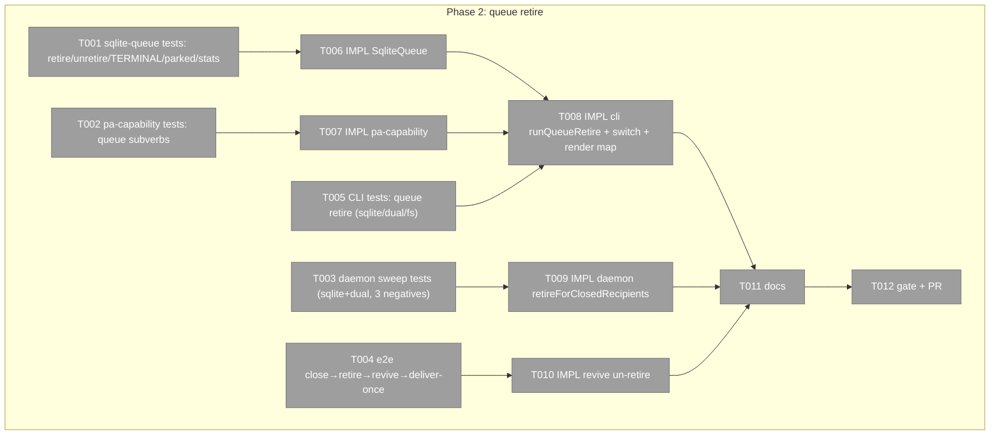
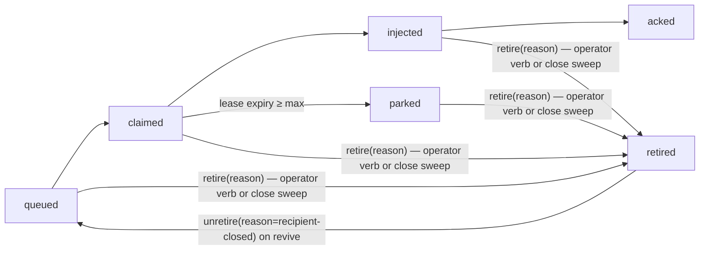
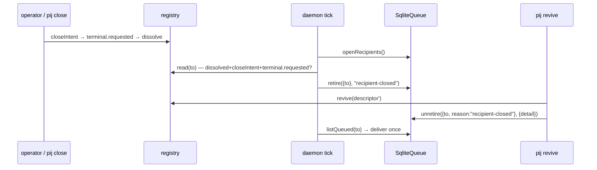

# Phase 2: Item 1 — `pij queue retire` + closed-recipient sweep — tasks dossier

**Plan**: `/Users/vaughanknight/GitHub/pij-worktrees/s391-day3-core/docs/plans/391-day3-core/391-day3-core-plan.md` (v1.5.0) · **Phase**: 2 of 5 (+ add-on AC-15 queue listing) · **Branch/PR**: `s391/item1-queue-retire` off `main` (rebased after item 6 merges), one PR · **Domains**: pij-messaging (state machine) · pij-control-plane (verb, sweep, revive) · pij-orchestration (PA) · **CS**: 3
**Rulings that bind this phase** (`rulings.md`): R-5 (a) + guards; PA class REFUSE for `queue retire`; `parked` = open-but-stuck (validator F5); dual via `sqliteOf` (F4).

### Executive Briefing
- **Purpose**: Operators had to retire 138 migrated rows with a raw `UPDATE` because no verb exists; mail queued to a seat that is later deliberately closed sits open forever. This phase adds a receipted, idempotent terminal `retired` state, the operator verb, a tick-scope sweep that retires open deliveries to seats whose close is COMPLETE and deliberate, and the revive-side un-retire so `close → revive` never loses mail.
- **What We're Building**: `DeliveryState += "retired"`; `TERMINAL = ["acked","retired"]` guard in every mutator; `SqliteQueue.retire(filter, reason)` + `unretire({to, reason}, {detail})`; `pij queue retire`; `Daemon.retireForClosedRecipients()` in `tickLocked` on `sqliteOf(this.channel)`; revive bin un-retire; PA subverb mapping for `queue`; docs.
- **Goals**: ✅ AC-03 (terminality, idempotence, receipt, `parked` retireable, stats/summary) · ✅ AC-04 (verb incl. dual + fs pointer) · ✅ AC-05 (sweep predicate + 3 negatives, sqlite AND dual) · ✅ AC-05b (close→retire→revive→deliver-once; only `recipient-closed` un-retires) · ✅ AC-06 (PA totality for `queue` subverbs; `queue retire` = refuse)
- **Non-Goals**: ❌ dispatch records (Phase 2b) · ❌ fs backend state machine · ❌ schema DDL/migration (state is free TEXT) · ❌ any `SessionDescriptor` field · ❌ `unbindGonePane` semantics (pane-gone mail stays for revive — untouched)

### Prior Phase Context
Phase 1 (item 6) is in flight on a disjoint touch set (`core/spawn.ts`, `core/models/*`, `cli.ts` spawn sites). No deliverable of Phase 1 is consumed here. Shared file: `cli.ts` (different regions: `:543-660` queue verbs, `:4475` routing, `:2186-2310` revive) — rebase after item 6 merges; conflicts are not expected.

### Pre-Implementation Check

| File | Exists? | Domain Check | Notes |
|------|---------|-------------|-------|
| `.pi/extensions/pij/adapters/sqlite-queue.ts` | yes | pij-messaging ✔ | **contract**: `DeliveryState` `:38`; header diagram `:8-11` is the contract-of-record; `receipt()` `:191`; `listUnread` `:249` / `listQueued` `:266` filter by literal state sets; `claimUnread` guards only `acked` `:297`; `ack` `:317` unconditional UPDATE; `claim` `:330-352` (`state='queued'`); `settle` `:356-376` guard `acked` only, typed `"injected"\|"queued"`; `resetClaimsOnStart` `:378`; `recoverStaleClaims` `:397-417` (`claimed,injected` + lease); `stats` `:428-443` `Record<DeliveryState,…>` literal (the ONLY compile-time catch); `summary` `:490-540` casts `r.state as DeliveryState`; `state` column `TEXT NOT NULL`, no CHECK (`:90-99`) |
| `.pi/extensions/pij/adapters/sqlite-queue.test.ts` | yes | ✔ | fixture `:20-29` (tmpdir home + injected `now`); mirror `"parks a message after maxAttempts"` `:165`, `"markRead is idempotent…"` `:72`, summary `:201` |
| `.pi/extensions/pij/adapters/channel-factory.ts` | yes | pij-messaging | `sqliteOf(channel)` `:96-101` (SqliteQueue \| DualWriteChannel.sqlite \| undefined); `DualWriteChannel.claimUnread` `:76-83` shows the advisory fs `markRead` mirror pattern |
| `.pi/extensions/pij/cli.ts` | yes | pij-control-plane | `runQueueMigrate` `:548-601` (sibling shape: `--json`, `--dry-run`, per-seat rows); `runQueue` `:603-647` narrows with `instanceof SqliteQueue` `:614` (→ use `sqliteOf`); routing `:4475-4481` (`process.argv[3] === "migrate"` → refactor to `switch`); revive bin: tmux-attach path writes revived descriptor `:2194-2200`, spawn path `:2300-2310` (`registry.revive(...)`) — un-retire hook goes AFTER the registry write on both paths |
| `.pi/extensions/pij/cli.integration.test.ts` | yes | ✔ | `pij([...])` harness; add `queue retire` cases (sqlite/dual/fs via `PIJ_QUEUE_BACKEND`) |
| `.pi/extensions/pij/daemon.ts` | yes | pij-control-plane | `tickLocked` `:367-395` (owned set from `registry.list()`; index rebuild); drain narrows `instanceof SqliteQueue` `:1089` (leave; the sweep is tick-scope, not drain-scope); `sqliteOf` already imported `:30`; `this.channel: DeliveryPort & InboxPort` `:261`; `diff.retired` at `:1380` is PANE vocabulary — name the sweep `retireForClosedRecipients` |
| `.pi/extensions/pij/daemon.delivery.test.ts` | yes | ✔ | fixture `:61-65` `new Daemon(home, ports(), new FsRegistry(home), new FsChannel(home), log)` — build a sibling fixture passing `new SqliteQueue(home)` and `new DualWriteChannel(new SqliteQueue(home), new FsChannel(home))`; `seat({...})` helper for descriptors |
| `.pi/extensions/pij/core/orchestration/pa-capability.ts` | yes | pij-orchestration | `queue: ALLOW` `:131` with a comment scoping it to read/migrate; `paCapabilityVerb` `:295-298` maps only `chore` |
| `.pi/extensions/pij/core/orchestration/pa-capability.test.ts` | yes | ✔ | `binEarlyVerbs()` `:50-60` patterns (`process.argv[2] === "x"`, `top === "x"`, `parsed.cmd.subverb === "x"`); `choreSubverbs()` `:69-75` slices a real `switch` and matches `case "x":` with an anti-vacuity floor `:116` |
| `/Users/vaughanknight/GitHub/pij-worktrees/s391-day3-core/docs/how/pij.md`, `/Users/vaughanknight/GitHub/pij-worktrees/s391-day3-core/docs/domains/pij-messaging/domain.md` | yes | docs | pij-messaging has NO `sqlite-queue.ts` source row and no delivery-state concept row (finding 08) |

Duplication check: no retire/purge/expire exists (`parked` is a lease-failure verdict written only by `recoverStaleClaims`; `summary`/`stats` are read-only). Nothing to reuse beyond the `receipt()` helper, the `settle` idempotence shape, and `sqliteOf`.

### Architecture Map

### Tasks

| Status | ID | Task | Domain | Path(s) | Done When | Notes |
|--------|-----|------|--------|---------|-----------|-------|
| [x] | T001 | TEST (RED): `retire({to:"pij-x"},"stale")` → matching rows `state="retired"`, `claim_token`/`lease_until` NULL, one `retired` receipt per row with `detail="stale"`; excluded from `listQueued`/`listUnread`; `pij-y` untouched; second call `{matched:0, retired:0}`; `ack`/`claimUnread`/`markRead`/`settle("injected"\|"queued")`/`claim`/`recoverStaleClaims`/`resetClaimsOnStart` never move a `retired` row (assert state + no new receipt); a `parked` row retires (default filter = `queued\|claimed\|injected\|parked`); `--state` filter restricts; `olderThanMs` uses `messages.created_at`; `stats()` has `retired`; `summary()` row state `retired` with trail; `unretire({to:"pij-x", reason:"recipient-closed"}, {detail:"revived …"})` → only rows whose LAST `retired` receipt detail === reason go back to `queued` with a `requeued` receipt carrying the detail; a row retired with reason `stale` stays retired | pij-messaging | `/Users/vaughanknight/GitHub/pij-worktrees/s391-day3-core/.pi/extensions/pij/adapters/sqlite-queue.test.ts` | RED on base | AC-03, AC-05b; findings 03, 13 |
| [x] | T002 | TEST (RED): `queueSubverbs()` scrape of `cli.ts` `top === "queue"` `switch (process.argv[3])` body (`case "x":`), floor `>= 2`; every subverb classified; `paCapabilityVerb("queue","retire") === "queue retire"`, `("queue","--json") === "queue"`; `PA_VERB_CLASSIFICATION["queue retire"].kind === "refuse"`, `["queue migrate"]` allow; `paBinRefusal` refuses `queue retire` for a `pa` seat | pij-orchestration | `/Users/vaughanknight/GitHub/pij-worktrees/s391-day3-core/.pi/extensions/pij/core/orchestration/pa-capability.test.ts` | RED | AC-06; finding 06 |
| [x] | T003 | TEST (RED) `daemon.delivery.test.ts` (sqlite AND dual fixtures): open rows (`queued`, `injected`, `parked`) to a descriptor with `lifecycle:"dissolved"` + `closeIntent` + `terminal:{disposition:"requested"}` → after `tick()` all `retired`, receipts `detail="recipient-closed"`, one log line; NEGATIVES: (a) descriptor dissolved via the `unbindGonePane` shape (dissolved, NO closeIntent) → untouched; (b) LIVE descriptor with `closeIntent` and NO `terminal` → untouched; (c) live seat → untouched; fs backend → sweep is a no-op (no throw). Write dissolved descriptors with `registry.write` + `registry.dissolve` (they are invisible to `list()`; the sweep must find them via `registry.read(to)`) | pij-control-plane | `/Users/vaughanknight/GitHub/pij-worktrees/s391-day3-core/.pi/extensions/pij/daemon.delivery.test.ts` | RED | AC-05; findings 02, 11, 12 |
| [x] | T003b | TEST (RED) INCIDENT REPLAY (2026-08-27 cross-government pane misbind, `~/GitHub/pij/government/incidents/2026-08-27-cross-government-pane-misbind.md`): seat X live on pane `%108` → 2 messages queued → complete deliberate close (closeIntent → terminal.requested → dissolve) → register a NEW unrelated live seat Y on the recycled pane id `%108` → run ≥4 ticks with `now` advanced past every lease → assert ZERO `sendText`/socket calls addressed to X's messages (Y receives nothing of X's), X's rows are `retired` with `recipient-closed` receipts on the FIRST tick after close; plus a direct guard test: with the sweep disabled/absent, `deliverPass` never injects for a descriptor whose `lifecycle === "dissolved"` | pij-control-plane | `/Users/vaughanknight/GitHub/pij-worktrees/s391-day3-core/.pi/extensions/pij/daemon.delivery.test.ts` | RED on base (base re-delivers) | AC-05c |
| [x] | T004 | TEST (RED) end-to-end with fakes: seat X live → 2 messages queued → `pij close`-shaped writes (closeIntent → terminal.requested → dissolve) → tick retires both (`recipient-closed`) → revive-shaped registry write (new pane/pid, `closeIntent`/`terminal` stripped) + `unretire` hook → both `queued` with `requeued` receipts → next tick delivers each EXACTLY once (count `sendText`/socket calls; a third tick delivers nothing) | pij-control-plane | `/Users/vaughanknight/GitHub/pij-worktrees/s391-day3-core/.pi/extensions/pij/daemon.delivery.test.ts` (or `daemon.test.ts`) | RED | AC-05b; R-5 guards |
| [x] | T005 | TEST (RED) `cli.integration.test.ts`: `PIJ_QUEUE_BACKEND=sqlite`: `pij queue retire --to pij-x --reason stale` prints `retired N/M …`; `--json` → `{retired, matched, reason}`; no `--reason` → exit 2 `E-ARG` + usage; `--dry-run` → counts, DB unchanged; `--older-than 30m`/`2h`/`1d` parses (bad → `E-ARG`); `PIJ_QUEUE_BACKEND=dual`: retires in sqlite AND writes an fs read-marker for each retired id (advisory); `PIJ_QUEUE_BACKEND=fs`: exit 1 with the `rm ~/.pij/<id>/inbox/msg-*.json` pointer | pij-control-plane | `/Users/vaughanknight/GitHub/pij-worktrees/s391-day3-core/.pi/extensions/pij/cli.integration.test.ts` | RED | AC-04; finding 12 |
| [x] | T006 | IMPL `sqlite-queue.ts`: `DeliveryState` + `"retired"`; `const TERMINAL: ReadonlySet<DeliveryState> = new Set(["acked","retired"])` used in `claimUnread` (`:297` → return `already-read`-style no-op for retired? NO — return `err("E-RETIRED", …)`? Decide: treat as `already-read` kind for InboxClaim compatibility, document), `ack` (guard), `settle` (`:365`), `claim` (SQL already `state='queued'`), `recoverStaleClaims`/`resetClaimsOnStart` (SQL sets exclude it — add `AND state NOT IN ('acked','retired')` belt-and-braces); `retire(filter: {to?, from?, olderThanMs?, state?: DeliveryState[]}, reason: string): {matched:number, retired:number}` (one tx; default state set `queued,claimed,injected,parked`; NULL `claim_token`/`lease_until`; receipt `retired` detail=reason); `unretire(filter:{to, reason}, opts:{detail}) : {requeued:number}` (rows whose latest `retired` receipt detail === reason → `queued`, receipt `requeued`); `stats` zero-init + `retired`; header diagram arm `─retire(reason)→ retired ⇐ any open state; unretire(reason)→ queued` | pij-messaging | `/Users/vaughanknight/GitHub/pij-worktrees/s391-day3-core/.pi/extensions/pij/adapters/sqlite-queue.ts` | T001 GREEN | finding 03 |
| [x] | T007 | IMPL `pa-capability.ts`: `paCapabilityVerb` maps `queue` subverbs exactly like `chore` (`if ((top !== "chore" && top !== "queue") …)`); keys `"queue migrate": ALLOW`, `"queue retire": refuse("it retires another seat's mail — a state change a zero-actuator PA reports, never performs (ruled 2026-08-27)")`; keep `queue: ALLOW` for the read view; update the `:128-131` comment | pij-orchestration | `/Users/vaughanknight/GitHub/pij-worktrees/s391-day3-core/.pi/extensions/pij/core/orchestration/pa-capability.ts` | T002 GREEN | ruled REFUSE |
| [x] | T008 | IMPL `cli.ts`: routing `:4475-4481` → `switch (process.argv[3]) { case "migrate": …; case "retire": runQueueRetire(process.argv.slice(4)); return; default: runQueue(process.argv.slice(3)); }`; `runQueueRetire(argv)`: parse `--to/--from/--older-than/--state/--reason/--dry-run/--json`; `const channel = openChannel(pijHome); const sq = sqliteOf(channel)`; fs → pointer message exit 1; dual → after retire, `for id of retiredIds: try { fsChannel.markRead(to, id) } catch {}` (obtain the fs half via `channel instanceof DualWriteChannel ? channel["fs"]` — expose a `fsMirror` getter on `DualWriteChannel` rather than reaching into a private); `runQueue` `:614` → `sqliteOf`; render map `const STATE_GLYPH: Record<DeliveryState,string> = {…}` (exhaustive — compile error on a new state) | pij-control-plane | `/Users/vaughanknight/GitHub/pij-worktrees/s391-day3-core/.pi/extensions/pij/cli.ts`, `/Users/vaughanknight/GitHub/pij-worktrees/s391-day3-core/.pi/extensions/pij/adapters/channel-factory.ts` (getter only) | T005 GREEN | finding 12 |
| [x] | T009b | IMPL `daemon.ts` drain guard (independent of the sweep): in `drainInboxLocked`/`deliverPass`, resolve the recipient's CURRENT descriptor via `registry.read(id)` and skip (no claim, no inject, no pointer) when `lifecycle === "dissolved"`; log once per seat | pij-control-plane | `/Users/vaughanknight/GitHub/pij-worktrees/s391-day3-core/.pi/extensions/pij/daemon.ts` | T003b guard test GREEN | AC-05c |
| [x] | T009 | IMPL `daemon.ts`: `private retireForClosedRecipients(): void` called from `tickLocked` right after `this.index.rebuild(...)`: `const sq = sqliteOf(this.channel); if (!sq) return;` → `sq.openRecipients()` (new tiny query `SELECT DISTINCT to_id FROM deliveries WHERE state IN ('queued','claimed','injected','parked')`) → for each `to`: `const d = this.registry.read(to)`; predicate `d?.lifecycle === "dissolved" && d.closeIntent !== undefined && d.terminal?.disposition === "requested"` → `sq.retire({to}, "recipient-closed")`; log `retire ${to}: ${n} open deliveries retired (recipient closed)` when n>0 | pij-control-plane | `/Users/vaughanknight/GitHub/pij-worktrees/s391-day3-core/.pi/extensions/pij/daemon.ts`, `/Users/vaughanknight/GitHub/pij-worktrees/s391-day3-core/.pi/extensions/pij/adapters/sqlite-queue.ts` (`openRecipients`) | T003 GREEN | findings 02, 11; name avoids `diff.retired` (pane) |
| [x] | T010 | IMPL revive bin: after the revived descriptor is persisted on BOTH paths (`cli.ts:2194-2200` attach; `:2300-2310` spawn), `sqliteOf(openChannel(pijHome))?.unretire({to: id, reason: "recipient-closed"}, {detail: \`revived by ${reviverId} → pane ${paneId} at ${nowIso}\`})`; print `requeued N message(s) retired at close` when N>0 | pij-control-plane | `/Users/vaughanknight/GitHub/pij-worktrees/s391-day3-core/.pi/extensions/pij/cli.ts` | T004 GREEN | R-5 guards |
| [x] | T013 | TEST (RED) `cli.integration.test.ts`: seed ~900 deliveries (or a few large-body rows) so `pij queue` output exceeds 70 KiB; run the CLI with stdout piped (the harness's `pij([...])` spawnSync already pipes); assert the LAST seq is present in output (fails on base: output is cut at exactly 65536 bytes because `runQueue` calls `process.exit(0)` right after a large `process.stdout.write`); assert default listing shows the latest 200 rows + footer `showing 200 of M (latest) — --all for everything, --since <seq>, --tail N`; `--all` shows M; `--since <seq>` and `--tail N` filter; `--json` → `{rows, total, shown}` | pij-control-plane | `/Users/vaughanknight/GitHub/pij-worktrees/s391-day3-core/.pi/extensions/pij/cli.integration.test.ts` | RED on base | AC-15 (o-prime add-on). Also add the one-line comment review-01 (Phase 1a) F-1 asked for above the existing 812-row pipe test: it is non-vacuous only because `runQueue` writes once and exits in the same tick — repointing AC-16 at a drain-safe verb would make it silently green forever |
| [x] | T014 | IMPL `cli.ts runQueue` (`:603-647`): replace every `process.exit(0)` after a write with `process.exitCode = 0; return;` (the ONE remaining `process.exit(json ? 0 : 1)` on the fs-backend refusal is a tiny write and may stay); default `limit: 200` unless `--all`; add `--since <seq>` (maps to `sinceSeq`) and `--tail N` (alias of `--last`); compute `total` with a `COUNT(*)` on the same WHERE (add `SqliteQueue.count(opts)` beside `summary`); footer line when `shown < total`; `--json` shape `{rows, total, shown}` (keep `rows` array first-class so existing consumers can adapt) | pij-control-plane | `/Users/vaughanknight/GitHub/pij-worktrees/s391-day3-core/.pi/extensions/pij/cli.ts`, `/Users/vaughanknight/GitHub/pij-worktrees/s391-day3-core/.pi/extensions/pij/adapters/sqlite-queue.ts` | T013 GREEN | AC-15 |
| [x] | T011 | DOCS: `docs/how/pij.md` queue section (`pij queue` default latest-200 + `--all/--since/--tail` + `showing N of M`; `pij queue retire` grammar, `retired` vs `parked`, close-sweep + revive requeue semantics, fs pointer); `docs/domains/pij-messaging/domain.md`: add `adapters/sqlite-queue.ts` to Source Locations and a `Delivery state machine` concept row (`queued→claimed→injected→acked`, `parked` open-but-stuck, `retired` terminal with reason receipt, `unretire` by reason) | docs | `/Users/vaughanknight/GitHub/pij-worktrees/s391-day3-core/docs/how/pij.md`, `/Users/vaughanknight/GitHub/pij-worktrees/s391-day3-core/docs/domains/pij-messaging/domain.md` | rows present | finding 08 |
| [x] | T012 | GATE `npx vitest run .pi/extensions/pij/` green; pathspec commits; report | — | — | 0 fail; commit sha in report | AC-10 |

### Context Brief
**Key findings from plan**: 02/11 (predicate = complete deliberate close; enumerate from the queue, `registry.read(to)`, tick-scope), 03 (TERMINAL set; SQL literals; `stats` literal), 06 (PA subverb hole), 12 (`sqliteOf`, dual mirror), 13 (`parked` open-but-stuck), 08 (domain doc rows).
**Domain dependencies**: `pij-messaging`: SqliteQueue (`DeliveryPort`+`InboxPort`), receipts (append-only) · `pij-control-plane`: daemon tick (`tickLocked`), registry `read` (hot-first, falls through to archive — `core/ports.ts:57-64`), revive bin · `pij-orchestration`: PA capability table + `paBinRefusal` gate (`cli.ts:4460`).
**Domain constraints**: `messages` immutable; every state change one transaction; retire ≠ delete; `registry.list()` never returns dissolved — use `read`; additive `SessionDescriptor` only (no new fields here); never write `.flow-pair/**`.
**Reusable**: `receipt()` helper; `settle` idempotence shape; `runQueueMigrate` CLI shape; `daemon.delivery.test.ts` fixture + `seat()` helper; `DualWriteChannel.claimUnread` mirror pattern.

### Discoveries & Learnings
| Date | Task | Type | Discovery | Resolution | References |
|------|------|------|-----------|------------|------------|
