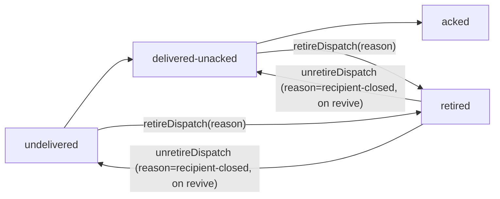

# Phase 2b: Item 1b — dispatch-record retire — tasks dossier

**Plan**: `/Users/vaughanknight/GitHub/pij-worktrees/s391-day3-core/docs/plans/391-day3-core/391-day3-core-plan.md` (v1.8.0 § Phase 2b, AC-11..14) · **Phase**: 2b · **Branch/PR**: `s391/item1b-dispatch-retire` off `main@c8dc3778` (item 1 merged), one PR · **Domains**: pij-orchestration (platform records) · pij-control-plane (verb, sweep, revive) · **CS**: 2
**Rulings** (`rulings.md`): re-scope (i) 09:40Z; PA class REFUSE 09:48Z (supersedes the ALLOW note); revive un-retires under the R-5 guard. **O-prime live acceptance**: the five board rows (determinist, federal-gorilla, persistent-capybara, curious-mawhrin, ancient-xoxarle) disappear after a retire.

### Executive Briefing
- **Purpose**: the anomaly board rots on `delivered-unacked-stale` DISPATCH records addressed to seats that were closed long ago; dispatch records are a separate platform entity (`DISPATCH_STATES = undelivered|delivered-unacked|acked`) with no terminal retire state and no writer on close. This phase adds an additive `retired` state + pure transitions, an operator verb, the same complete-close sweep arm, revive un-retire under the R-5 guard, and a detector that skips retired rows.
- **Goals**: ✅ AC-11 pure `retireDispatch`/`unretireDispatch` (idempotent, canonical JSON, legacy load) · ✅ AC-12 `pij dispatch-retire` verb (core-parsed like `dispatch-packet`/`ack-dispatch`; PA `refuse`) · ✅ AC-13 sweep arm + revive un-retire (only `recipient-closed`) · ✅ AC-14 detector skips `retired`
- **Non-Goals**: ❌ sqlite deliveries (Phase 2) · ❌ changing `acknowledgeDispatch` semantics · ❌ the rail/spine renderer beyond skipping retired rows in `pij anomalies`

### Prior Phase Context (Phase 2 — reuse)
- `Daemon.retireForClosedRecipients()` (tick-scope; predicate dissolved + closeIntent + terminal.requested) — ADD the dispatch arm inside it (same predicate, same log line family).
- Revive bin un-retire hook (both paths, `cli.ts` ~`:2194-2200` and ~`:2300-2310`) — ADD the dispatch un-retire beside the deliveries one, same reason guard.
- `paCapabilityVerb` subverb mapping — NOT needed here: `dispatch-retire` is a core-parsed verb key, classified directly.

### Pre-Implementation Check
| File | Exists? | Notes |
|---|---|---|
| `/Users/vaughanknight/GitHub/pij-worktrees/s391-day3-core/.pi/extensions/pij/core/platform/types.ts` | yes | `DISPATCH_STATES` `:103` (`as const` tuple → add `"retired"`); `Dispatch` `:167-185` — add optional `retirement?: { reason: string; actor: string; ts: string; priorState: "undelivered"\|"delivered-unacked" }` (additive; legacy records load) |
| `/Users/vaughanknight/GitHub/pij-worktrees/s391-day3-core/.pi/extensions/pij/core/platform/dispatch.ts` | yes | `DISPATCH_FIELD_ORDER` `:8-21` (append `retirement`); `canonicalDispatchJson` `:38`; `markDispatchDelivered` `:73`; `acknowledgeDispatch` `:87-116` (pattern for the new pure fns; must refuse on `retired`) |
| `/Users/vaughanknight/GitHub/pij-worktrees/s391-day3-core/.pi/extensions/pij/core/platform/dispatch.test.ts` | yes | sibling tests |
| `/Users/vaughanknight/GitHub/pij-worktrees/s391-day3-core/.pi/extensions/pij/core/platform/ports.ts` | yes | `DispatchStorePort { write, read, list }` `:59-65` |
| `/Users/vaughanknight/GitHub/pij-worktrees/s391-day3-core/.pi/extensions/pij/adapters/dispatch-store.ts` | yes | `FsDispatchStore implements DispatchStorePort` `:15` — the daemon sweep opens `new FsDispatchStore(pijHome)` (bin wires it at `cli.ts:772`) |
| `/Users/vaughanknight/GitHub/pij-worktrees/s391-day3-core/.pi/extensions/pij/core/cli.ts` | yes | verbs `dispatch-packet` `:456`, `ack-dispatch` `:471` (parse shape to mirror for `dispatch-retire`); store writes `:4404, :4536, :4592, :4698`; `deps.dispatchStore?` `:240`; anomalies input `:5855` `dispatches: deps.dispatchStore?.list()` |
| `/Users/vaughanknight/GitHub/pij-worktrees/s391-day3-core/.pi/extensions/pij/core/orchestration/pa-capability.ts` | yes | `"dispatch-packet": OBLIGATION` `:213`, `"ack-dispatch": conditional(...)` `:220` → add `"dispatch-retire": refuse("…zero-actuator PA…")` (the exhaustive scrape of `readonly verb: "…"` catches it) |
| `/Users/vaughanknight/GitHub/pij-worktrees/s391-day3-core/.pi/extensions/pij/core/anomalies.ts` | yes | detector loop `:695-707` — skip `state === "retired"` |
| `/Users/vaughanknight/GitHub/pij-worktrees/s391-day3-core/.pi/extensions/pij/core/anomalies.test.ts` | yes | `dispatchRecord({...})` fixture (~`:740-770`), `kind === "delivered-unacked-stale"` filter |
| `/Users/vaughanknight/GitHub/pij-worktrees/s391-day3-core/.pi/extensions/pij/daemon.ts` | yes | Phase 2's `retireForClosedRecipients` (add arm) |
| `/Users/vaughanknight/GitHub/pij-worktrees/s391-day3-core/.pi/extensions/pij/daemon.delivery.test.ts`, `/Users/vaughanknight/GitHub/pij-worktrees/s391-day3-core/.pi/extensions/pij/cli.integration.test.ts` | yes | fixtures |
| `docs/how/pij.md` | yes | dispatch retire section |

### Tasks
| Status | ID | Task | Domain | Path(s) | Done When | Notes |
|--------|-----|------|--------|---------|-----------|-------|
| [x] | T001 | TEST (RED) `dispatch.test.ts`: `retireDispatch(d, {reason, actor, ts})` → `state:"retired"`, `retirement:{reason, actor, ts, priorState}`, `updated` stamped; on `acked`/`retired` returns `ok(d)` unchanged; `unretireDispatch(d, {actor, ts})` restores `priorState` and clears `retirement` ONLY when `retirement.reason === "recipient-closed"`, else unchanged; `acknowledgeDispatch` on a retired record → `err`; canonical JSON includes `retirement` in field order; a legacy record without `retirement` round-trips byte-identical | pij-orchestration | `/Users/vaughanknight/GitHub/pij-worktrees/s391-day3-core/.pi/extensions/pij/core/platform/dispatch.test.ts` | RED | AC-11 |
| [x] | T002 | TEST (RED) `anomalies.test.ts`: a `retired` dispatch older than `dispatchStaleMs` → NO `delivered-unacked-stale`; the existing `stale` fixture still flags | pij-orchestration | `/Users/vaughanknight/GitHub/pij-worktrees/s391-day3-core/.pi/extensions/pij/core/anomalies.test.ts` | RED | AC-14 |
| [x] | T003 | TEST (RED) `pa-capability.test.ts` needs no new scrape — assert `PA_VERB_CLASSIFICATION["dispatch-retire"].kind === "refuse"`; CLI test (`cli.integration.test.ts` or core `cli.test.ts`): `pij dispatch-retire <id> --reason R` and `--to <seat> --reason R` (all open records for that recipient) write retired records and print counts; no `--reason` → `E-ARG`; `--json` → `{retired, matched, reason}`; `--dry-run` | pij-orchestration / control-plane | `/Users/vaughanknight/GitHub/pij-worktrees/s391-day3-core/.pi/extensions/pij/core/orchestration/pa-capability.test.ts`, `/Users/vaughanknight/GitHub/pij-worktrees/s391-day3-core/.pi/extensions/pij/cli.integration.test.ts` | RED | AC-12 |
| [x] | T004 | TEST (RED) `daemon.delivery.test.ts`: complete deliberate close of seat X with two `delivered-unacked` + one `undelivered` dispatch → after tick all three `retired` (`recipient-closed`); pane-gone / live-with-closeIntent / live seat → untouched; revive-shaped write + un-retire hook → the three restore to their prior states; an operator-retired record (reason `stale`) stays retired through revive | pij-control-plane | `/Users/vaughanknight/GitHub/pij-worktrees/s391-day3-core/.pi/extensions/pij/daemon.delivery.test.ts` | RED | AC-13; R-5 guard |
| [x] | T005 | IMPL `types.ts` (`DISPATCH_STATES` + `"retired"`; `retirement?`), `dispatch.ts` (`retireDispatch`, `unretireDispatch`, field order, ack refusal) | pij-orchestration | `/Users/vaughanknight/GitHub/pij-worktrees/s391-day3-core/.pi/extensions/pij/core/platform/types.ts`, `/Users/vaughanknight/GitHub/pij-worktrees/s391-day3-core/.pi/extensions/pij/core/platform/dispatch.ts` | T001 GREEN | additive only |
| [x] | T006 | IMPL `anomalies.ts:695` skip retired | pij-orchestration | `/Users/vaughanknight/GitHub/pij-worktrees/s391-day3-core/.pi/extensions/pij/core/anomalies.ts` | T002 GREEN | |
| [x] | T007 | IMPL `core/cli.ts`: parse `dispatch-retire` (mirror `ack-dispatch` `:471`), handler using `deps.dispatchStore` (`read`/`list` + `write`), output; `pa-capability.ts` `"dispatch-retire": refuse(...)`; `cli.ts` help text | pij-control-plane / orchestration | `/Users/vaughanknight/GitHub/pij-worktrees/s391-day3-core/.pi/extensions/pij/core/cli.ts`, `/Users/vaughanknight/GitHub/pij-worktrees/s391-day3-core/.pi/extensions/pij/core/orchestration/pa-capability.ts`, `/Users/vaughanknight/GitHub/pij-worktrees/s391-day3-core/.pi/extensions/pij/cli.ts` | T003 GREEN | |
| [x] | T008 | IMPL `daemon.ts`: inside `retireForClosedRecipients`, for each closed recipient also `new FsDispatchStore(pijHome).list().filter(d => d.to === id && (d.state === "delivered-unacked" \|\| d.state === "undelivered"))` → `retireDispatch(..., {reason:"recipient-closed", actor:"daemon"})` → `write`; revive bin: beside the deliveries un-retire, `unretireDispatch` for records with `retirement.reason === "recipient-closed"` and `to === id` | pij-control-plane | `/Users/vaughanknight/GitHub/pij-worktrees/s391-day3-core/.pi/extensions/pij/daemon.ts`, `/Users/vaughanknight/GitHub/pij-worktrees/s391-day3-core/.pi/extensions/pij/cli.ts` | T004 GREEN | |
| [x] | T011 | (Phase 2 review-01 F-9, low) TEST: one more sweep fixture — LIVE (`lifecycle:"bound"`) + `closeIntent` + `terminal.disposition:"requested"` + no `revivePendingAt` → untouched (the persist-before-mutate window between the two close writes, `daemon.ts` close path / `core/session.ts:505-513`); IMPL: hoist the null-guard in `retireForClosedRecipients` to `if (descriptor === null) continue;` so each of the four clauses is independently mutable; record the mutation RED in the execution log | pij-control-plane | `/Users/vaughanknight/GitHub/pij-worktrees/s391-day3-core/.pi/extensions/pij/daemon.delivery.test.ts`, `/Users/vaughanknight/GitHub/pij-worktrees/s391-day3-core/.pi/extensions/pij/daemon.ts` | RED→GREEN | carried from Phase 2 |
| [x] | T012 | (F-10, info) TEST+IMPL: `pij queue retire --to X --all-recipients` → `E-ARG` "choose a selector OR --all-recipients" (mirrors the `--all`/`--tail` choose-one) | pij-control-plane | `/Users/vaughanknight/GitHub/pij-worktrees/s391-day3-core/.pi/extensions/pij/cli.integration.test.ts`, `/Users/vaughanknight/GitHub/pij-worktrees/s391-day3-core/.pi/extensions/pij/cli.ts` | RED→GREEN | carried from Phase 2 |
| [x] | T013 | (F-11, info) Move the FX-01 pins into their own `it()` blocks named for what they pin (selector requirement; `--all`/`--tail` conflict) — no behaviour change; assert the selector-requirement message on the E-ARG line, not the usage line | pij-control-plane | `/Users/vaughanknight/GitHub/pij-worktrees/s391-day3-core/.pi/extensions/pij/cli.integration.test.ts` | GREEN, suite count +2 | carried from Phase 2 |
| [x] | T009 | DOCS `docs/how/pij.md` (dispatch retire; board semantics; revive restore) | docs | `/Users/vaughanknight/GitHub/pij-worktrees/s391-day3-core/docs/how/pij.md` | present | |
| [x] | T010 | GATE vitest green; pathspec commit; report. O-prime runs the live acceptance after merge. | — | git root | 0 fail; sha in report | AC-10 |

### Context Brief
**Key findings**: scope-check answer (`reports/scope-check-dispatch-records.md`): dispatch records are not reachable by the deliveries retire; detector never consults recipient lifecycle. **Domain constraints**: additive `DISPATCH_STATES`; canonical field order is a contract (spine/attest hashing may depend on `canonicalDispatchJson` — keep new field LAST and optional); never write `.flow-pair/**`. **Reusable**: Phase 2 sweep + revive hooks; `acknowledgeDispatch` shape; `dispatchRecord()` fixture.

### Discoveries & Learnings
| Date | Task | Type | Discovery | Resolution | References |
|------|------|------|-----------|------------|------------|
