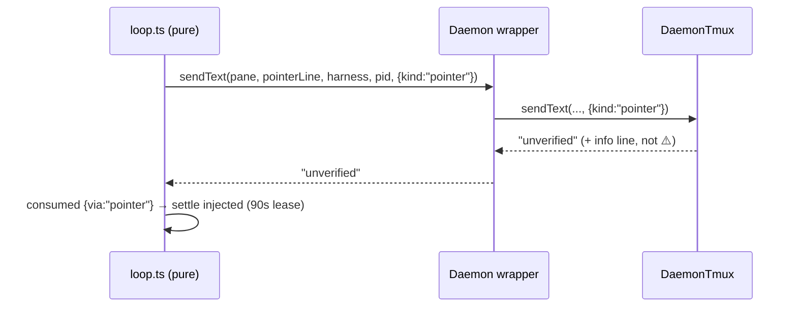

# Phase 3: Item 5 — honest pointer-path UNVERIFIED line (+ finding C dual gate) — tasks dossier

**Plan**: `/Users/vaughanknight/GitHub/pij-worktrees/s391-day3-core/docs/plans/391-day3-core/391-day3-core-plan.md` (v1.9.0 § Phase 3, AC-07, AC-08, AC-08b, AC-18) · **Branch/PR**: `s391/item5-pointer-unverified` off `main@9133733` (anchors re-verified on it 2026-08-27T16:05Z) · **Domain**: pij-control-plane · **CS**: 2
**Rulings**: validator F2 (Daemon port wrapper must forward the 5th arg — composition test); s392 ticket finding C (`daemon.ts:1089` → `sqliteOf`). Outcome vocabulary is frozen (plan 071 D7 guard test).

### Executive Briefing
- **Purpose**: a one-line pointer whose Enter the daemon cannot confirm is marked `injected` under a 90 s lease and re-announced later — correct at-most-once behaviour — but `sendTextUnchecked` logs `⚠️ … UNVERIFIED … never confirmed submission`, which reads as a stranded body. The adapter cannot know the caller was the pointer path. Add an optional `opts.kind` to the `sendText` port, pass `{kind:"pointer"}` from the pointer path, forward it through the production `Daemon` wrapper, and log an honest line for pointers. Plus finding C: the drain's `instanceof SqliteQueue` gate → `sqliteOf`.
- **Goals**: ✅ AC-07 adapter wording per path, outcome word unchanged · ✅ AC-08 loop passes `{kind:"pointer"}` · ✅ AC-08b real-`Daemon` composition forwards `opts` · ✅ AC-18 dual backend takes the pointer path + runs stale-claim recovery
- **Non-Goals**: ❌ `unverified`→`delivered` (never) · ❌ receipts (pointer path emits none today — keep) · ❌ lease/re-announce mechanics · ❌ composer-idle guard (Amendment 4) · ❌ typed-body path wording

### Pre-Implementation Check
| File | Exists? | Notes |
|---|---|---|
| `/Users/vaughanknight/GitHub/pij-worktrees/s391-day3-core/.pi/extensions/pij/core/daemon/loop.ts` | yes | port `sendText(paneId, text, harness?, pid?)` `:71`; pointer path `:637-653` (`pointerLine`, `via:"pointer"`, call `:647`); typed-body call `:672`; `via` union `:531`. PURE — no stderr here |
| `/Users/vaughanknight/GitHub/pij-worktrees/s391-day3-core/.pi/extensions/pij/adapters/daemon-tmux.ts` | yes | public `sendText` `:445-447`; `sendTextUnchecked(paneId, text, harness?, pid?)` `:471-476`; warning write `:540-556`; short-tail early break `:538` + `:150-154` (why pointers reach unverified after ONE Enter) |
| `/Users/vaughanknight/GitHub/pij-worktrees/s391-day3-core/.pi/extensions/pij/daemon.ts` | yes | port wrapper `:283-290` (4-arg lambda → MUST accept+forward `opts`); pointer settle `:1156-1160` (`POINTER_LEASE_MS` `:48`); drain gate `:1089` `instanceof SqliteQueue` → `sqliteOf(this.channel)` (import at `:30`; dual-aware precedent `:1525`); pointer flag `:1138` `{ pointer: sq !== undefined }` |
| `/Users/vaughanknight/GitHub/pij-worktrees/s391-day3-core/.pi/extensions/pij/adapters/daemon-tmux.test.ts` | yes | `describe("DaemonTmux.sendText — claude submission verification")` `:364`; `"exhausted — payload stays stranded → unverified…"` `:454`; vocabulary guard `:511-527` MUST stay green |
| `/Users/vaughanknight/GitHub/pij-worktrees/s391-day3-core/.pi/extensions/pij/core/daemon/loop.test.ts` | yes | pointer path describe `:1206`; `:1216-1240` exact `{outcome, via:"pointer"}`; composer-idle guard `:1260` (Amendment 4) unchanged |
| `/Users/vaughanknight/GitHub/pij-worktrees/s391-day3-core/.pi/extensions/pij/daemon.test.ts` | yes | `fakePorts({sendOutcome})` fixture `:96-152`; `"emits an unverified receipt…"` `:313` |
| `/Users/vaughanknight/GitHub/pij-worktrees/s391-day3-core/.pi/extensions/pij/daemon.delivery.test.ts` | yes | `new Daemon(home, ports(), new FsRegistry(home), new FsChannel(home), log)` fixture `:61-65` → dual fixture for AC-18 |
| `/Users/vaughanknight/GitHub/pij-worktrees/s391-day3-core/.pi/extensions/pij/adapters/channel-factory.ts` | yes | `sqliteOf` `:96-101`, `DualWriteChannel` `:53` |
| `docs/how/pij.md` | yes | daemon log vocabulary |

### Tasks
| Status | ID | Task | Domain | Path(s) | Done When | Notes |
|--------|-----|------|--------|---------|-----------|-------|
| [x] | T001 | TEST (RED) `daemon-tmux.test.ts`: exhausted-Enter fixture with 5th arg `{kind:"pointer"}` → returns `"unverified"`, stderr line contains neither `UNVERIFIED` nor `⚠️`, contains `pointer` and `re-announce`/`lease`; same fixture without the arg → today's `⚠️ … UNVERIFIED …` line verbatim; vocabulary guard `:511-527` untouched | pij-control-plane | `/Users/vaughanknight/GitHub/pij-worktrees/s391-day3-core/.pi/extensions/pij/adapters/daemon-tmux.test.ts` | RED | AC-07 |
| [x] | T002 | TEST (RED) `loop.test.ts`: fake `sendText` records its args; pointer path passes `{kind:"pointer"}` as 5th arg; typed-body path passes none; `:1216-1240` and `:1260` unchanged | pij-control-plane | `/Users/vaughanknight/GitHub/pij-worktrees/s391-day3-core/.pi/extensions/pij/core/daemon/loop.test.ts` | RED | AC-08 |
| [x] | T003 | TEST (RED) `daemon.test.ts`: REAL `Daemon` with a raw-port fake whose `sendText` records args; a sqlite-backed pointer delivery reaches the raw port with `opts.kind === "pointer"` (a 4-arg wrapper is silently assignable — only this composition test catches the drop) | pij-control-plane | `/Users/vaughanknight/GitHub/pij-worktrees/s391-day3-core/.pi/extensions/pij/daemon.test.ts` | RED | AC-08b; validator F2 |
| [x] | T004 | TEST (RED) `daemon.delivery.test.ts`: Daemon on `new DualWriteChannel(new SqliteQueue(home), new FsChannel(home))`: a queued message to a legacy seat is delivered via the pointer line (fake `sendText` sees `pointerLine` text, row `injected` with lease); an expired-lease row is recovered on the next drain | pij-control-plane | `/Users/vaughanknight/GitHub/pij-worktrees/s391-day3-core/.pi/extensions/pij/daemon.delivery.test.ts` | RED on base (dual takes the typed-body path today) | AC-18; finding C |
| [x] | T005 | IMPL `loop.ts:71` port: `sendText(paneId, text, harness?, pid?, opts?: { readonly kind?: "pointer" \| "body" })`; `:647` pass `{ kind: "pointer" }` | pij-control-plane | `/Users/vaughanknight/GitHub/pij-worktrees/s391-day3-core/.pi/extensions/pij/core/daemon/loop.ts` | T002 GREEN | typed-body call `:672` unchanged |
| [x] | T006 | IMPL `daemon-tmux.ts`: `sendText`/`sendTextUnchecked` accept `opts`; at `:540-556` branch on `opts?.kind === "pointer"`: `ℹ️ <harness> pointer typed into pane <id> (pid <n>) but submission unconfirmed after <N> Enter attempt(s) — body is safe in the queue; row stays injected under a <POINTER_LEASE_MS/1000>s lease and is re-announced on expiry` (keep tail/pid detail); body path wording unchanged | pij-control-plane | `/Users/vaughanknight/GitHub/pij-worktrees/s391-day3-core/.pi/extensions/pij/adapters/daemon-tmux.ts` | T001 GREEN | finding 07 |
| [x] | T007 | IMPL `daemon.ts:283-290` wrapper: 5th param `opts`, forward to `rawPorts.sendText(paneId, text, harness, pid, opts)`; `:1089` `const sq = sqliteOf(this.channel);` | pij-control-plane | `/Users/vaughanknight/GitHub/pij-worktrees/s391-day3-core/.pi/extensions/pij/daemon.ts` | T003 + T004 GREEN | |
| [x] | T008 | DOCS `docs/how/pij.md`: daemon log vocabulary (pointer info line vs body UNVERIFIED warning); dual backend note | docs | `/Users/vaughanknight/GitHub/pij-worktrees/s391-day3-core/docs/how/pij.md` | present | |
| [x] | T009 | GATE vitest green; pathspec commit; report | — | git root | 0 fail; sha in report | AC-10 |

### Context Brief
**Key findings**: 07 (adapter is caller-blind; loop is pure; pointers hit unverified after one Enter), 09 (wrapper drops opts), finding C (dual gate). **Constraints**: `SendOutcome` vocabulary frozen; pointer path emits no receipt (`daemon.ts:1155-1163` continues before `emitSendReceipt`); optional trailing param keeps 12 test fakes compiling. **Reusable**: `fakePorts`, busy-pane fixture, dual fixture pattern from Phase 2.

### Discoveries & Learnings
| Date | Task | Type | Discovery | Resolution | References |
|------|------|------|-----------|------------|------------|
