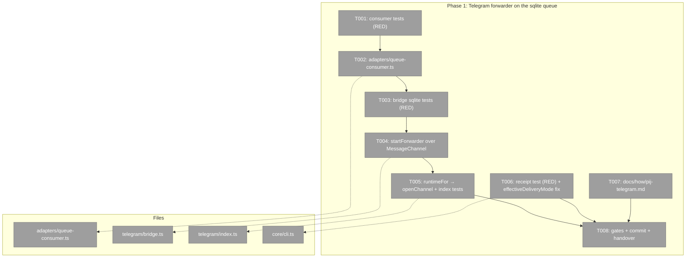
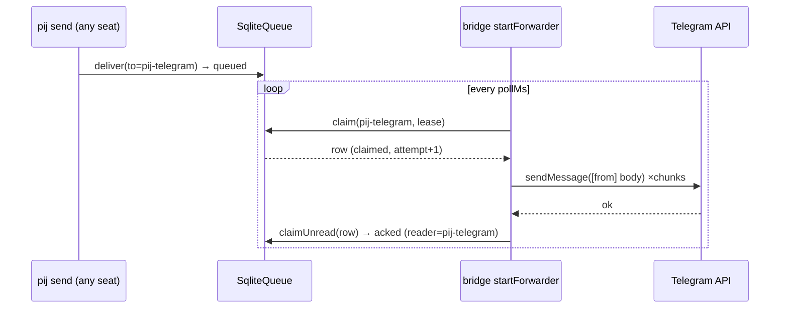

# Phase 1: 3b — Telegram forwarder on the sqlite queue + honest pull receipt

**Plan**: `/Users/vaughanknight/GitHub/pij-worktrees/s392-day3-codex-doctrine/docs/plans/392-day3-codex-doctrine/day3-codex-doctrine-plan.md`
**Worktree**: `/Users/vaughanknight/GitHub/pij-worktrees/s392-day3-codex-doctrine` · **Branch**: `s392/day3-codex-doctrine` · **Base**: `main@2953d75`
**Rulings**: `../../rulings.md` (authoritative: rows 149/290, watermark, consumer placement)
**Status**: complete — implementation commit `69f1c4524c39340ff63c26ba498fd489ca3faeec`

### Executive Briefing
- **Purpose**: Telegram is dark on the merged code because the bridge still drains an fs inbox that the sqlite-default daemon never writes. This phase makes the bridge consume the durable queue **at-least-once, acking only after a successful send** (two named, bounded duplicate windows), and makes `pij send` stop claiming `delivered` for a pull seat it cannot have delivered to.
- **What We're Building**: a small generic `startQueueConsumer` over `SqliteQueue` (claim → handler → ack; handler rejection = leave claimed for the daemon's lease sweep), a sqlite-capable `startForwarder` whose handler REJECTS while any required text part is undelivered (the current closure swallows `send` errors — `bridge.ts:573-581` — that must not reach an ack), `runtimeFor` on `openChannel`, a two-site `effectiveDeliveryMode` fix in `core/cli.ts`, a how-doc section, and a handover file for the o-prime's bridge restart + live proof.
- **Goals**:
  - ✅ AC-01…AC-06 green in vitest (see plan § Acceptance Criteria)
  - ✅ `failed`/`acked`/`parked` rows never forwarded; every `queued` row forwarded once (state machine = watermark)
  - ✅ fs backend (`PIJ_QUEUE_BACKEND=fs`) byte-for-byte unchanged
  - ✅ no write-side change to `adapters/sqlite-queue.ts`
  - ✅ a row is NEVER acked while a required text bubble failed to send (plan finding 07)
- **Non-Goals**:
  - ❌ restarting the bridge or daemon, or writing the live queue (o-prime batons)
  - ❌ true exactly-once (no Telegram idempotency key exists) — the contract is at-least-once with bounded duplicates (plan finding 08)
  - ❌ changing fs-branch behaviour (log + continue stays for `PIJ_QUEUE_BACKEND=fs`)
  - ❌ `--skip-backlog`, `pij queue retire`, pi receiver (Phase 2)

### Prior Phase Context
_None — Phase 1._

### Pre-Implementation Check

| File | Exists? | Domain Check | Notes |
|------|---------|-------------|-------|
| `.pi/extensions/pij/adapters/queue-consumer.ts` | create | pij-messaging (adapters/) | NEW contract; no existing "consumer"/"watch" concept over `SqliteQueue` (checked `sqlite-queue.ts` exports + `docs/domains/pij-messaging/domain.md`) |
| `.pi/extensions/pij/adapters/queue-consumer.test.ts` | create | pij-messaging | sibling test |
| `.pi/extensions/pij/telegram/bridge.ts` | modify | pij-messaging | `startForwarder` :548–649 |
| `.pi/extensions/pij/telegram/bridge.test.ts` | modify | pij-messaging | existing `startForwarder` describes :785–1100 build `new FsChannel(home,{pollMs:25})` |
| `.pi/extensions/pij/telegram/index.ts` | modify | pij-messaging | `BridgeRuntime.channel` :138; `runtimeFor` :316; `seenInbox` :292 |
| `.pi/extensions/pij/telegram/index.test.ts` | modify | pij-messaging | |
| `.pi/extensions/pij/core/cli.ts` | modify | pij-messaging | `classifySendReceipt` :2216–2235; `daemonReceiptAuthoritative` :691–696; `effectiveDeliveryMode` :2270 |
| `.pi/extensions/pij/core/cli.test.ts` | modify | pij-messaging | receipt tests near :1191 (pull-inbox) |
| `docs/how/pij-telegram.md` | modify | pij-messaging | new section |
| `docs/plans/392-day3-codex-doctrine/reports/phase-1-handover.md` | create | plan folder | handover for o-prime |

Contract change: `startForwarder(channel: FsChannel, …)` → `startForwarder(channel: MessageChannel, …)` (widening; `BridgeRuntime.channel` likewise). Additive, no descriptor/schema change.

### Architecture Map



### Tasks

| Status | ID | Task | Domain | Path(s) | Done When | Notes |
|--------|-----|------|--------|---------|-----------|-------|
| [x] | T001 | Write `queue-consumer.test.ts` (RED) over a real `SqliteQueue` on a temp home with injected `now`: (a) 3 queued rows → handler called once each in seq order → each row `acked` with receipt `reader=<self>`; (b) `kind:"receipt"` row reaches the handler (`dm.kind==="receipt"`) and is acked; (c) handler throws → row stays `claimed` (no ack, no `released` receipt) → advance `now` past `leaseMs` + `queue.recoverStaleClaims()` → handled again (attempt 2) → after `maxAttempts` it is `parked`; (d) pre-seeded `acked` + `failed` rows (set `failed` via a raw `UPDATE deliveries SET state='failed'` helper on the test db) are never handled while `queued` ones are; (e) dispose stops the poll (no handler call after dispose + timer tick); (f) `onScan(atMs)` fires once per poll | pij-messaging | `/Users/vaughanknight/GitHub/pij-worktrees/s392-day3-codex-doctrine/.pi/extensions/pij/adapters/queue-consumer.test.ts` | Suite exists and fails only because `queue-consumer.ts` is missing | Plan finding 03/04; mirror `sqlite-queue.test.ts` fixtures (`tmpHome`, `now` injection) |
| [x] | T002 | Implement `adapters/queue-consumer.ts`: `export function startQueueConsumer(deps: { queue: SqliteQueue; self: SessionId; onMessage: (m: ClaimedMessage) => Promise<void>; pollMs?: number (500); leaseMs?: number (60_000); token?: string (`consumer-<pid>`); log?; onScan?; now? }): () => void`. Poll loop (`setInterval`, `unref`, re-entrancy guard): `while ((row = queue.claim(self,{leaseMs, token})))` → `await onMessage(row)` → `queue.claimUnread(self, row.messageId, {messageId, readAt: iso(now), reader: self})`; on throw → `log(...)`, break (leave claimed; the daemon's `recoverStaleClaims` re-queues/parks). Header comment states the contract: at-least-once by row state (ack only after the handler resolves), failure = lease, no write-side sqlite change | pij-messaging | `/Users/vaughanknight/GitHub/pij-worktrees/s392-day3-codex-doctrine/.pi/extensions/pij/adapters/queue-consumer.ts` | T001 GREEN; `npx tsc --noEmit -p .pi/extensions/pij` clean (or the repo's `just typecheck`) | Do NOT add `park`/`retire` to `sqlite-queue.ts` |
| [x] | T003 | Add a `describe("startForwarder over SqliteQueue (sqlite default)")` to `bridge.test.ts` (RED): forwards one text message once with the `[from]` prefix and the row ends `acked` with the `acked` receipt's `at` ≥ the moment `send` resolved (AC-01); a `kind:"receipt"` row is acked and never sent (AC-02); boot backlog — two `queued` rows + one `failed` row (raw update) + one `acked` row → exactly the two queued are sent, then a second `startForwarder` on the same db sends nothing (AC-03); **production closure** with `deps.send` rejecting for a text bubble → row stays `claimed`, no ack, no `released` receipt; advance `now` + `queue.recoverStaleClaims()` → resent (AC-04); a media-only failure with `echoFailure` wired → row acked (handled per s113 W5); a 2-chunk message whose SECOND bubble fails → not acked. Existing fs describes untouched (AC-05) | pij-messaging | `/Users/vaughanknight/GitHub/pij-worktrees/s392-day3-codex-doctrine/.pi/extensions/pij/telegram/bridge.test.ts` | New describe fails on the current `FsChannel`-only signature; all existing tests still pass | Use `new SqliteQueue(home)` + `queue.deliver({from,to:TELEGRAM_PEER_ID,body})`; `waitFor` helper exists at :35 |
| [x] | T004 | `startForwarder(channel: MessageChannel, deps)`: refactor the per-message closure into `forwardOne(dm): Promise<{ undeliveredText: number }>` — `sendText` counts bubbles whose `deps.send` rejected (still logs; fs behaviour unchanged); media keeps the s113 W5 retry + `echoFailure` and counts as handled. `const sq = sqliteOf(channel)`; if `sq` → `startQueueConsumer({queue: sq, self: TELEGRAM_PEER_ID, onMessage: async (dm) => { const r = await forwardOne(dm); if (r.undeliveredText > 0) throw new Error(`ForwardIncomplete: ${r.undeliveredText} text part(s) undelivered`); }})` — receipts resolve immediately (→ acked); the consumer acks right after the handler resolves; else → current `channel.watch(TELEGRAM_PEER_ID, (dm) => void forwardOne(dm), deps.seen)`. Update the OUTBOUND header comment (:15–20) and the `startForwarder` doc comment (:495–510): both paths + the at-least-once contract | pij-messaging | `/Users/vaughanknight/GitHub/pij-worktrees/s392-day3-codex-doctrine/.pi/extensions/pij/telegram/bridge.ts` | T003 GREEN; every prior `startForwarder` test GREEN; typecheck clean | `sendText` catches+logs each failed bubble and COUNTS it (fs parity for logging); on the sqlite branch the `onMessage` handler THROWS `ForwardIncomplete` whenever `undeliveredText > 0` so the row is never acked; fs branch keeps log-and-continue |
| [x] | T005 | `telegram/index.ts`: `BridgeRuntime.channel: MessageChannel` (import from `../adapters/channel-factory.js`); `runtimeFor` → `channel: openChannel(pijHome)` — note the fs path must keep `pollPrimaryWatchOpts()`: add an `openChannel`-compatible way (e.g. `openChannel(pijHome, process.env, { fsWatchOpts: pollPrimaryWatchOpts() })` as an additive optional third arg in `channel-factory.ts`, OR construct `FsChannel(pijHome, pollPrimaryWatchOpts())` only when `queueBackend()==="fs"`); pass `seen: seenInbox(rt.pijHome)` only when `sqliteOf(rt.channel)` is undefined. `index.test.ts`: with env `PIJ_QUEUE_BACKEND=sqlite` the started bridge forwards a `SqliteQueue.deliver`ed message (fake `bot.api`); with `fs` the existing path runs | pij-messaging | `/Users/vaughanknight/GitHub/pij-worktrees/s392-day3-codex-doctrine/.pi/extensions/pij/telegram/index.ts`, `…/telegram/index.test.ts`, (optional) `…/adapters/channel-factory.ts` | `index.test.ts` GREEN; `pij telegram start` wiring compiles; fs opt-out proven | `echoFailure`/inbound `rt.channel.deliver` are port methods — unchanged |
| [x] | T006 | `core/cli.test.ts` (RED): `pij send pij-telegram "x"` against a registry descriptor `{id:"pij-telegram", harness:"pi", lifecycle:"bound"}` (no `paneId`, no `deliveryMode`) prints `queued (pull-inbox)` and `--json` → `{receipt:"queued", reason:"pull-inbox"}`; a claude push seat with a pane keeps its current classification. Fix: `classifySendReceipt` :2225 → `effectiveDeliveryMode(descriptor) === "pull"`; `daemonReceiptAuthoritative` :693 → `effectiveDeliveryMode(target) !== "pull"` (move/hoist `effectiveDeliveryMode` above :691 or forward-reference — it is a function declaration, hoisting is fine) | pij-messaging | `/Users/vaughanknight/GitHub/pij-worktrees/s392-day3-codex-doctrine/.pi/extensions/pij/core/cli.ts`, `…/core/cli.test.ts` | New tests GREEN; existing receipt tests GREEN | Plan finding 02; spine 23889 |
| [x] | T007 | `docs/how/pij-telegram.md`: add "## Queue backend & restart semantics" — sqlite is the default; the bridge claims→forwards→acks each row, **ack only after the text send succeeded**; contract is **at-least-once** with two bounded duplicate windows: W1 ack fails after a successful send (≤1 resend per lease expiry), W2 the daemon restarts while a send is in flight (`resetClaimsOnStart` re-queues it, ≤1 resend); a message is never lost-but-acked; the delivery state is the only watermark (never replays `acked`/`failed`/`parked`; every `queued` row is forwarded on start, including backlog); a failed text send stays `claimed` and is retried by the daemon's lease sweep, parked after 6 attempts; `PIJ_QUEUE_BACKEND=fs` opt-out (log+continue as before); sensor: `pij queue --to pij-telegram`, oracle: the phone | pij-messaging | `/Users/vaughanknight/GitHub/pij-worktrees/s392-day3-codex-doctrine/docs/how/pij-telegram.md` | Section present; every command in it is copy-paste valid | |
| [x] | T008 | Gates + commit + handover: run `npx vitest run .pi/extensions/pij/` (all), `just typecheck`, `just pij-skill-check`, `just lint` if present (report pre-existing failures, do not fix them); commit with pathspec ONLY the files in this table (`git commit -- <paths>`; never `.flow-pair/**`, `scratch/**`, `session-store.db`); write `reports/phase-1-handover.md`: commit sha, gate outputs (paths), the bridge start command bound to the worktree CLI — `cd /Users/vaughanknight/GitHub/pij-worktrees/s392-day3-codex-doctrine && npx tsx .pi/extensions/pij/cli.ts telegram start` (plus the post-merge `pij telegram start` variant), the pre-restart retirement statement for row 149 (`sqlite3 ~/.pij/queue/pij.sqlite "UPDATE deliveries SET state='failed', last_error='delivered-via-fs-pre-cutover', updated_at=strftime('%s','now')*1000 WHERE seq=149 AND state='queued'; INSERT INTO receipts(seq,state,attempt,at,detail) VALUES (149,'retired',0,strftime('%s','now')*1000,'delivered-via-fs-pre-cutover');"`), and the AC-07 proof sequence (restart → row 290 on the phone (oracle) → `pij send pij-telegram "s392 live proof <ts>"` → phone within 5 s → `pij queue --to pij-telegram` shows 290 + new row `acked` with the ack receipt after the send, 120 `failed` untouched) | pij-messaging | `/Users/vaughanknight/GitHub/pij-worktrees/s392-day3-codex-doctrine/docs/plans/392-day3-codex-doctrine/reports/phase-1-handover.md` | Handover file exists with sha + commands; gates recorded | The coder does NOT restart anything live (o-prime baton) |

### Context Brief

**Key findings from plan**:
- Finding 01 (Critical): bridge hard-wired to `FsChannel`/`watch` → switch to `openChannel` + consumer when `sqliteOf(channel)` is defined.
- Finding 02 (Critical): `classifySendReceipt`/`daemonReceiptAuthoritative` read raw `deliveryMode` → use `effectiveDeliveryMode`.
- Finding 03 (High): `SqliteQueue` already has claim/ack/lease; no write-side change.
- Finding 04 (High): retry/park is the daemon's lease sweep (`recoverStaleClaims`, recipient-agnostic); the consumer never sweeps.
- Finding 07 (Critical): the closure swallows `send` errors → the sqlite handler must reject on undelivered text; tests drive the production closure.
- Finding 08 (High): at-least-once; `resetClaimsOnStart` (`daemon.ts:1545`) is unscoped → duplicate window W2; document, don't fix here.

**Domain dependencies** (`docs/domains/pij-messaging/domain.md`):
- `pij-messaging`: `DeliveryPort`/`InboxPort` (`core/ports.ts:143-153`) — the channel contract `openChannel` returns.
- `pij-messaging`: `SqliteQueue.claim/claimUnread/recoverStaleClaims/listQueued` (`adapters/sqlite-queue.ts:250-420`; `claim` :330, `recoverStaleClaims` :397) — the state machine the consumer drives.
- `pij-messaging`: `sqliteOf(channel)` / `queueBackend(env)` (`adapters/channel-factory.ts:99,43`) — backend detection.
- `pij-messaging`: `FsChannel.watch` (`adapters/channel.ts:241`) — the legacy path, kept verbatim.

**Domain constraints**:
- Pure-core / adapter split: `adapters/**` may import `core/types`, `core/ports`; `telegram/**` imports adapters; never the reverse.
- `.test.ts` sibling per module; fakes/temp-fs only; no network, no token, no live daemon.
- Additive contracts only; legacy descriptors and fs inboxes must keep loading.
- Commits are pathspec-mandatory.

**Reusable from prior phases / existing code**:
- `bridge.test.ts` helpers: `waitFor` (:35), `tmpHome` (:44), `desc` (:49), fake `bot.api` pattern (`makeBridge`).
- `sqlite-queue.test.ts` fixtures for temp db + `now` injection.
- `core/inbox.ts consumeInbox` (:207-255) — the listUnread→claimUnread ack shape (reference only).

**Mermaid flow diagram** (row state under the consumer):
```mermaid
flowchart LR
    Q[queued] -->|claim + lease| C[claimed]
    C -->|forwardOne ok (0 undelivered text) → claimUnread| A[acked]
    C -->|forwardOne rejects (text undelivered)| C
    C -->|daemon restart resetClaimsOnStart| Q
    C -->|lease expiry + daemon sweep| Q
    C -->|attempt ≥ max| P[parked]
    F[failed] -.->|never listed| X((skip))
```

**Mermaid sequence diagram**:


### Discoveries & Learnings

_Populated during implementation by the implement verb._

| Date | Task | Type | Discovery | Resolution | References |
|------|------|------|-----------|------------|------------|
| 2026-08-27 | T006/T008 | Compatibility fixture | Four daemon-owned claude/copilot receipt controls omitted `paneId`, so the required `effectiveDeliveryMode` inference correctly treated them as pull seats. | Orchestrator widened the fence for pane evidence only; added `paneId:"%1"` and the ruled comment to the four fixtures. | `.pi/extensions/pij/adapters/fs-registry.overlay.test.ts:166,181,197,550` |

```
docs/plans/392-day3-codex-doctrine/
  ├── day3-codex-doctrine-plan.md
  ├── thesis.md · rulings.md · pending-decisions.md
  ├── reports/ (preamble-checkpoint.md, validate-v2-plan.md, phase-1-handover.md)
  └── tasks/phase-1-telegram-sqlite-forwarder/
      ├── tasks.md
      └── execution.log.md   # created by the implement verb
```
