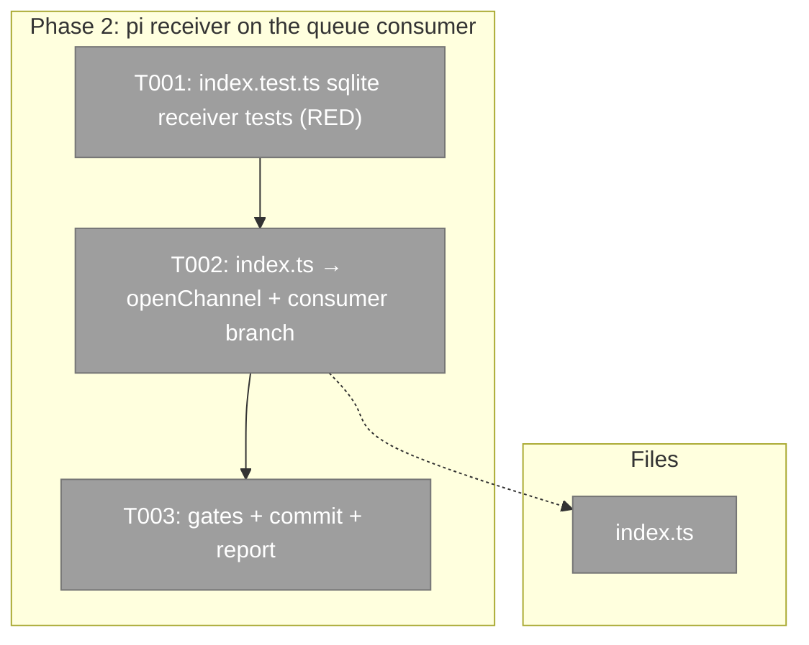
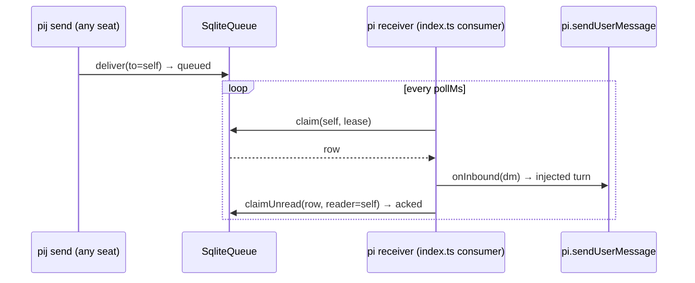

# Phase 2: 3c — pi in-process receiver adopts the queue consumer

**Plan**: `/Users/vaughanknight/GitHub/pij-worktrees/s392-day3-codex-doctrine/docs/plans/392-day3-codex-doctrine/day3-codex-doctrine-plan.md` (v1.3.0)
**Worktree**: `/Users/vaughanknight/GitHub/pij-worktrees/s392-day3-codex-doctrine` · **Branch**: `s392/day3-codex-doctrine`
**Rulings**: `../../rulings.md` ruling 3 (obs-03 owner = this stream; fence widened to `.pi/extensions/pij/index.ts` +test)
**Status**: complete — implementation commit `621c846d9faa83140c6fd997f4fb2e9b49202481`

### Executive Briefing
- **Purpose**: A `harness:"pi"` peer's in-process receiver (`index.ts:314-395`) is hard-wired to `new FsChannel` + `FsChannel.watch`, exactly the bridge's defect; under the sqlite default nothing ever reaches `pi.sendUserMessage`. This phase puts the receiver on Phase 1's `startQueueConsumer`, with fs behaviour byte-for-byte unchanged.
- **What We're Building**: `openChannel(pijHome)` in both `index.ts` construction sites (`:108` `pij_send` tool deps, `:314` receiver); under sqlite a consumer whose handler runs `receiver.onInbound(dm, dm.messageId)` and lets the consumer ack; under fs the current watch/markRead block verbatim; `noteInboxScan` heartbeat kept on both.
- **Goals**:
  - ✅ AC-08 green: sqlite-delivered message → one injected turn → row `acked` (`reader=<self>`), `noteInboxScan` stamped per poll
  - ✅ fs: every existing `index.test.ts` assertion unchanged (they pin `PIJ_QUEUE_BACKEND=fs` explicitly where they seed `msg-*.json` files)
  - ✅ same at-least-once contract as Phase 1: ack only after `onInbound` returned
  - ✅ no `SessionDescriptor` change; no `sqlite-queue.ts` write-side change
- **Non-Goals**:
  - ❌ changing `PijSession.onInbound` semantics, the TUI, or the daemon's observe-only stance toward pi inboxes
  - ❌ receipts rendering changes (`kind:"receipt"` rows still record-not-inject — `onInbound` already does that)
  - ❌ any live restart (the running pi seats pick this up only on their next boot)

### Prior Phase Context
_Phase 1 — from commits `69f1c452` (impl) + `3501f855` (handover); cold review in flight (verdict pending — if it returns FIX_REQUIRED on the consumer, the orchestrator will re-brief you)._
- A. **Deliverables**: `.pi/extensions/pij/adapters/queue-consumer.ts` (+test, 219 lines of tests); `telegram/bridge.ts` `forwardOne` + sqlite branch; `telegram/index.ts` on `openChannel`; `adapters/channel-factory.ts` gained `OpenChannelOptions`; `core/cli.ts` receipt fix; `docs/how/pij-telegram.md` § Queue backend & restart semantics.
- B. **Dependencies exported** (verified in source): `startQueueConsumer(deps: QueueConsumerDeps): () => void` with `QueueConsumerDeps = { queue: SqliteQueue; self: SessionId; onMessage: (message: ClaimedMessage) => Promise<void>; pollMs?; leaseMs?; token?; log?; onScan?: (atMs: number) => void; now?: () => number }`; `openChannel(pijHome, env = process.env, options: OpenChannelOptions = {})` where `OpenChannelOptions = { fsWatchOpts?: ConstructorParameters<typeof FsChannel>[1] }` — pass `{ fsWatchOpts: pollPrimaryWatchOpts() }` to keep the fs branch poll-primary; `sqliteOf(channel)`.
- C. **Gotchas**: the handler must THROW to keep a row unacked (the consumer acks right after `onMessage` resolves; a rejected handler leaves the row `claimed` for the daemon's lease sweep); dispose stops the poll; `token` defaults to `consumer-<pid>`; existing fs-seeded tests must pin `PIJ_QUEUE_BACKEND=fs`.
- D. **Incomplete**: none in code. Aggregate repo gates are red on pre-existing out-of-fence debt (pwsh test, repo lint, `just pij-skill-check` on main's skills/, smoke) — report them, do not fix them.
- E. **Patterns**: temp `PIJ_HOME` + real `SqliteQueue` + injected `now`; `waitFor`; production closure driven by a rejecting fake (see `telegram/bridge.test.ts` sqlite describe) — mirror that shape for `index.test.ts`.

### Pre-Implementation Check

| File | Exists? | Domain Check | Notes |
|------|---------|-------------|-------|
| `.pi/extensions/pij/index.ts` | modify | pij-messaging (pi extension entry) | `:10` import; `:108` `delivery: new FsChannel(pijHome)`; `:314` receiver channel; `:360-395` watch block; `:415` dispose |
| `.pi/extensions/pij/index.test.ts` | modify | pij-messaging | helpers `makeFakePi` :32, `makeFakeCtx` :55, `allocatePiIdentity` :70, `inboxPath` :81; inbound tests :313, :347 seed fs files |
| `.pi/extensions/pij/adapters/queue-consumer.ts` | exists after Phase 1 | pij-messaging | consumed, not modified |
| `.pi/extensions/pij/adapters/channel-factory.ts` | exists | pij-messaging | consumed (`openChannel`, `sqliteOf`, `queueBackend`) |

No contract change. `PijSession` already takes `delivery: DeliveryPort` (`core/session.ts`), so a `MessageChannel` fits.

### Architecture Map

### Tasks

| Status | ID | Task | Domain | Path(s) | Done When | Notes |
|--------|-----|------|--------|---------|-----------|-------|
| [x] | T001 | `index.test.ts` (RED): (a) with `PIJ_QUEUE_BACKEND=sqlite` in the test env, boot the extension over a temp `PIJ_HOME`, `new SqliteQueue(pijHome).deliver({from:"pij-x", to:<self>, body:"hello"})` → `makeFakePi`'s `sendUserMessage` receives the framed body once; the row is `acked` with receipt `reader=<self>`; a second poll injects nothing; (b) a `kind:"receipt"` row is recorded (event log) and acked, never injected; (c) `noteInboxScan` heartbeat: the session's inbox-scan stamp advances across polls (use the existing plan-057 assertion pattern); (d) reload (`session_start` with reason `reload`) disposes the consumer and re-opens one without re-injecting the acked row; (e) pin `PIJ_QUEUE_BACKEND=fs` on the existing fs-seeded tests (:313, :347) so they keep exercising the fs path unchanged | pij-messaging | `/Users/vaughanknight/GitHub/pij-worktrees/s392-day3-codex-doctrine/.pi/extensions/pij/index.test.ts` | New tests FAIL on current wiring; existing tests GREEN with the env pin | Env is read by `queueBackend(env)` — set `process.env.PIJ_QUEUE_BACKEND` in `beforeEach`, restore in `afterEach` |
| [x] | T002 | `index.ts`: replace both `new FsChannel(...)` sites with `openChannel(pijHome)` (keep poll-primary fs watch opts via the Phase 1 mechanism); in the receive block: `const sq = sqliteOf(channel)`; if `sq` → `disposeWatch = startQueueConsumer({queue: sq, self, onMessage: async (dm) => { receiver.onInbound(dm, dm.messageId); }, onScan: (at) => receiver.noteInboxScan(at), log})` (the consumer acks with `{readAt, reader:self}` after the handler returns — parity with the fs `markRead` marker); else the current `listUnread`/`seen`/`channel.watch` block verbatim. `pij_send` tool deps `delivery: openChannel(pijHome)` | pij-messaging | `/Users/vaughanknight/GitHub/pij-worktrees/s392-day3-codex-doctrine/.pi/extensions/pij/index.ts` | T001 GREEN; all `index.test.ts` GREEN; typecheck clean | Keep the Plan-019 comment block (daemon never injects into pi) and add one line on the sqlite branch; `onInbound` errors propagate → row stays claimed (same contract as Phase 1) |
| [x] | T003 | Gates (`npx vitest run .pi/extensions/pij/`, `just typecheck`, `just pij-skill-check`), pathspec commit of `index.ts` + `index.test.ts` only, `reports/phase-2-report.md` (claim · artifacts · shas · gates · observations · open) | pij-messaging | `/Users/vaughanknight/GitHub/pij-worktrees/s392-day3-codex-doctrine/docs/plans/392-day3-codex-doctrine/reports/phase-2-report.md` | Gates recorded; report exists | No live restart — running pi seats adopt on next boot |

### Context Brief

**Key findings from plan**: 01 (same FsChannel wiring), 03 (queue API sufficient), 07/08 (ack only after the handler returns; at-least-once).

**Domain dependencies**:
- `pij-messaging`: `startQueueConsumer` (`adapters/queue-consumer.ts`, Phase 1) — the poll/claim/ack loop.
- `pij-messaging`: `openChannel` / `sqliteOf` / `queueBackend` (`adapters/channel-factory.ts:131,99,43`).
- `pij-control-plane`: `PijSession.onInbound` (`core/session.ts:542`) and `noteInboxScan` (`:662`) — the injection + heartbeat seams; unchanged.

**Domain constraints**: the daemon never injects into pi (`core/harness/pi.ts daemonOwnsDelivery`); the in-process receiver is the SOLE consumer of a pi inbox — the consumer keeps that true (it claims only `self`).

**Reusable**: Phase 1's consumer tests and temp-home fixtures; `index.test.ts` fakes (`makeFakePi`, `makeFakeCtx`).

### Discoveries & Learnings

| Date | Task | Type | Discovery | Resolution | References |
|------|------|------|-----------|------------|------------|
| 2026-08-27 | T002 | Resource ownership | `pij_send` now opens a sqlite channel per tool call; leaving it unclosed would leak a database handle on every send. | Wrapped dispatch in `try/finally` and closed `sqliteOf(delivery)` after the synchronous send path. Receiver consumers close their sqlite handle on reload/shutdown through the disposer. | `.pi/extensions/pij/index.ts` |
| 2026-08-27 | T001 | Backend parity | The two retained-message tests seed fs inbox files directly and would stop testing that path after the sqlite default is adopted. | Pinned only those controls to `PIJ_QUEUE_BACKEND=fs`; sqlite tests set/restore the env explicitly. | `.pi/extensions/pij/index.test.ts` |
