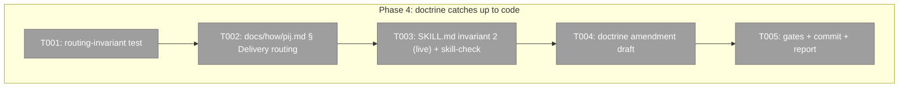
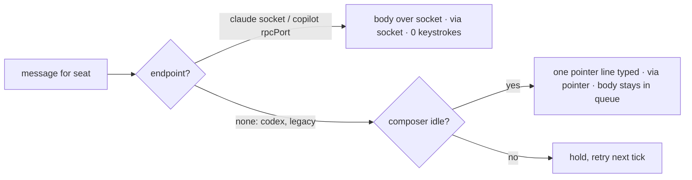

# Phase 4: 7 — Pointer-delivery doctrine relaxation

**Plan**: `/Users/vaughanknight/GitHub/pij-worktrees/s392-day3-codex-doctrine/docs/plans/392-day3-codex-doctrine/day3-codex-doctrine-plan.md` (v1.3.0)
**Worktree**: `/Users/vaughanknight/GitHub/pij-worktrees/s392-day3-codex-doctrine` · **Branch**: `s392/day3-codex-doctrine`
**Rulings**: Codex deferred (`../../rulings.md`) — codex is a POINTER-PATH harness in this phase's invariant.
**Status**: DISPATCHED 2026-08-27T10:1xZ (pipelined while the Phase 2 review runs; disjoint fence)

### Executive Briefing
- **Purpose**: The daemon already delivers the FULL body over Claude's inbox socket and Copilot's `--ui-server` RPC (`core/daemon/loop.ts:612-628`, `via:"socket"`), and types only a one-line pointer for socketless seats (`:633-652`, `via:"pointer"`). The written rules still say "never inline a body" everywhere, because they were born from the Claude Code 2.1.246 pty-chunk clip. This phase pins the real routing in a named test and brings the how-doc, the LIVE skill invariant, and a drafted government doctrine amendment in line — per-harness, not global.
- **What We're Building**: a `describe("routing invariant …")` in `loop.test.ts`; a "Delivery routing" section in `docs/how/pij.md` (+ correcting its stale fs-file sentence); a one-clause edit to `skills/pij/SKILL.md` global invariant 2; a doctrine amendment DRAFT in this folder for the o-prime.
- **Goals**:
  - ✅ AC-10 green; `just pij-skill-check` before/after diff = zero new findings (ruling PD-02; the check is red on main for pre-existing debt — item 9 pays it)
  - ✅ the two purposes of "pointer delivery" are separated in text: (P1) **transport** — pointer only where a pty can clip (socketless seats); (P2) **persist-before-send / audit** — packets and large bodies are still written to disk first (orient-global iron rule 2, `/pij` invariant 4) — P2 is NOT relaxed
  - ✅ the pointer path and its composer-idle guard are untouched in code
- **Non-Goals**:
  - ❌ any change to `loop.ts` / `daemon-tmux.ts` routing code (test + docs only)
  - ❌ editing `government/**` (draft only; o-prime folds it in)
  - ❌ editing orient-global.md (portable, centrally owned) — the draft names it as a follow-on for the o-prime
  - ❌ a body-size cap anywhere

### Prior Phase Context
Phase 1 (3b) MERGED as PR #1 (main 27077052); Phase 2 (3c) committed 35f9aff/236dec9, cold review IN FLIGHT in this tree (the reviewer mutates `index.ts`, `adapters/queue-consumer.ts`, `index.test.ts` — a transient red there is not yours; re-run). FX001 (test-only) committed 246f234. Nothing in this phase depends on their code. Codex is DEFERRED (ruling) → in T001 the codex case asserts `via:"pointer"`.

### Pre-Implementation Check

| File | Exists? | Domain Check | Notes |
|------|---------|-------------|-------|
| `.pi/extensions/pij/core/daemon/loop.test.ts` | modify | pij-control-plane | existing describes: socket-first claude `:1069`, copilot rpcPort `:1179`, pointer path `:1206` (incl. composer-idle guard `:1260`) |
| `docs/how/pij.md` | modify | pij-control-plane | § "Push and pull delivery" `:61-75`; § "The message + receipt protocol" `:235` opens with a now-stale "every send publishes `msg-<messageId>.json`" |
| `skills/pij/SKILL.md` | modify (LIVE, symlinked to every agent) | pij-skill | global invariant 2 at `:59`; gate `just pij-skill-check` (budget 150 lines) |
| `docs/plans/392-day3-codex-doctrine/doctrine-amendment-pointer-relaxation.md` | create | plan folder | draft for `government/doctrine/preconditions-travel-with-remedies.md` + orient-global iron rule 2 |

Note: the brief said "the skill's C10 wire-discipline text"; on inspection C10 (`references/00-routing.md:193-210`) carries no pointer clause — the clause is SKILL.md invariant 2. Edit that; leave C10 untouched (report this in the phase report).

### Architecture Map

### Tasks

| Status | ID | Task | Domain | Path(s) | Done When | Notes |
|--------|-----|------|--------|---------|-----------|-------|
| [ ] | T001 | `loop.test.ts`: add `describe("routing invariant — body on socket/RPC, pointer only where a pty can clip (plan 392 Phase 4)")` with four `it`s reusing the fixtures of the three existing describes: (1) claude seat + resolvable socket ⇒ consumed `via:"socket"`, `sendText` never called with the body; (2) copilot seat + `rpcPort` ⇒ same; (3) codex seat (no endpoint today) ⇒ `via:"pointer"`, typed text === `pointerLine(from,1)`, body never typed; (4) claude seat with NO socket + `opts.pointer` ⇒ `via:"pointer"` and the composer-idle guard (`refreshRenderedComposerHold`) is consulted before typing. Name each `it` with the harness so the doc can cite them | pij-control-plane | `/Users/vaughanknight/GitHub/pij-worktrees/s392-day3-codex-doctrine/.pi/extensions/pij/core/daemon/loop.test.ts` | Tests GREEN on current code (they document, then guard); a mutation that removes the `harness === "claude"` gate turns (1) RED | Test-only; no `loop.ts` change |
| [ ] | T002 | `docs/how/pij.md`: after § "Push and pull delivery" add `### Delivery routing — body or pointer` with a per-harness table (claude → inbox socket, full body, 0 keystrokes · copilot with `--ui-server` → RPC, full body · codex → pointer line today · legacy/socketless → pointer line + `pij inbox` · pi → in-process receiver, full body), the rule ("the pointer is the remedy for the pty clip — 2.1.246 chunk regression; a channel that cannot clip receives the body"), what does NOT change (persist-before-send for packets; the composer-idle guard; commands still typed), and cite T001's describe by name. Fix § protocol's first bullet: under the default `sqlite` backend a send is a row in `~/.pij/queue/pij.sqlite` (`pij queue --to <id>` to inspect); the `msg-*.json`/`read-*.json` files describe `PIJ_QUEUE_BACKEND=fs` | pij-control-plane | `/Users/vaughanknight/GitHub/pij-worktrees/s392-day3-codex-doctrine/docs/how/pij.md` | Section present, table complete, test cited; stale fs sentence corrected | Rebase onto main first if s391 touched this file |
| [ ] | T003 | `skills/pij/SKILL.md` invariant 2 → "**Pointer delivery**: persist packets/large bodies to disk first (audit + durability); on the wire, a socket/RPC seat (claude with inbox socket, copilot with `--ui-server`) may receive the body inline — the daemon delivers it byte-exact; a socketless seat receives a path pointer, never a body (pty clip). Keep sends short either way (C10)." Gate per o-prime ruling PD-02 (the check is RED on main for pre-existing debt): run `just pij-skill-check > .harness/temp/s392/skill-check-before.txt` BEFORE editing and `…-after.txt` AFTER; `diff` them — bar is ZERO new findings (budgets/strings identical; if the clause tips SKILL.md's 150-line budget, trim within SKILL.md to stay flat); attach both outputs + the diff to the report/PR. Touch nothing else in the skill | pij-skill | `/Users/vaughanknight/GitHub/pij-worktrees/s392-day3-codex-doctrine/skills/pij/SKILL.md` | before/after diff shows no new finding; diff is one clause | LIVE skill — tell the orchestrator in the report; the orchestrator tells the o-prime before merge |
| [ ] | T004 | Write `doctrine-amendment-pointer-relaxation.md` (plan folder): title, evidence pointers (`reports/pij-comms-review-2026-08-27.md` §5/§11/§13 benchmarks — FULL PATH, not bare "review §N": 3 KB bodies byte-exact, 0 keystrokes on socket/RPC; T001 test names; the 2.1.246 clip history), the proposed ruling text for `government/doctrine/preconditions-travel-with-remedies.md` ("the pointer is the remedy for the pty clip; on a channel that cannot clip, deliver the body — persistence of packets is a separate, unchanged rule"), and a proposed wording for orient-global iron rule 2 that separates P1/P2. Mark it DRAFT — o-prime is the single writer | pij-skill | `/Users/vaughanknight/GitHub/pij-worktrees/s392-day3-codex-doctrine/docs/plans/392-day3-codex-doctrine/doctrine-amendment-pointer-relaxation.md` | File exists with both proposed texts and evidence pointers | No government edit |
| [ ] | T005 | Gates (`npx vitest run .pi/extensions/pij/core/daemon/`, `just typecheck`, `just pij-skill-check`), pathspec commit of the four files, `reports/phase-4-report.md` | pij-control-plane | `/Users/vaughanknight/GitHub/pij-worktrees/s392-day3-codex-doctrine/docs/plans/392-day3-codex-doctrine/reports/phase-4-report.md` | Gates recorded; report exists | |

### Context Brief

**Key findings from plan**: 06 (socket/RPC already delivers full bodies; pointer = socketless path).

**Domain dependencies**: `pij-control-plane`: `drainTmuxInbox` (`core/daemon/loop.ts:598-660`), `pointerLine` (`:582`), `DaemonPorts.sendSocket`; `pij-skill`: `skills/pij/SKILL.md` invariants, `harness/scripts/pij-skill-check.sh` budgets.

**Domain constraints**: skill text is live-deployed (production push); government is single-writer (o-prime); orient-global is portable and centrally owned — propose, never edit.

**Reusable**: fixtures in the three existing `loop.test.ts` describes (`:1069`, `:1179`, `:1206`).

### Discoveries & Learnings

| Date | Task | Type | Discovery | Resolution | References |
|------|------|------|-----------|------------|------------|
