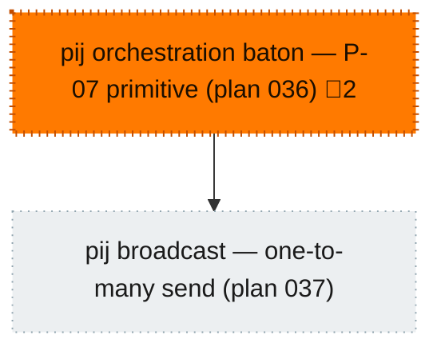

<!-- GENERATED by `harness flow render` — do not hand-edit; regenerate from the flow JSON. -->
# Flow · pij-orchestration-portfolio

**Kind**: prime-flow · **Now**: wi-036 · **Nodes**: 2 · **Events**: 8

**Rail**: [ ◇─◇ ]  [ ◇ pij orchestration baton — P-07 primitive (plan 036) · ◇ pij broadcast — one-to-many send (plan 037) ]

**Legend** — colour = type/status: 🟩 done · 🟢 in-progress · 🟥 blocked · 🟦 known · ⬜ assumed · 🔶 decision · 🗣 user input · 🟪 harness chore (faded = not yet done) · 🤖 companion · 🛠 worker · 🟧 current (you are here). Badges: 💬 comments · 📄 artifacts · 📝 instructions · 🧰 chore (° optional / recommended / ‼ strongly-recommended; ✓ done · ✕ skipped).

## Node log

### wi-036 · pij orchestration baton — P-07 primitive (plan 036)
- `2026-07-11T08:35:09.355Z` · — · — — s036 pij-1khprxk (Fable 5, Jordan-spawned, ADOPTING — canary a+b PASS, brief delivered pending ack). Namespace ruled: pij orchestration baton. Seed: 035 R9.7 + E-22.
- `2026-07-11T08:49:34.500Z` · — · — — 2026-07-11 09:15Z: preamble checkpoint VERIFIED (reports/preamble-checkpoint.md; ruling #6 work-authorized). IN FLIGHT — builder guided: fresh flight plan + explore, interview corpus as research input. OBS-1/OBS-2 encoded to payload same-hour.
