<!-- GENERATED by `harness flow render` — do not hand-edit; regenerate from the flow JSON. -->
# Flow · pij-orchestration-portfolio

**Kind**: prime-flow · **Now**: wi-copilot-effort-advertisement · **Next**: wi-046 · **Intent**: Ship effort-level correction while real-trees, portable-models, and supply-chain streams pipeline in parallel · **Nodes**: 14 · **Events**: 49

**Rail**: [ ◆─◆─◆─◆─◆─◆─◆─◆─✗─◇─◇─◇─◇─◇ ]  [ ◆ pij orchestration baton — P-07 primitive (plan 036) · ◆ pij broadcast — one-to-many send (plan 037) · ◆ pij prime designation — set/list/filter primes (plan 038) · ◆ dependabot chores audit — dependency updates (plan 039) · ◆ memorable pij session ids (plan 040, Jordan-tasked direct) · ◆ pij inbox without tmux (plan 041) · ◆ pij orchestrator routing skill (plan 042) · ◆ Telegram last-speaker routing (plan 043) · ✗ compact-before-redispatch enforcement (plan 044) · ◇ Correct Copilot Sol/Terra/Luna effort advertisement · ◇ Real pij parent-child trees and adoption linkage (plan 046) · ◇ Repo-managed portable Pi models catalog · ◇ Repo-managed portable Pi models catalog (plan 047) · ◇ Supply-chain min-release-age=7 policy ]

```mermaid
flowchart TD
    wi_036["pij orchestration baton — P-07 primitive (plan 036) 💬2"]:::done
    wi_037["pij broadcast — one-to-many send (plan 037)"]:::done
    wi_038["pij prime designation — set/list/filter primes (plan 038)"]:::done
    wi_039["dependabot chores audit — dependency updates (plan 039)"]:::done
    wi_040["memorable pij session ids (plan 040, Jordan-tasked direct)"]:::done
    wi_041["pij inbox without tmux (plan 041)"]:::done
    wi_042["pij orchestrator routing skill (plan 042)"]:::done
    wi_043["Telegram last-speaker routing (plan 043)"]:::done
    wi_044["compact-before-redispatch enforcement (plan 044) 💬2"]:::blocked
    wi_copilot_effort_advertisement["Correct Copilot Sol/Terra/Luna effort advertisement 💬3"]:::unknown
    wi_046["Real pij parent-child trees and adoption linkage (plan 046) 💬1"]:::unknown
    wi_portable_models_config["Repo-managed portable Pi models catalog 💬1"]:::unknown
    wi_047["Repo-managed portable Pi models catalog (plan 047) 💬1"]:::unknown
    wi_min_release_age["Supply-chain min-release-age=7 policy 💬2"]:::unknown

    wi_036 --> wi_037 --> wi_038 --> wi_039 --> wi_040 --> wi_041 --> wi_042 --> wi_043 --> wi_044 --> wi_copilot_effort_advertisement --> wi_046 --> wi_portable_models_config --> wi_047 --> wi_min_release_age

    classDef done fill:#1B7F2E,stroke:#0F4F1B,color:#fff;
    classDef blocked fill:#E53935,stroke:#8E1513,color:#fff;
    classDef unknown fill:#ECEFF1,stroke:#90A4AE,color:#1a1a1a,stroke-dasharray:1 4;
    classDef current fill:#FF7A00,stroke:#C24E00,color:#1a0e00,stroke-width:4px;
    class wi_copilot_effort_advertisement current;
```

**Legend** — colour = type/status: 🟩 done · 🟢 in-progress · 🟥 blocked · 🟦 known · ⬜ assumed · 🔶 decision · 🗣 user input · 🟪 harness chore (faded = not yet done) · 🤖 companion · 🛠 worker · 🟧 current (you are here). Badges: 💬 comments · 📄 artifacts · 📝 instructions · 🧰 chore (° optional / recommended / ‼ strongly-recommended; ✓ done · ✕ skipped).

## Node log

### wi-036 · pij orchestration baton — P-07 primitive (plan 036)
- `2026-07-11T08:35:09.355Z` · — · — — s036 pij-1khprxk (Fable 5, Jordan-spawned, ADOPTING — canary a+b PASS, brief delivered pending ack). Namespace ruled: pij orchestration baton. Seed: 035 R9.7 + E-22.
- `2026-07-11T08:49:34.500Z` · — · — — 2026-07-11 09:15Z: preamble checkpoint VERIFIED (reports/preamble-checkpoint.md; ruling #6 work-authorized). IN FLIGHT — builder guided: fresh flight plan + explore, interview corpus as research input. OBS-1/OBS-2 encoded to payload same-hour.

### wi-044 · compact-before-redispatch enforcement (plan 044)
- `2026-07-12T10:18:19.777Z` · — · — — 2026-07-12 10:18Z: canary 3/3 and preamble checkpoint verified; Jordan direct spin-one preamble authorizes explore/plan; planning fence only; stop at WAITING_FOR_BUILD_CONFIG.
- `2026-07-12T11:41:11.365Z` · — · — — 2026-07-12 11:41Z: Plan v1.4 cold VALIDATED; WAITING_FOR_BUILD_CONFIG and s041 convergence on three overlapping skill/domain paths. No implementation.

### wi-copilot-effort-advertisement · Correct Copilot Sol/Terra/Luna effort advertisement
- `2026-07-12T20:35:14.398Z` · — · — — Jordan ruling Seq 86: each supports none, low, medium, high, xhigh, max; current pij models advertises minimal,xhigh,max.
- `2026-07-12T20:41:57.397Z` · — · — — 2026-07-12 20:42Z: s045 allocated at origin/main@347b6dd; worktree boot green; planning-only fence; spawn next.
- `2026-07-12T20:53:51.781Z` · — · — — 2026-07-12 20:54Z: canary 3/3 and preamble checkpoint verified; planning authorized; stop at WAITING_FOR_BUILD_CONFIG.

### wi-046 · Real pij parent-child trees and adoption linkage (plan 046)
- `2026-07-12T21:25:58.372Z` · — · — — Jordan pipeline ruling Seq 102: preamble verified; research complete; Builder planning/cold validation released. No product edits/fleet before build config.

### wi-portable-models-config · Repo-managed portable Pi models catalog
- `2026-07-12T21:50:12.937Z` · — · — — Human boundary: version portable models.json catalog; exclude local provider, auth, general skills, sessions/runtime; no implementation yet.

### wi-047 · Repo-managed portable Pi models catalog (plan 047)
- `2026-07-12T22:03:49.125Z` · — · — — 2026-07-12 22:03Z: preamble checkpoint verified; Builder research/plan/cold validation active; implementation unauthorized.

### wi-min-release-age · Supply-chain min-release-age=7 policy
- `2026-07-12T22:12:45.336Z` · — · — — Human: check in only, no more. No scope/acceptance/files yet; read-only proposed item.
- `2026-07-12T22:16:49.537Z` · — · — — 2026-07-12 22:17Z: s048 allocated at main@3b1a47b; worktree boot green; planning-only fence; adopted Pi seat canary next.
